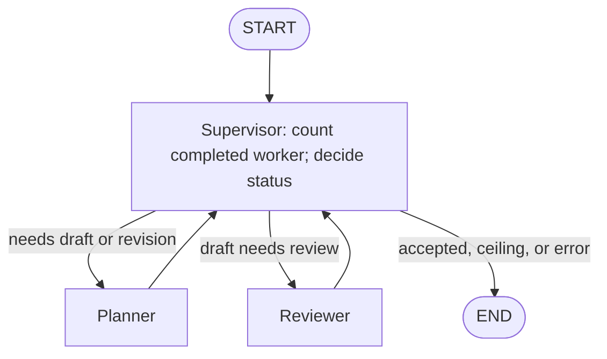

# Planner–Reviewer graph (HW2 Parts 3–4)

The graph turns listing text into three topical tags and a summary of at most
25 whitespace-separated words. A Planner proposes metadata; a Reviewer critiques
that proposal; Python decides whether to accept it, request a revision, retry a
malformed response, or stop. Part 4 adds strict Pydantic validation and a measured
experiment around this same graph. It calls the existing local Ollama adapter in
`src/model_client.py` and does not require the Part 2 API server.

## Run it

From the repository root, use a separate agent environment with Python 3.11 or 3.12:

```sh
python3.12 -m venv .venv-agents
source .venv-agents/bin/activate
python -m pip install -r requirements-agents.txt
ollama serve
```

Run `ollama serve` in a separate terminal if Ollama is not already running. The
recorded HW1 substitute model is `qwen3:1.7b`; check it with `ollama list` and use
`ollama pull qwen3:1.7b` if it is missing. No model download is part of graph execution.

```sh
python code/agents_graph.py \
  --input-json reports/hw02/cases/part3_listing.json \
  --evidence-dir /tmp/data260-graph-demo
```

Or provide `--title "..." --content "..."` directly. Do not combine those with
`--input-json`. Optional `--email` is input metadata, not model context.
Use `python code/agents_graph.py --help` for the complete options.

Defaults are model `qwen3:1.7b`, temperature `0.0`, timeout `120` seconds per model
call, and `--max-turns 10`. The standalone CLI also accepts model and service
defaults from `SMOL_MODEL` and `OLLAMA_URL`; the Part 4 campaign passes its frozen
settings explicitly. The adapter uses JSON mode, disables reasoning for graph
calls, and fixes `num_ctx=4096` in `src/model_client.py`. Temperature zero reduces
sampling variation but does not guarantee repeatable text. A finite timeout stops a failed call; the turn
ceiling stops repeated model work.

The CLI streams readable progress to **stderr**, then emits exactly one terminal
JSON object on **stdout**. This lets another program parse the result while a
person watches the steps. Exit codes:

| Exit | Status | Meaning |
|---|---|---|
| 0 | `accepted` | Current valid proposal has a valid review with no issues. |
| 1 | `turn_limit` | Budget exhausted; draft is diagnostic, not approved output. |
| 2 | `error` | Invalid configuration, model/service error, internal error, or failed evidence capture. |

`final_output` contains accepted metadata only. An unsuccessful run retains its
latest proposal, feedback, revision, and error for diagnosis.

## What changed from HW1

The sequential entry point, `code/agents_demo.py`, always calls Planner followed
by Reviewer. Its final Python processing can repair or replace metadata. The graph
keeps the same adapter but makes the decision after each worker explicit. It never
silently shortens a summary, invents tags, strips Markdown fences, or treats a
missing review as approval.



`AgentState` is a `TypedDict` representing the current run: original input, runtime
adapter, current draft, review, revision IDs, retry context, counters, status, and
trace. LangGraph merges the partial updates returned by each node. Nodes replace
lists and dictionaries instead of mutating the incoming state. Each run starts
with fresh state; the adapter is never serialized or checkpointed.

The **supervisor** performs bookkeeping and decides terminal status. The pure
`router_logic` function chooses the next edge from that state. The supervisor
does not make a model call. This follows LangGraph's
[state, node, and edge model](https://docs.langchain.com/oss/python/langgraph/graph-api).

## One turn means one worker execution

A Planner execution is one turn. A Reviewer execution is another turn. An initial
supervisor visit and later routing visits consume no turns. Each worker marks its
attempt pending; the next supervisor consumes that marker exactly once.

| Ceiling | Example worker sequence | Result |
|---|---|---|
| 1 | Planner | Unreviewed draft; `turn_limit`. |
| 2 | Planner → Reviewer accepts | `accepted` on the last allowed turn. |
| 2 | Planner → Reviewer rejects | `turn_limit`. |
| 3 | Planner → Reviewer rejects → Planner | Revised draft remains unreviewed. |
| 4 | Planner → Reviewer rejects → Planner → Reviewer accepts | `accepted`. |
| 10 | Five rejected draft/review pairs | `turn_limit`. |

Malformed responses can cause consecutive calls to the same worker. Ten turns
therefore allow **at most** five complete pairs. LangGraph's recursion limit counts
graph steps, including supervisor visits; it is set above the worker budget so
ordinary exhaustion ends normally rather than raising a recursion exception.

The supervisor checks fatal error first, current acceptance second, and ceiling
third. A valid approval on the last allowed turn is still successful.

## Response contracts and retries

Planner JSON:

```json
{"tags": ["Apartment", "Transit", "Pet friendly"], "summary": "Two-bedroom apartment near downtown San Jose with laundry, parking, pet-friendly policies, and light rail access."}
```

Reviewer JSON:

```json
{"issues": ["The summary claims a balcony that the listing never mentions."]}
```

An empty `issues` array approves the current proposal. A Reviewer can supply a
short `message`, but cannot substitute new tags or a replacement summary. The
Planner revises using the previous draft and critique. No private reasoning is
required in either response.

`contracts.py` first parses the entire JSON response. It rejects duplicate keys,
nonfinite constants, top-level nonobjects, Markdown fences, trailing prose, and
malformed JSON. Part 4 then validates the Planner object with the Pydantic
`PlannerProposal` model: exactly three strict string tags and one strict string
summary, with no extra fields or type coercion. Each tag must contain non-whitespace
text and have a Python string length of 3–30 inclusive. Length counts the original
string, including spaces; validation preserves Unicode and whitespace. For
example, `"AI"` fails, while `" AI"` passes the length rule. The summary must be
nonblank and satisfy `len(summary.split()) <= 25`.

Validation does not trim, normalize case, deduplicate, truncate, or synthesize
tags. Successful proposals remain ordinary JSON dictionaries, and `AgentState`
remains a `TypedDict`. Pydantic errors become field-specific
`ResponseContractError` feedback, such as `tags.0` and its minimum length. An
invalid Planner response retries Planner with the error and original rejected
response; a malformed Reviewer response retries Reviewer on the same proposal.
This is content retry, not an unbounded transport retry. The normal Reviewer
still checks relevance and unsupported claims: schema validity alone is not
approval.

Every Planner attempt advances `proposal_revision` and invalidates the old review,
including attempts whose JSON is malformed. Acceptance requires
`reviewed_revision == proposal_revision`. An old approval can never approve a
new or failed draft. Service, timeout, and unexpected internal errors end the run.

Raw responses and usage are recorded before parsing. A rejected response still
counts as work. A transport failure consumes a worker attempt but may produce no
adapter response or token counts. Missing usage metadata can be normalized to zero
by the shared adapter; zero reported tokens do not prove the call was free.

## Demonstrate the feedback loop

```sh
python code/agents_graph.py \
  --input-json reports/hw02/cases/part3_listing.json \
  --max-turns 10 --controlled-reviewer \
  --evidence-dir /tmp/data260-controlled-demo
```

This explicitly labeled demonstration still calls the real Reviewer. After a
valid review, it appends a forced issue so Planner must revise. The raw model
response stays unchanged in the trace, and the simulation is recorded separately.
It defaults off. Expected exit code **1** proves normal bounded termination; it
does not mean the demo produced approved metadata. Malformed model responses are
recorded honestly and may interrupt the alternating pattern.

## Tests and evidence

```sh
python -m unittest discover -s tests/agent_graph -v
python scripts/verify_part3.py --live --output-dir /tmp/data260-part3-current-check
```

Unit tests use scripted adapters through the actual compiled graph. They cover
turn boundaries, revision safety, malformed output, retry context, transport
errors, state isolation, usage accounting, and CLI behavior without model wording
assertions. The live verifier runs an ordinary case and the controlled ceiling
case, preserving separate stdout, stderr, result JSON, and structured trace.

The example verifier command writes a fresh `verification_part3.json`,
`RUN_LOG_PART3.txt`, and unique `raw/part3/` run folders under
`/tmp/data260-part3-current-check`. These checks use the current, stronger Part 4
validator. The original [Part 3 verification](../reports/hw02/verification_part3.json)
and [raw evidence](../reports/hw02/raw/part3/) retain their original code hashes,
validation rules, and timestamps. Always supply a separate `--output-dir` when
repeating the Part 3 verifier; its default would overwrite historical reports.
The records include resolved model settings, timestamps,
observed Git commit, dirty-tree status, and dependency versions. The assignment's
SID/seed fields are identity metadata; the verifier does not claim to have seeded
the model. `--live` is required for real-model checks; offline success alone does
not establish live acceptance. Use `--output-dir` to keep another verification run
separate from the checked-in evidence. Test doubles and the controlled Reviewer
demonstration are excluded from all Part 4 measurements.

## Part 4 measured experiments

The [Part 4 reproduction instructions](../reports/hw02/REPRODUCIBLE_RUN_INSTRUCTIONS.md)
give setup, the expensive real-model campaign command, offline regeneration, and
verification commands. [METRICS.md](../reports/hw02/METRICS.md) contains the measured
tables, all adversarial outcomes, the deployment recommendation, and its explicit
run command. [deployment_choice.json](../reports/hw02/deployment_choice.json)
records the decision with evidence references. The graph default remains 10 turns.

The frozen schedule has 75 distinct fresh executions: 30 ordinary schema/retry
runs at ceiling 10, 20 ordinary runs at ceiling 2, 20 ordinary runs at ceiling 10,
and five adversarial runs at ceiling 10. The comparison uses 20 alternating pairs:
2 then 10 in odd pairs, 10 then 2 in even pairs. Each measurement session begins
with a saved, excluded ordinary warm-up. Every measured call uses the real model
and normal Reviewer, with sequential processes and ordinary Ollama caching and
model residency. No adversarial pilots selected the frozen case.

A completion requires `accepted`, a schema-valid current proposal, and approval
of its matching revision. In the 30-run table, “Valid first attempt,” “Valid after
1 retry,” and “Valid after 2+ retries” mean accepted after one, two, or at least
three Planner attempts, respectively. “Hit turn ceiling” takes precedence over an
earlier valid draft. Planner retries equal Planner attempts minus one; a Reviewer
retry does not increase that count. A semantic revision can therefore count as a
Planner retry with zero schema failures. The supplementary first-schema-valid
counts make that distinction visible. Operational errors and interrupted/unknown
runs remain separate and prevent a complete campaign.

Table latency is the CLI's `elapsed_ms`: application-run latency including Git
inspection, adapter/graph construction, execution, and trace handling. It excludes
process startup/imports and evidence writing. Category means use all runs in that
row, with N/A for empty rows. Each ceiling's completion rate uses all 20 planned
trials, and its mean latency includes normal ceiling exits. Choose higher observed
completion first, lower all-run mean latency second, and smaller ceiling third.
The recommendation applies to this model, input, configuration, and sample.

The campaign freezes input bytes, source snapshots/hashes, settings, package
versions, model digest, schedule, and Git state before measurement. Trial start
markers, stdout/stderr, terminal results, and raw CLI traces remain preserved.
`code/agents_experiments.py report` replays saved evidence with no model calls;
`scripts/report_part4.py` formats those verified results into the report tables
and machine-readable recommendation, recording its presentation-source hash
separately. `scripts/verify_part4.py` independently checks schema/approval, turn accounting,
provenance, cohort completeness, and report arithmetic. Its
[verification_part4.json](../reports/hw02/verification_part4.json) is scoped to
Part 4 and does not replace final whole-assignment verification.

The original baseline source snapshots remain authoritative for the measured
runs. After measurement, `code/agents_experiments.py` and
`scripts/verify_part4.py` were hardened for failure handling and recommendation
provenance. The graph, schema, prompts, shared adapter, and calculation rules were
unchanged. Current tools can verify the preserved baseline offline, but execution
or resume is refused when current source hashes differ from its frozen hashes.
Prepare a new campaign for further measurements.

Before resuming a compatible campaign, the runner checks preserved excluded
warm-ups as well as measured trials. Any failed, unknown, or incomplete excluded
warm-up requires preserving that campaign and preparing a new one; it must not
resume into measured slots. Git metadata commands each have a five-second timeout
and complete before a new trial directory is reserved, so a metadata failure
leaves the slot unstarted.

The graph uses shared root-level `code/` and `src/`, without web-app integration
or a separate HW2 application. The full report PDF, personal AI-use answers,
combined Parts 1–4 run log/instructions and verification, repository collaborator
access, final HW2 tag, and smoke verification against that tag remain final
submission tasks. The implementation plan stays outside Git.
