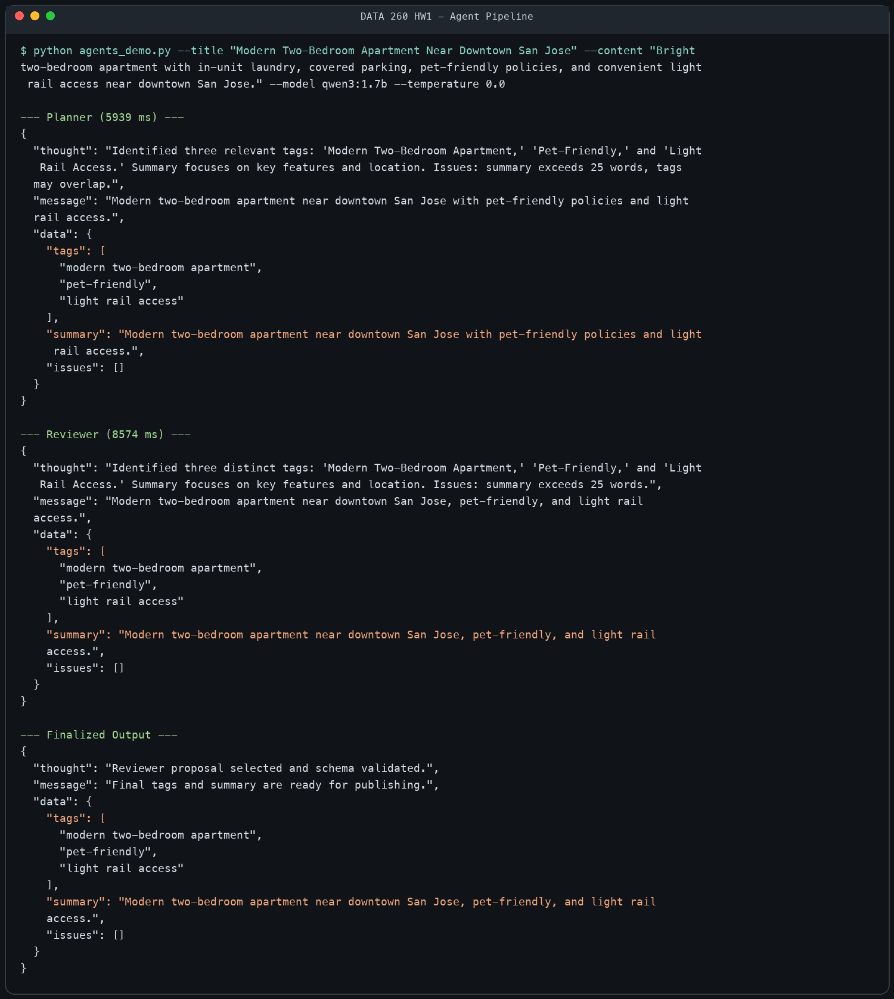
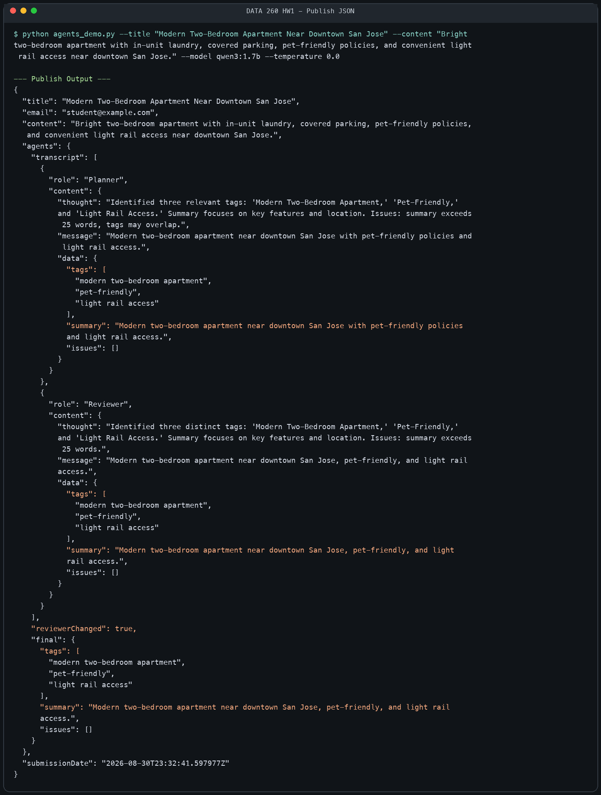

# Agentic AI - Part 2

## Configuration

- Assigned domain: Rental Housing Listings (DOMAIN_ID 6)
- Python: 3.12.13
- Ollama: 0.33.0
- Requested model: `qwen3:8b`
- Model used for the recorded run: `qwen3:1.7b`
- Temperature: 0.0

The `qwen3:8b` download repeatedly stalled and restarted near 79% in the local environment, so I used the smaller Qwen3 model for the recorded run. The program still defaults to `qwen3:8b`; the smaller model is selected explicitly in the command below.

## Exact command

Run from the repository root after activating the Python 3.12 environment:

```bash
python code/agents_demo.py --title "Modern Two-Bedroom Apartment Near Downtown San Jose" --content "Bright two-bedroom apartment with in-unit laundry, covered parking, pet-friendly policies, and convenient light rail access near downtown San Jose." --model qwen3:1.7b --temperature 0.0
```

## Console evidence





The complete machine-readable console capture is in `raw/part2_console_output.txt`, and the timestamped run record is in `RUN_LOG.txt`.

## Short answers

**Q1. What three final tags did you obtain?**
`modern two-bedroom apartment`, `pet-friendly`, and `light rail access`.

**Q2. What was the final summary?**
Modern two-bedroom apartment near downtown San Jose, pet-friendly, and light rail access.

**Q3. Did the Reviewer agent change anything?**
Yes. It kept all three tags but shortened and rephrased the Planner's summary by changing “with pet-friendly policies” to the more concise “pet-friendly.”

## Step-by-step explanation

1. **Input:** The command-line program receives a title and content. The agent code contains no fixed rental-housing keywords; all topical text comes from these arguments.
2. **Planner:** The first Ollama call proposes exactly three tags and a one-sentence summary in JSON.
3. **Reviewer:** The second Ollama call receives both the original task and the Planner's raw, unrepaired response. It checks tag relevance and uniqueness plus the 25-word summary limit, then returns its own raw JSON proposal.
4. **Finalizer:** Only the deterministic Python step normalizes the Reviewer result. It guarantees exactly three distinct input-derived tags, limits the summary to 25 words, rejects unresolved issues, and creates the publishable data.
5. **Publish output:** The program prints a final JSON package containing the original input, the two-agent transcript, whether the Reviewer changed the proposal, the final tags and summary, and a UTC submission timestamp.

## Reproduction instructions

```bash
conda create -n data260-hw1 python=3.12 -y
conda activate data260-hw1
python -m pip install -r reports/hw01/requirements-part2.txt
brew install ollama
ollama serve
```

In a second terminal:

```bash
ollama pull qwen3:8b
python code/agents_demo.py --title "Modern Two-Bedroom Apartment Near Downtown San Jose" --content "Bright two-bedroom apartment with in-unit laundry, covered parking, pet-friendly policies, and convenient light rail access near downtown San Jose." --model qwen3:8b --temperature 0.0
```

If the 8B model is too large for the local machine, pull `qwen3:1.7b` and use `--model qwen3:1.7b`, as in the recorded run.

## Verification

```bash
python -m unittest discover -s reports/hw01/tests -v
```

The full Homework 1 suite checks Part 1 syntax and form structure, JSON extraction, input-derived tag fallback, exact schema constraints, the raw Planner handoff, non-determinism data integrity, and Part 4 token accounting.
