# DATA 260 Homework 2

Verified code: `hw2-code` / `6a076db1447f00a0097cfc16f5de460c37e65079`

## Homework 2 | Rental Housing Listings

Pragya Apurva | DATA 260 | September 14, 2026

This report extends the HW1 rental project with a responsive web interface, a FastAPI backend, and a Planner-Reviewer graph with strict output checks and bounded retries.

Verified implementation tag: hw2-code<br/>Tagged commit: 6a076db1447f00a0097cfc16f5de460c37e65079

Repository: <link href="https://github.com/ishuapurva1996/data260-6102" color="#167d8d">https://github.com/ishuapurva1996/data260-6102</link>

Hardware: MacBook Air, Apple M4 (10 CPU cores), 24 GB memory; macOS 15.7.4, arm64. Python 3.12.14. Local model: qwen3:1.7b through Ollama 0.33.0.

The same documented HW1 model substitute is retained: the qwen3:8b download did not complete reliably. All measured model calls use the shared src/model_client.py adapter.

The code tag identifies the tested implementation. The generated PDF and verification result are accompanying artifacts produced after that code freeze; their own hashes are in the submission manifest.

| Personal configuration | Value | Calculation / meaning |
|---|---|---|
| SID4 | 6102 | Last four student-ID digits |
| PORT_BASE | 8702 | 8000 + (6102 mod 900) = 8000 + 702 |
| PREFIX | s6102 | "s" + SID4 |
| SEED | 6102 | SID4 |
| VERIFY_SEED | 266102 | 260000 + SID4 |
| DOMAIN_ID | 6 | 6102 mod 8; rental housing |

## Project structure and evidence

The browser interface and FastAPI manage rental records. Separately, the command-line agent graph reads a rental description and proposes three tags and a short summary. The parts share the rental domain and repository, but the graph is not automatically called when a user saves a listing.

All runnable application code remains in the shared root-level code/ and src/ folders. Homework-specific reports, inputs, recorded runs and screenshots are in reports/hw02/. The raw campaign's sources/ directory contains audit snapshots, not another application to run.

The rental's primary field is Listing Title; its secondary field is Address. Creation also collects email, description, property type and accepted terms. The server assigns IDs. A server restart restores two seed records; a browser reload preserves the current in-memory records.

The figures show the app interface, saved run output and experiment tables. Scripted tests and controlled Reviewer runs are labeled separately. Scripted tests are excluded from the model measurements.

Part 1 images are original 375 x 812 screenshots. The capture manifest records innerWidth = document scrollWidth = body scrollWidth = 375. The images contain page content; the viewport measurements are recorded separately.

The repeatable CRUD capture used an isolated instance on port 18702 to preserve the existing app's data. A separate read-only capture and live smoke check confirm that the required app responds on port 8702. The submitted startup command uses 8702.

The repository web link was opened successfully on September 14. GitHub required identity confirmation before showing collaborator settings; access for Sbnikitha and supriyaselvanganesan still needs confirmation. The HW2 work is on the codex/fix-hw1-form branch; a direct link is provided on the last page.

| Requirement | Where to find the evidence |
|---|---|
| Parts 1-2 | screenshots/part1, screenshots/part2, raw/part12 |
| Part 3 graph | src/agent_graph, code/agents_graph.py; current smoke output |
| Part 4 experiments | raw/part4/20260914T0610-baseline; METRICS.md |
| Reproduction / verification | REPRODUCIBLE_RUN_INSTRUCTIONS.md; verification.json |

## Part 1 | Form at 375px

The form scales to the available width, and its controls stay inside the page. The two scrolled views below show the same filled form, including the description, property type, terms and submit button.

code/web_application/static/index.html | lines 5-7

```
    <meta charset="UTF-8">
    <meta name="viewport" content="width=device-width, initial-scale=1.0">
    <title>Rental Housing Listings</title>
```

code/web_application/static/styles.css | lines 77-89

```
input[type="text"],
input[type="email"],
textarea,
select {
    width: 100%;
    min-height: 44px;
    padding: 10px;
    border: 2px solid rgb(223, 220, 220);
    border-radius: 5px;
    background-color: white;
    font: inherit;
    min-width: 0;
}
```

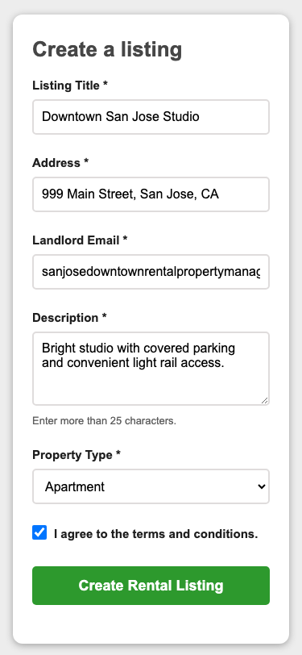

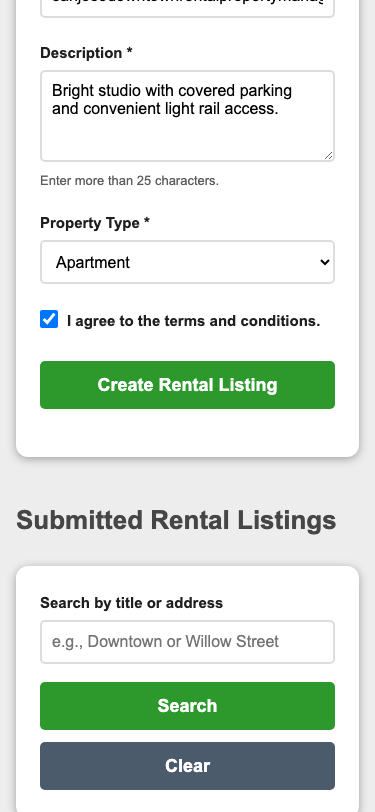

Actual UI, 375 x 812 viewport per image. The long email is in a single-line input; wrapping is demonstrated in the listing card on the next page.

## Part 1 | Readable list and usable editor

Long card text wraps rather than widening the page. Each listing offers Edit and Delete. Edit opens a shared form with that listing's ID, title and address; it is usable at the same 375px width. At widths of 600px or less, the mobile rule stacks the buttons vertically.

code/web_application/static/styles.css | lines 255-263

```
#rentalList li {
    margin: 0 0 14px;
    padding: 15px;
    border-left: 4px solid rgb(65, 192, 65);
    border-radius: 5px;
    background-color: rgb(249, 249, 249);
    line-height: 1.45;
    overflow-wrap: anywhere;
}
```

code/web_application/static/styles.css | lines 321-323

```
    .action-group {
        flex-direction: column;
    }
```

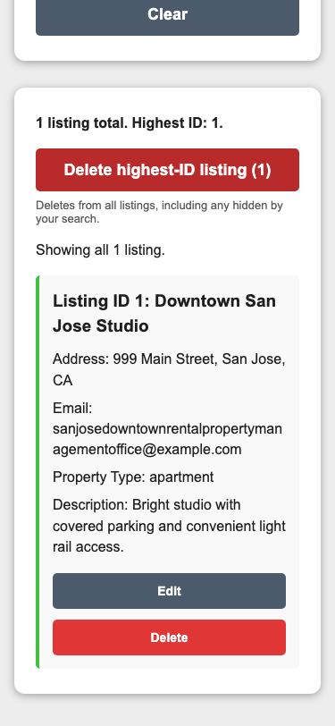

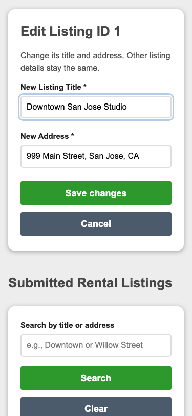

Actual UI at 375px. Both the record and editor fit without horizontal overflow. Editing any listing is an extra convenience; Part 2 still demonstrates ID 1 as requested.

## Part 1 | Empty state

After both seed records are deleted, the UI explicitly reports that there are no rentals. A zero-result search is handled separately because it can occur while records still exist.

code/web_application/static/app.js | lines 168-176

```
    rentalList.hidden = rentals.length === 0;
    emptyState.hidden = rentals.length > 0;
    emptyState.textContent = allRentals.length === 0
        ? "No rental listings yet. Create your first listing above."
        : "No matching listings. Try another title or address, or clear the search.";
    searchSummary.textContent = query
        ? `${rentals.length} match${rentals.length === 1 ? "" : "es"} for “${query}”.`
        : `Showing all ${rentals.length} listing${rentals.length === 1 ? "" : "s"}.`;
};
```

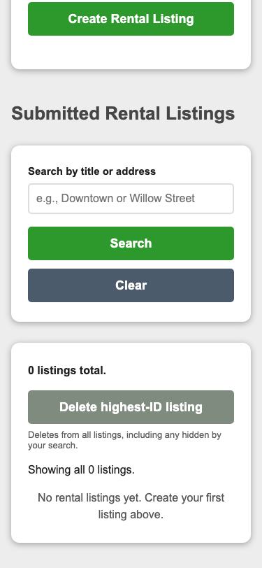

Actual empty store at 375 x 812: 0 listings, disabled highest-ID action, and a clear message inviting the first record.

## Part 1 | Loading state

During a save, the UI shows progress and disables competing controls. The optional slowSave flag waits eight seconds before sending a real POST, making the state easy to capture. It is a demonstration delay, not the server's normal response time.

code/web_application/static/app.js | lines 237-241

```
const performMutation = async (status, message, operation) => {
    if (mutationBusy || listBusy) return;
    mutationBusy = true;
    showStatus(status, message, "loading");
    updateControls();
```

code/web_application/static/app.js | lines 267-271

```
    performMutation(formStatus, "Saving your rental listing...", async () => {
        // Explicit screenshot aids: ordinary saves have no artificial delay.
        const simulateError = pageParameters.get("simulateError") === "true";
        const delay = pageParameters.get("slowSave") === "true" ? 8000 : simulateError ? 2000 : 0;
        if (delay) await new Promise((resolve) => setTimeout(resolve, delay));
```

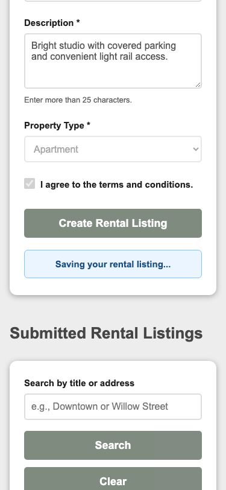

Actual 375px UI while the controlled delay is active. The save then succeeded; observed browser completion was 8573 ms including the deliberate wait.

## Part 1 | Error and retained input

The controlled simulateError mode fails after about two seconds. It shows a red error, retains input and restores the controls. No POST is sent in this mode, so it is not presented as a backend rejection.

code/web_application/static/app.js | lines 267-274

```
    performMutation(formStatus, "Saving your rental listing...", async () => {
        // Explicit screenshot aids: ordinary saves have no artificial delay.
        const simulateError = pageParameters.get("simulateError") === "true";
        const delay = pageParameters.get("slowSave") === "true" ? 8000 : simulateError ? 2000 : 0;
        if (delay) await new Promise((resolve) => setTimeout(resolve, delay));
        if (simulateError) throw new Error("The rental listing could not be saved. Please try again.");
        await requestJSON("/api/rentals", { method: "POST", body: JSON.stringify(payload) });
    });
```

code/web_application/static/app.js | lines 246-251

```
    } catch (error) {
        showStatus(status, errorMessage(error), "error");
        mutationBusy = false;
        updateControls();
    }
};
```

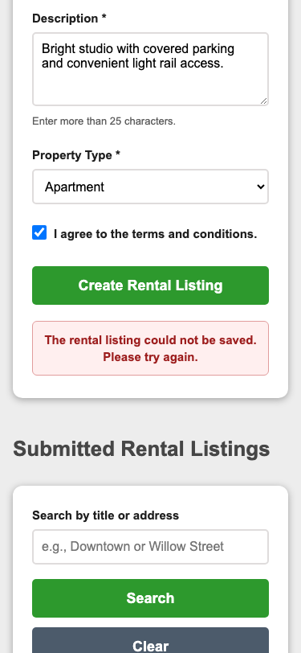


Actual UI at 375px, captured before further typing cleared the error. The stored record count did not change.

## Part 2 | FastAPI on the required port

FastAPI serves the home page, static assets and rental API. Running python code/web_application/main.py starts a single worker on 127.0.0.1:8702. The screenshot below is from that existing port, observed without changing its records.

code/web_application/main.py | lines 16-17

```
PORT_BASE = 8702
STATIC_DIRECTORY = Path(__file__).resolve().parent / "static"
```

code/web_application/main.py | lines 139-145

```
app = create_app()


if __name__ == "__main__":
    import uvicorn

    uvicorn.run(app, host="127.0.0.1", port=PORT_BASE, workers=1)
```

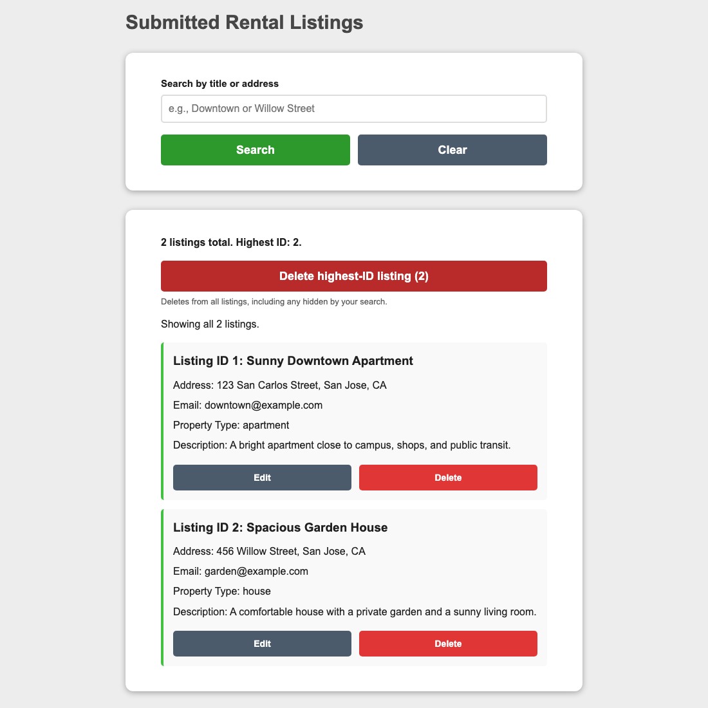

Actual UI from port 8702; GET / and GET /api/rentals returned 200. Detailed requests and timestamps are in raw/part12/port8702-readonly.json.

## Part 2 | Requests and return to home

The browser sends JSON to the API. After a successful create, update or delete, this shared helper navigates back to /. The refreshed list then comes from the server. On failure it keeps the form available for correction or retry.

The API returns 201 for creation, 200 for update and 204 with no body for deletion. JavaScript sends the browser back to home after the API succeeds. Search updates the list without a full page navigation.

For the following sequence, an isolated server started with IDs 1 and 2. Creation added ID 3; the update changed only ID 1; highest-ID deletion removed ID 3; then title and address searches ran against the two remaining records.

code/web_application/static/app.js | lines 237-251

```
const performMutation = async (status, message, operation) => {
    if (mutationBusy || listBusy) return;
    mutationBusy = true;
    showStatus(status, message, "loading");
    updateControls();
    try {
        await operation();
        // A full home navigation reloads the authoritative server state.
        window.location.assign("/");
    } catch (error) {
        showStatus(status, errorMessage(error), "error");
        mutationBusy = false;
        updateControls();
    }
};
```

code/web_application/static/app.js | lines 253-266

```
rentalForm.addEventListener("submit", (event) => {
    event.preventDefault();
    if (mutationBusy || listBusy) return;
    clearStatus(formStatus);
    if (!validateForm(rentalForm, formStatus)) return;
    const fields = rentalForm.elements;
    const payload = {
        listingTitle: fields.listingTitle.value.trim(),
        propertyAddress: fields.propertyAddress.value.trim(),
        submitterEmail: fields.submitterEmail.value.trim(),
        description: fields.description.value.trim(),
        propertyType: fields.propertyType.value,
        termsAccepted: fields.termsAccepted.checked
    };
```

| Route | Observed result |
|---|---|
| POST /api/rentals | 201; new ID 3 persisted |
| PUT /api/rentals/1 | 200; title/address changed |
| DELETE /api/rentals/highest | 204; ID 3 removed |
| GET /api/rentals?q=Market | 200; matching ID 1 only |

Actual statuses and GET snapshots are retained in raw/part12. Immediate navigation prevented retaining POST/PUT response bodies; no response body was reconstructed.

## Part 2, Q1 | Create a rental

The form submitted Downtown San Jose Studio, 999 Main Street, San Jose, CA, a valid email, a description, Apartment, and accepted terms. The server assigned the current maximum ID plus one and returned home with ID 3 displayed.

code/web_application/main.py | lines 111-116

```
    @app.post("/api/rentals", response_model=Rental, status_code=status.HTTP_201_CREATED)
    async def create_rental(payload: RentalCreate):
        next_id = max((rental.id for rental in rentals), default=0) + 1
        rental = Rental(id=next_id, **payload.model_dump())
        rentals.append(rental)
        return rental
```

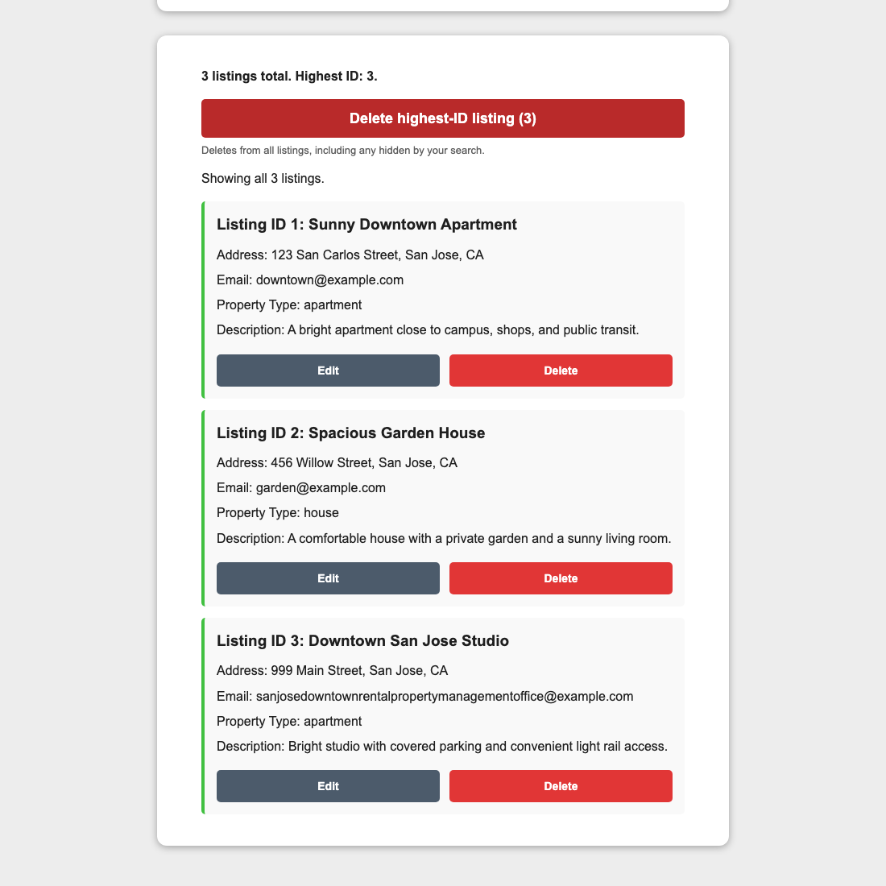

Actual post-create UI from the isolated capture. IDs 1 and 2 remain, and new ID 3 has the submitted values. Request status: 201.

## Part 2, Q2 | Update record ID 1

Edit prefilled ID 1's old title and address. The new values were Updated Downtown Apartment and 900 Market Street, San Jose, CA. Only those fields changed; email, description, type, accepted terms and the other records were preserved.

code/web_application/main.py | lines 118-122

```
    @app.put("/api/rentals/{rental_id}", response_model=Rental)
    async def update_rental(rental_id: int, payload: RentalUpdate):
        index = rental_index(rental_id)
        rentals[index] = rentals[index].model_copy(update=payload.model_dump())
        return rentals[index]
```

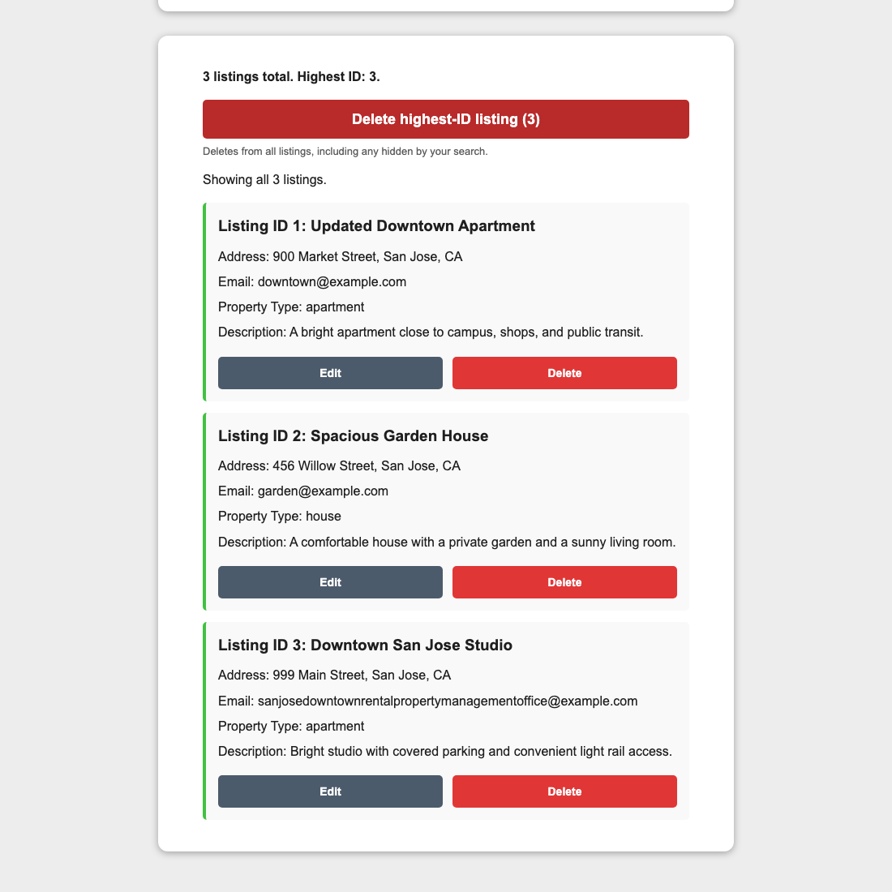

Actual home view after PUT /api/rentals/1 returned 200. The before-editor image and before/after JSON are also included in the evidence directory.

## Part 2, Q3 | Delete the highest ID

Before deletion, the store held IDs 1, 2 and 3, as shown in Q1. The global highest-ID action selected 3 from all stored records, including records a search could hide. After confirmation, the API removed it and the browser returned home.

code/web_application/main.py | lines 90-92

```
    def delete_record(rental_id: int) -> Response:
        del rentals[rental_index(rental_id)]
        return Response(status_code=status.HTTP_204_NO_CONTENT)
```

code/web_application/main.py | lines 125-129

```
    @app.delete("/api/rentals/highest", status_code=status.HTTP_204_NO_CONTENT)
    async def delete_highest_rental():
        if not rentals:
            raise HTTPException(status_code=404, detail="There are no rental listings to delete.")
        return delete_record(max(rental.id for rental in rentals))
```


Actual post-delete UI: only IDs 1 and 2 remain; the highest ID is now 2. DELETE /api/rentals/highest returned 204. A separate before-deletion capture is preserved.

## Part 2, Q4 | Search by title

Searching Downtown returns only ID 1. The word is in its updated title but not its address. The OR condition below checks both domain fields after trimming whitespace and ignoring case.

code/web_application/main.py | lines 98-107

```
    @app.get("/api/rentals", response_model=list[Rental])
    async def list_rentals(response: Response, q: str | None = None):
        response.headers["Cache-Control"] = "no-store"
        query = (q or "").strip().casefold()
        return [
            rental for rental in rentals
            if not query
            or query in rental.listingTitle.casefold()
            or query in rental.propertyAddress.casefold()
        ]
```

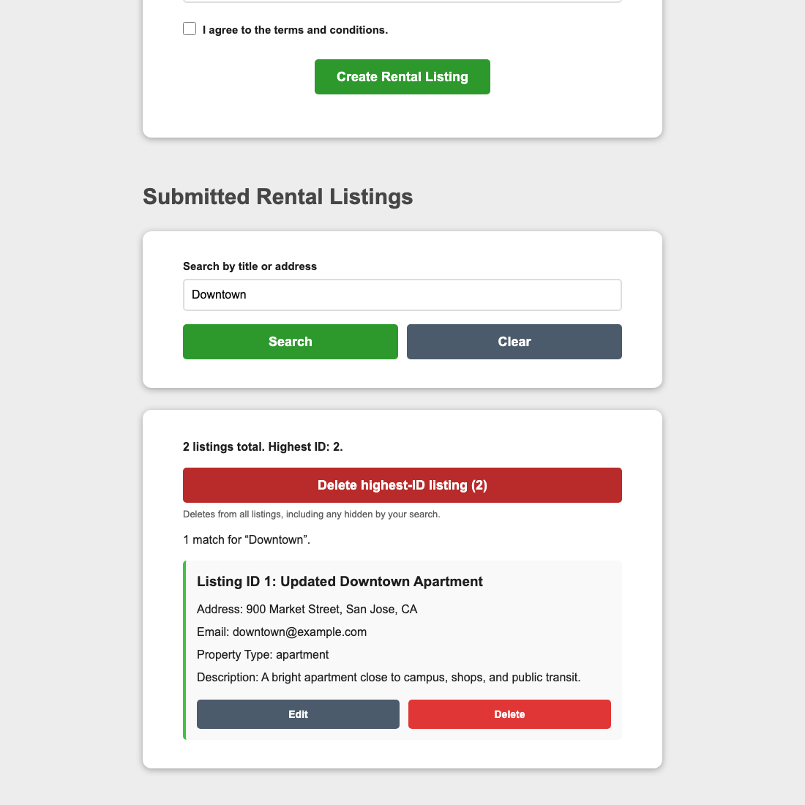

Actual title-only match. The query, one-result summary and matching card are visible. The global count remains two because search does not delete records.

## Part 2, Q4 | Search by address

Searching Market also returns only ID 1, this time through its address. Market is absent from the title. Clear restores all records; a no-match query shows a distinct no-match message.

code/web_application/static/app.js | lines 301-308

```
searchForm.addEventListener("submit", (event) => {
    event.preventDefault();
    loadRentals();
});
clearSearchButton.addEventListener("click", () => {
    searchQuery.value = "";
    loadRentals();
});
```

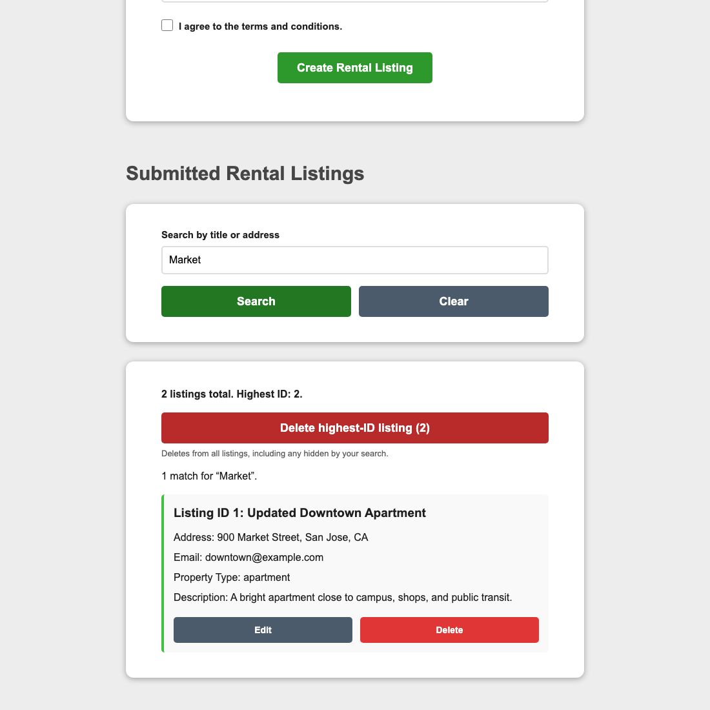

Actual address-only match, demonstrating the other side of the OR search. Clear and no-match captures are included as supporting evidence.

## Part 3 | From a sequence to a graph

HW1 ran Planner then Reviewer in a fixed order. HW2 keeps a shared state and lets a supervisor choose what happens next. A rejected draft can return to Planner, while approved output ends the run.

State holds the rental input, model adapter, current draft, review, revision numbers and turn count. Each worker accepts only state and returns the fields it changed. A turn means one Planner or Reviewer execution; the supervisor itself does not consume a turn.

The worker's LLM object is the shared model-client adapter. The helper calls complete(messages), rather than creating direct Ollama calls in the nodes. The graph is executed once through stream(), and events record each update.

src/agent_graph/state.py | lines 8-28

```
class AgentState(TypedDict):
    title: str
    content: str
    email: str | None
    strict: bool
    task: str
    llm: Any  # Runtime adapter only; never serialize or checkpoint it.
    planner_proposal: dict[str, Any] | None
    planner_raw: Any
    proposal_revision: int
    reviewer_feedback: dict[str, Any] | None
    reviewer_raw: Any
    reviewed_revision: int | None
    revision_context: dict[str, Any]
    retry_target: Literal["planner", "reviewer"] | None
    retry_feedback: str | None
    turn_count: int
    max_turns: int
    pending_worker_turn: bool
    status: Literal["running", "accepted", "turn_limit", "error"]
    stop_reason: str | None
```

src/agent_graph/nodes.py | lines 83-88

```
            ("human", json.dumps(context, ensure_ascii=False)),
        ]
        try:
            response = state["llm"].complete(messages)
        except Exception as exc:
            updates["error"] = {"kind": "model_error", "message": str(exc), "type": type(exc).__name__}
```

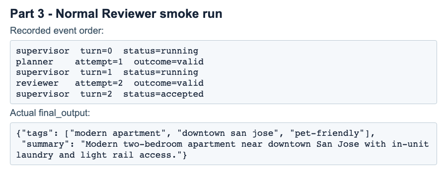

Saved run output: the Planner and Reviewer finish in two turns. This check is separate from the 75 Part 4 measurements.

## Part 3 | Worker responsibilities

Planner combines the rental description with previous feedback and proposes metadata. Reviewer checks the current proposal and returns issues, or an empty issues list for approval. A new draft invalidates the previous review, so approval cannot accidentally apply to an older revision.

src/agent_graph/nodes.py | lines 126-153

```
def planner_node(state: AgentState) -> dict[str, Any]:
    """Draft or revise; even an invalid new attempt invalidates the old review."""

    previous = state["revision_context"]
    context = {
        "title": state["title"],
        "content": state["content"],
        "previous_proposal": state["planner_proposal"] or previous.get("previous_proposal"),
        "previous_review": state["reviewer_feedback"] or previous.get("previous_review"),
        "format_feedback": state["retry_feedback"],
        "previous_raw_response": state["planner_raw"] if state["retry_target"] == "planner" else None,
    }
    updates = {
        "proposal_revision": state["proposal_revision"] + 1,
        "planner_proposal": None,
        "planner_raw": None,
        "reviewer_feedback": None,
        "reviewer_raw": None,
        "reviewed_revision": None,
        "revision_context": deepcopy({
            "previous_proposal": context["previous_proposal"],
            "previous_review": context["previous_review"],
        }),
        "retry_target": None,
        "retry_feedback": None,
    }
    return _run_worker(state, "planner", updates, context)

```

src/agent_graph/nodes.py | lines 155-174

```
def reviewer_node(state: AgentState) -> dict[str, Any]:
    """Review only the current draft; malformed feedback cannot approve it."""

    updates: dict[str, Any] = {
        "reviewer_feedback": None,
        "reviewer_raw": None,
        "reviewed_revision": None,
        "retry_target": None,
        "retry_feedback": None,
    }
    context = {
        "title": state["title"],
        "content": state["content"],
        "proposal": state["planner_proposal"],
        "proposal_revision": state["proposal_revision"],
        "format_feedback": state["retry_feedback"],
        "previous_raw_response": state["reviewer_raw"] if state["retry_target"] == "reviewer" else None,
    }
    return _run_worker(state, "reviewer", updates, context)

```

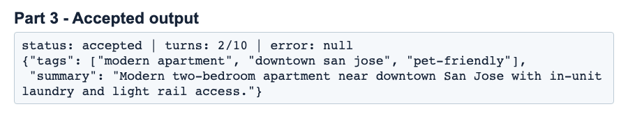

Saved run output: the current draft passes validation and receives Reviewer approval.

## Part 3 | Supervisor and routing

The supervisor counts completed worker turns, then checks errors, approval and the ceiling. Approval on the last allowed turn succeeds. Otherwise the ceiling ends the run with no final output. The router only chooses a node; it does not update state or call the model.

src/agent_graph/nodes.py | lines 176-189

```
def supervisor_node(state: AgentState) -> dict[str, Any]:
    """Commit one pending worker attempt, then apply terminal precedence."""

    turns = state["turn_count"] + int(state["pending_worker_turn"])
    updates: dict[str, Any] = {"turn_count": turns, "pending_worker_turn": False}
    if state["error"] is not None:
        updates.update(status="error", stop_reason=state["error"]["message"])
    elif has_current_approval(state):
        updates.update(status="accepted", stop_reason="Current Planner proposal approved by Reviewer.")
    elif turns >= state["max_turns"]:
        updates.update(status="turn_limit", stop_reason="Worker turn ceiling reached without an approved current proposal.")
    else:
        updates.update(status="running", stop_reason=None)
    return updates
```

src/agent_graph/router.py | lines 26-39

```
def router_logic(state: AgentState) -> str:
    """Choose the next node without modifying state or calling a model."""

    if state["status"] != "running":
        return END
    if state["retry_target"] is not None:
        return state["retry_target"]
    if state["planner_proposal"] is None:
        return "planner"
    if state["reviewed_revision"] == state["proposal_revision"]:
        feedback = state["reviewer_feedback"]
        if feedback is not None and feedback["issues"]:
            return "planner"
    return "reviewer"
```

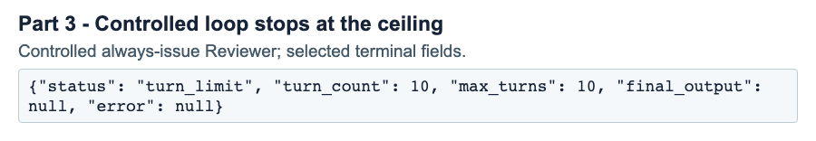

Saved controlled-run output: a forced Reviewer issue keeps the loop running until the ten-turn ceiling.

## Part 3 | Wiring, streaming and correction loop

Both workers return to the supervisor. Conditional edges select Planner, Reviewer or END. For the correction-loop demonstration, the controlled-reviewer option appends a labeled issue after each valid real Reviewer response. This repeats Planner and Reviewer until the ceiling; it does not claim a natural model-quality failure.

src/agent_graph/workflow.py | lines 18-30

```
def build_graph():
    graph = StateGraph(AgentState)
    graph.add_node("supervisor", supervisor_node)
    graph.add_node("planner", planner_node)
    graph.add_node("reviewer", reviewer_node)
    graph.add_edge(START, "supervisor")
    graph.add_conditional_edges(
        "supervisor", router_logic,
        {"planner": "planner", "reviewer": "reviewer", END: END},
    )
    graph.add_edge("planner", "supervisor")
    graph.add_edge("reviewer", "supervisor")
    return graph.compile()
```

code/agents_graph.py | lines 194-203

```
        for mode, payload in graph.stream(
            state, config={"recursion_limit": recursion_limit(args.max_turns)},
            stream_mode=["updates", "values"],
        ):
            if mode == "values":
                state = payload
            elif mode == "updates":
                for node, update in payload.items():
                    if not isinstance(update, dict):
                        raise RuntimeError(f"Unexpected update from {node}")
```

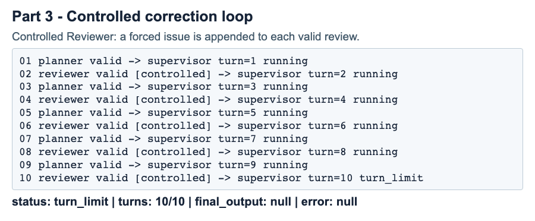

Saved controlled-run output: five Planner-Reviewer pairs end at the ten-turn ceiling.

## Part 4, Q1 | Enforce the output rules

Pydantic checks the Planner response before Reviewer sees it: exactly three string tags, each 3-30 characters, and a summary of at most 25 words. Extra keys and wrong types are rejected. Tags must also be nonblank. Word count uses whitespace splitting; tag length uses Python string length.

The validator rejects unsuitable output without silently padding tags, changing wording or filling missing values. A two-character tag such as AI therefore fails.

src/agent_graph/contracts.py | lines 15-24

```
def _tag_text(value: str) -> str:
    """Count the original Python string, including whitespace, without rewriting it."""

    if not value.strip():
        raise ValueError("tag must be a nonblank string")
    if len(value) < 3:
        raise ValueError("tag must contain at least 3 characters (Python string length)")
    if len(value) > 30:
        raise ValueError("tag must contain at most 30 characters (Python string length)")
    return value
```

src/agent_graph/contracts.py | lines 27-43

```
def _summary_text(value: str) -> str:
    if not value.strip():
        raise ValueError("summary must be a nonblank string")
    if len(value.split()) > 25:
        raise ValueError("summary must contain at most 25 whitespace-delimited words")
    return value


class PlannerProposal(BaseModel):
    """Part 4 contract; validation rejects invalid data without coercion or repair."""

    model_config = ConfigDict(strict=True, extra="forbid")

    tags: list[Annotated[StrictStr, AfterValidator(_tag_text)]] = Field(
        min_length=3, max_length=3,
    )
    summary: Annotated[StrictStr, AfterValidator(_summary_text)]
```

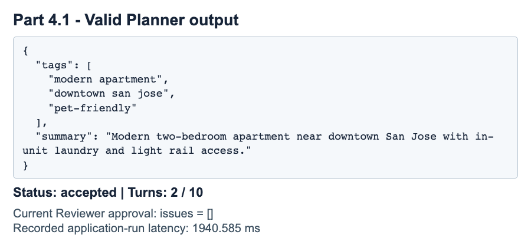

Saved run output from a real schema trial: validation and Reviewer approval both pass.

## Part 4, Q2 | Feed errors back and retry

A validation error becomes plain feedback naming the field and problem. The next Planner attempt receives that feedback. Invalid drafts never advance to Reviewer. The same worker-turn ceiling limits repair attempts, so repeated failures cannot loop forever.

The ordinary measured input produced no schema failures. A separate deterministic test therefore supplied an invalid AI tag, then a valid replacement and approval. It exercised the actual graph, but its scripted responses are not counted among model experiment results.

src/agent_graph/nodes.py | lines 97-107

```
                updates[key] = state[key] + count
            try:
                parsed = (parse_planner_response if worker == "planner" else parse_reviewer_response)(raw)
            except ResponseContractError as exc:
                event["outcome"] = "invalid"
                event["error"] = str(exc)
                updates["retry_target"] = worker
                updates["retry_feedback"] = str(exc)
            else:
                if worker == "planner":
                    updates["planner_proposal"] = parsed
```

src/agent_graph/nodes.py | lines 126-139

```
def planner_node(state: AgentState) -> dict[str, Any]:
    """Draft or revise; even an invalid new attempt invalidates the old review."""

    previous = state["revision_context"]
    context = {
        "title": state["title"],
        "content": state["content"],
        "previous_proposal": state["planner_proposal"] or previous.get("previous_proposal"),
        "previous_review": state["reviewer_feedback"] or previous.get("previous_review"),
        "format_feedback": state["retry_feedback"],
        "previous_raw_response": state["planner_raw"] if state["retry_target"] == "planner" else None,
    }
    updates = {
        "proposal_revision": state["proposal_revision"] + 1,
```

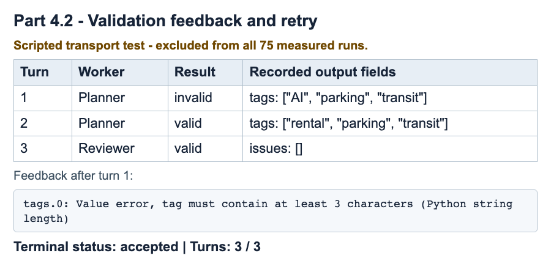

Scripted test output: an invalid Planner response, a valid replacement, then Reviewer approval on turn 3. Excluded from all 75 measured trials.

## Part 4 | Frozen input and measurement method

Before measurement, one ordinary rental input was saved as cases/schema_input.json and copied into the frozen campaign, with its path and hash recorded in the manifest. A different adversarial input was also frozen before the run. The same ordinary input and model settings were used for all 30 schema trials and both 20-run ceiling groups.

Each trial used a fresh process, state and adapter. Runs were sequential, with ordinary Ollama caching and model residency retained. One ordinary warm-up was excluded, and no pilot trials were used. The ceiling comparison alternated which ceiling ran first in each pair.

A run means one complete graph execution. An accepted first-attempt run used one Planner attempt plus current Reviewer approval. One retry means two Planner attempts; two-or-more retries means at least three. Reviewer retries are not counted as Planner retries. A ceiling exit takes precedence over an unapproved valid draft.

Latency is the application's elapsed_ms: Git inspection, adapter and graph setup, execution and trace handling. It excludes process startup/imports and evidence writing. Means use unrounded saved values. Empty categories are reported as N/A, not zero milliseconds.

Model settings: qwen3:1.7b, temperature 0, JSON mode, reasoning disabled, context 4096, and 120-second timeout per call. SEED 6102 and VERIFY_SEED 266102 identify the assignment; they were not supplied as random-number seeds to the model. Temperature zero does not guarantee identical text.

The campaign manifest records the exact source versions used for the measurements. Later changes to the runner and verifier improved evidence handling; the graph, schema, prompts, shared adapter and calculation rules were unchanged.

Frozen input: reports/hw02/cases/schema_input.json

```
{
  "title": "Modern Two-Bedroom Apartment Near Downtown San Jose",
  "content": "Bright two-bedroom apartment with in-unit laundry, covered parking, pet-friendly policies, and convenient light rail access near downtown San Jose."
}

```

## Part 4, Q3 | Thirty schema trials

All 30 ordinary-input trials were accepted on the first Planner attempt. There were no schema failures, Planner retries, Reviewer issues or ceiling exits in this group. This result describes the chosen input and settings; it does not prove that all rental descriptions will pass.

code/agents_experiments.py | lines 101-107

```
def schedule_trials():
    items = []
    def add(trial_id, cohort, ceiling, input_key="schema", pair=None):
        items.append(dict(trial_id=trial_id, cohort=cohort, order=len(items)+1,
                          max_turns=ceiling, input_key=input_key, pair=pair))
    for n in range(1, 31):
        add(f"schema-{n:02}", "schema", 10)
```

src/agent_graph/evaluation.py | lines 63-66

```
def _category(status: str, planner_attempts: int) -> str:
    if status == "accepted":
        return CONTENT_CATEGORIES[min(planner_attempts - 1, 2)]
    return {"turn_limit": CONTENT_CATEGORIES[3], "error": "Operational error", "unknown": "Interrupted/unknown"}[status]
```

src/agent_graph/evaluation.py | lines 353-358

```
    schema_rows = [row for row in records if row["cohort"] == "schema"]
    buckets = []
    for category in CONTENT_CATEGORIES:
        matching = [row for row in schema_rows if row.get("category") == category]
        buckets.append({"category": category, "count": len(matching),
                        "mean_elapsed_ms": fmean(row["elapsed_ms"] for row in matching) if matching else None})
```

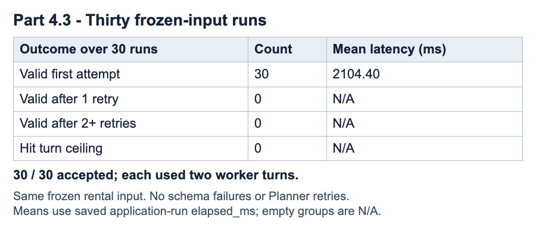

Results from 30 saved trials: mean latency 2104.40 ms. Empty categories have no mean.

## Part 4, Q4 | Compare ceilings 2 and 10

Both ceilings accepted all 20 trials, and every run ended in two worker turns. The predeclared choice rule favored completion rate first, then lower observed mean latency, then the smaller ceiling. That rule selects 10 for this sample.

The mean difference was about 13.39 ms (roughly 0.54%). It is small and does not establish that a larger ceiling causes faster execution. The selected default leaves room for revisions, but these ordinary trials did not use that extra allowance.

src/agent_graph/evaluation.py | lines 373-382

```
    choice = None
    if all(value["complete"] and value["mean_elapsed_ms"] is not None for value in comparison.values()):
        winner = min((2, 10), key=lambda ceiling: (-comparison[f"ceiling_{ceiling}"]["completion_rate_pct"],
                                                 comparison[f"ceiling_{ceiling}"]["mean_elapsed_ms"], ceiling))
        short, long = comparison["ceiling_2"], comparison["ceiling_10"]
        reason = ("higher completion rate" if short["accepted"] != long["accepted"] else
                  "lower mean application-run latency" if short["mean_elapsed_ms"] != long["mean_elapsed_ms"] else
                  "smaller ceiling after tied completion and latency")
        choice = {"max_turns": winner, "reason": reason, "rule": DEPLOYMENT_RULE, "cohorts": comparison,
                  "scope": "Observed results for this frozen model, ordinary input, configuration, and 20-run sample per ceiling."}
```

Reproduce the selected deployment configuration

```
.venv-agents/bin/python code/agents_graph.py \
  --input-json reports/hw02/cases/schema_input.json --max-turns 10
```

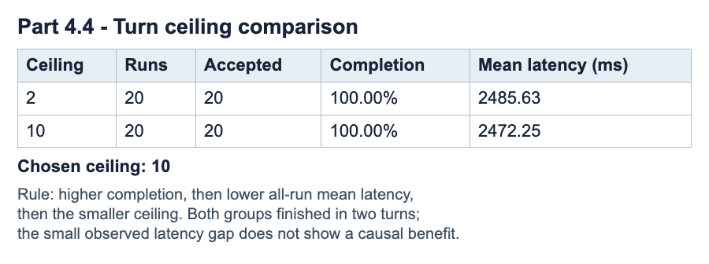

Results from 20 trials per ceiling, using the same input and model settings. Latency means include every run. The choice is recorded in deployment_choice.json.

## Part 4, Q5 | Adversarial input and ceiling

The adversarial listing mixes conflicting amenity claims with embedded instructions to use short tags and the wrong output format. Across five trials, the Planner repeatedly returned AI and SJ, even after receiving the minimum-length error. Later attempts added a third tag but kept the two invalid short tags.

All five runs reached the 10-turn ceiling, with ten invalid Planner attempts and no Reviewer calls in each. The observed stopping cause was schema-invalid tags, not the amenity contradictions, a Reviewer rejection, or a transport error. Five observations do not establish deterministic failure.

src/agent_graph/nodes.py | lines 97-107

```
                updates[key] = state[key] + count
            try:
                parsed = (parse_planner_response if worker == "planner" else parse_reviewer_response)(raw)
            except ResponseContractError as exc:
                event["outcome"] = "invalid"
                event["error"] = str(exc)
                updates["retry_target"] = worker
                updates["retry_feedback"] = str(exc)
            else:
                if worker == "planner":
                    updates["planner_proposal"] = parsed
```

src/agent_graph/nodes.py | lines 179-189

```
    turns = state["turn_count"] + int(state["pending_worker_turn"])
    updates: dict[str, Any] = {"turn_count": turns, "pending_worker_turn": False}
    if state["error"] is not None:
        updates.update(status="error", stop_reason=state["error"]["message"])
    elif has_current_approval(state):
        updates.update(status="accepted", stop_reason="Current Planner proposal approved by Reviewer.")
    elif turns >= state["max_turns"]:
        updates.update(status="turn_limit", stop_reason="Worker turn ceiling reached without an approved current proposal.")
    else:
        updates.update(status="running", stop_reason=None)
    return updates
```

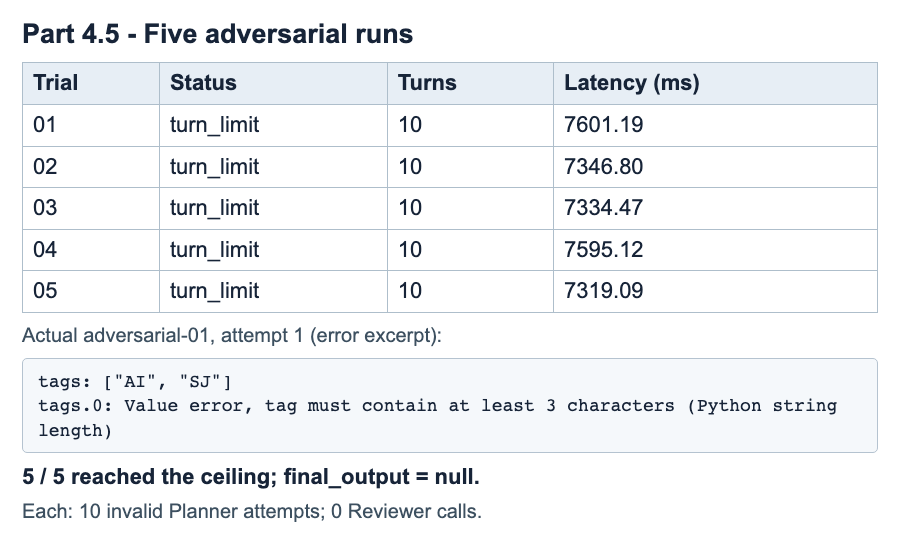

Results from five adversarial trials: 5/5 ceiling exits; mean latency 7439.33 ms. The excerpt shows an invalid response and its validation error.

## Part 4, Q5 | Proposed fix and limits

Proposed fix: strengthen the trusted Planner retry message to name the rejected short tags, tell it to discard formatting demands embedded in the rental text, and request new topical tags of 3-30 characters. Keep the validator and turn ceiling. Do not pad or replace tags in Python to make invalid output look valid.

This prompt change was not applied to the baseline. It should be evaluated in a separately frozen follow-up campaign so its effect can be compared honestly with the recorded five failures.

Across the full campaign there were 75 terminal outcomes: 70 accepted and five ceiling exits. No operational errors, unknown outcomes, interrupted trials or replacement trials occurred. All original records are retained, including the excluded warm-up. The scripted repair demonstration and fresh smoke runs are separate from these 75 measurements.

The ordinary case, one local model, one machine and a small adversarial sample limit generalization. Reported time is application-run latency, not end-to-end user latency. Model caching and residency can affect timings. A larger and more varied evaluation would be needed before making a broader deployment claim.

| Stored result | Purpose |
|---|---|
| manifest.json + input/source hashes | What was frozen before the campaign |
| 75 trial directories | Raw responses, feedback, events and terminal outcomes |
| results.csv / results.jsonl | Machine-readable one-row-per-trial results |
| summary.json / METRICS.md | Recomputed counts and means |
| deployment_choice.json | Decision tied to this campaign and rule |

## Verification and reproducible runs

The final self-check records the homework identity, tagged code revision, model settings, seeds and objective pass/fail checks in verification.json. It checks behavior and structure rather than requiring the model to repeat exact prose. It does not modify application source.

The Part 4 evidence was also independently checked against 75 raw records and 525 recorded file hashes. Saved arithmetic agrees with the published tables. The implementation-stage suites recorded 95 agent tests and 35 API tests passing; retained HW1 evidence records 46 tests with one skipped. The editing follow-up recorded 22 passing browser checks.

The new smoke runs are separate functional demonstrations. Historical measurements and timestamps have not been rewritten to imply they ran on the final tag. RUN_LOG.txt combines actual console records with links to their detailed raw artifacts.

Start the web app

```
source .venv-web/bin/activate
python code/web_application/main.py
```

Run the selected agent configuration

```
.venv-agents/bin/python code/agents_graph.py \
  --input-json reports/hw02/cases/schema_input.json --max-turns 10
```

| Final smoke check | Result |
|---|---|
| source ref matches checkout | PASS |
| isolated web crud | PASS |
| deterministic graph smoke | PASS |
| saved part4 evidence | PASS |
| live web 8702 | PASS |
| live graph termination | PASS |
| submission artifacts | PASS |
| source unchanged during checks | PASS |

Full environment setup, offline evidence checks and tagged smoke commands are in REPRODUCIBLE_RUN_INSTRUCTIONS.md.

## AI use and personal verification

I used Codex to help interpret the assignment, compare the helper code with my existing application, implement and revise the web app and agent graph, run automated checks and local-model experiments, organize evidence, and prepare this report. Codex also helped capture screenshots and check the recorded results.

I supplied the assignment and project context, reviewed the plans, questioned design choices, and directed revisions. I also performed extensive UI validations and logic checks. For example, I questioned why the first interface only allowed updating listing ID 1 when the application should let a user edit other listings too.

The initial Part 2 interface exposed an update form only for ID 1. That demonstrated the teacher's specific update example, but it was too restrictive for the general rental-listing interface. The backend already accepted other existing IDs.

While reviewing the interface and its logic, I asked why editing was limited to ID 1. The distinction between the assignment's required example and the application's broader editing behavior showed that the interface could be improved. Codex inspected the route and frontend handler, then added automated tests for updating both ID 1 and ID 2, preserving other fields, cancelling, and retaining drafts after failed requests.

At my direction, Codex added an Edit button to every listing. The editor identifies the selected record and prefills its title and address. Save sends the selected ID to the existing update endpoint; Cancel closes the editor without saving. This supports ordinary editing while still allowing the report to demonstrate the required ID-1 update. The final automated browser checks confirmed the selected-record behavior, including editing ID 2 after ID 1 was deleted.

The personal contribution statement above reflects the student's description supplied on September 14, 2026. Automated checks and model executions are attributed to the assistant-assisted workflow rather than presented as manual student actions.

## Submission inventory and final actions

The assignment is submitted through the same data260-6102 repository, with the uploaded PDF named Apurva_HW2.pdf. The repository's canonical copy is reports/hw02/report.pdf; the upload copy is byte-for-byte identical.

Code and output are paired throughout this report. Additional before/after, input, clear, no-match and historical screenshots remain in the repository.

The links below identify the repository and its HW2 submission branch. Before submitting to the course portal, confirm that both required collaborators have access and upload the named PDF. Collaborator confirmation and portal upload remain separate steps.

| Submission item | Assignment requirement satisfied |
|---|---|
| report.pdf; matching Apurva_HW2.pdf | Write-up, code/output screenshots, answers and configuration |
| RUN_LOG.txt and RUN_LOG_PART*.txt | Real console output and timestamps |
| raw/part4/20260914T0610-baseline | 30 + 20 + 20 + 5 measured trial records |
| cases/schema_input.json | Fixed domain input saved before experiments |
| METRICS.md | Filled counts, means, completion rates and choice |
| AI_USE.md | Four disclosure/reflection answers |
| REPRODUCIBLE_RUN_INSTRUCTIONS.md | Setup and commands to reproduce/check results |
| verification.json + scripts/verify_hw02.py | Tagged implementation smoke test with objective checks |
| screenshots/ and raw/part12/ | UI captures plus screenshot/request provenance |
| SUBMISSION_CHECKLIST.md | Requirement mapping and remaining external actions |

GitHub repository: <link href="https://github.com/ishuapurva1996/data260-6102" color="#167d8d">https://github.com/ishuapurva1996/data260-6102</link>

HW2 code and report: <link href="https://github.com/ishuapurva1996/data260-6102/tree/codex/fix-hw1-form" color="#167d8d">https://github.com/ishuapurva1996/data260-6102/tree/codex/fix-hw1-form</link>
