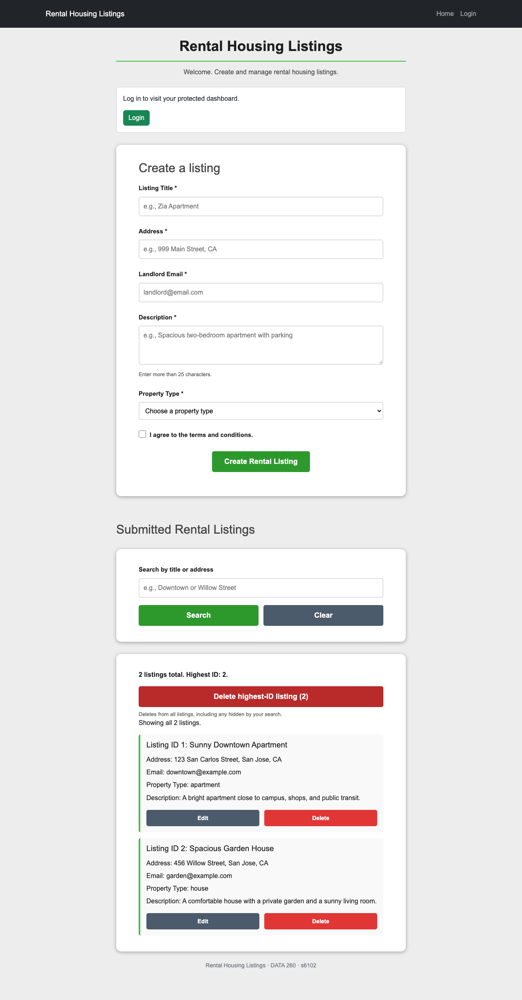
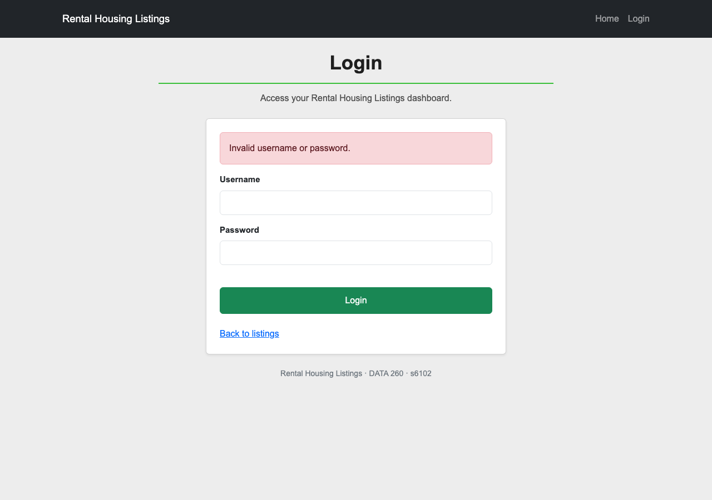
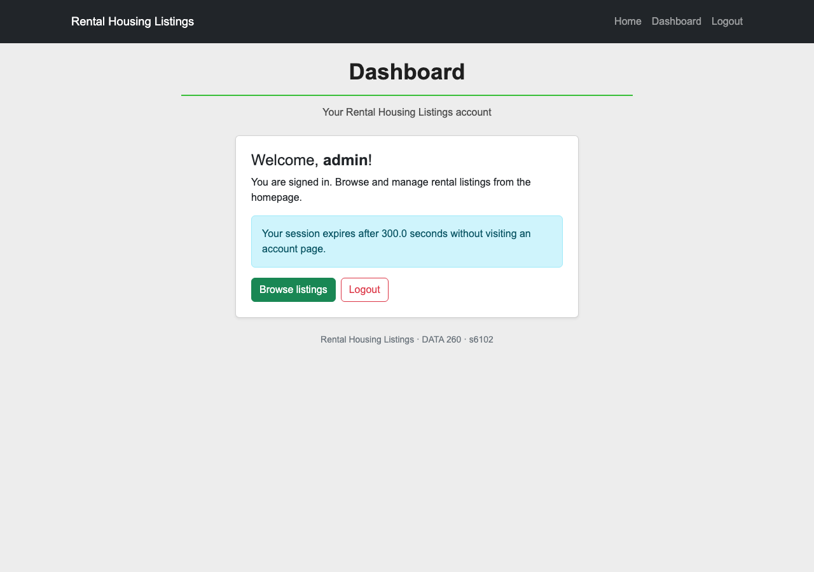
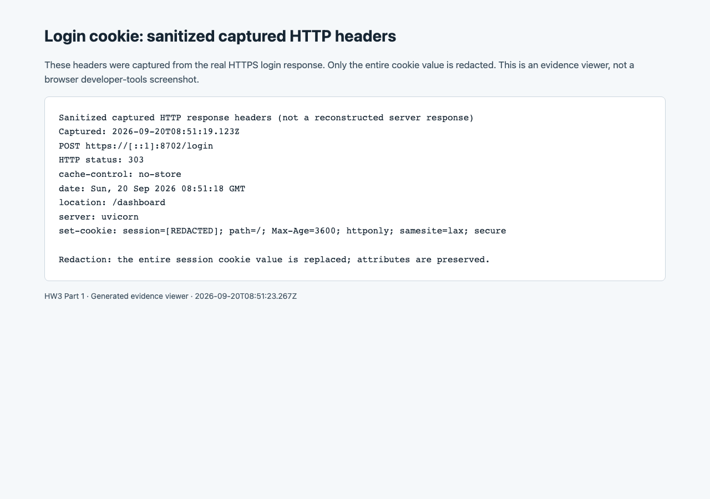
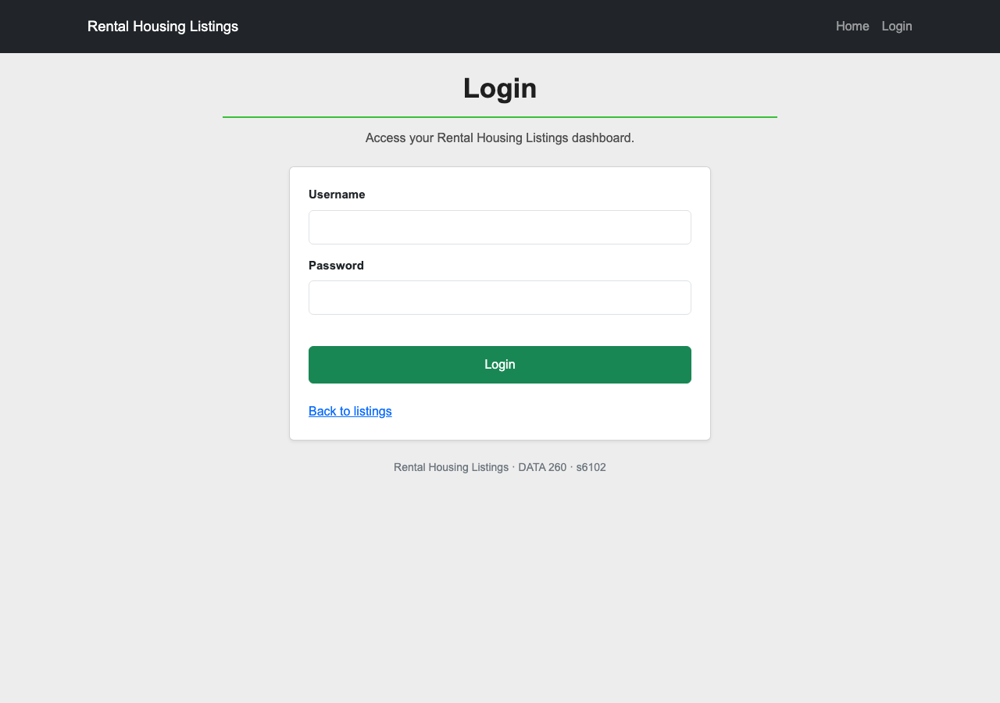
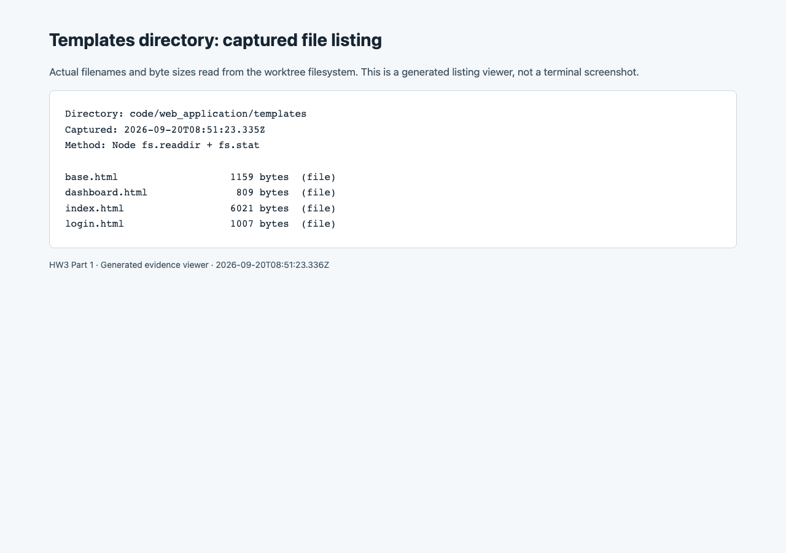

# Part 1: Authentication for Rental Housing Listings

## Configuration and execution environment

| Value | This implementation |
|---|---|
| SID4 | 6102 |
| PORT_BASE | 8702 = 8000 + (6102 mod 900) |
| PREFIX | s6102 |
| SEED | 6102 |
| VERIFY_SEED | 266102 |
| DOMAIN_ID | 6 = 6102 mod 8; Rental Housing Listings |
| Hardware | MacBook Air, Apple M4, 10 CPU cores, 24 GB memory |
| Operating system | macOS 15.7.4, arm64 |
| Runtime | Python 3.12.14; Node.js v24.19.0 |
| Web software | FastAPI 0.109.0, Starlette 0.35.1, Uvicorn 0.27.0, Jinja2 3.1.6, python-multipart 0.0.20, itsdangerous 2.2.0, HTTPX 0.27.2, Bootstrap 5.3.2 |
| Browser | Playwright 1.62.1; Chromium 151.0.7922.34 |
| Local AI model | None used by Part 1 at runtime |
| Tested code commit | `015c8224ea9a0aa265385931c1fb81ecba409313` |
| Evidence collection | 2026-09-20T08:51:17.847Z to 2026-09-20T08:51:23.428Z (UTC) |

This section covers Part 1 only. The final submission tag and combined PDF belong to later integration; no final `hw3` tag is claimed here. The live demonstration used `https://[::1]:8702`, the IPv6 loopback address. The existing server on `127.0.0.1:8702` belonged to the shared checkout and was left running. [Run instructions](REPRODUCIBLE_RUN_INSTRUCTIONS.md), [console evidence](RUN_LOG.txt), and [machine-readable browser results](../raw/part1/browser-evidence.json) record the exact setup and checks.

## What was added

HTTP requests do not automatically remember who made an earlier request. A **session** connects later requests to a login. In this app, valid demo credentials create a random session identifier. The browser receives a signed cookie containing that identifier and the username. A signature lets the server detect changed cookie contents; it does not encrypt the cookie. No password is stored in it.

The server also keeps a registry of active session identifiers, usernames, and last-activity times. A request to the dashboard must pass both checks: the signed cookie must be valid, and its identifier and username must match an active registry entry. This second check makes logout and inactivity enforceable even if somebody saved a copy of the cookie.

The existing rental app was extended rather than copied. A separate `routers/auth.py` handles the four requested paths. Jinja renders one shared homepage, retaining the rental form IDs and the existing JavaScript/API behavior. A base template shares the Bootstrap navbar; cards, buttons and alerts style the account pages. Bootstrap is stored locally so page appearance does not depend on a CDN being available during a run.

| Route | Observed behavior |
|---|---|
| GET / | Anonymous users see Login plus rental controls; signed-in users see Dashboard and Logout. |
| GET /login | Displays labeled username/password fields. |
| POST /login | Valid `admin` / `password` credentials produce HTTP 303 to /dashboard. Invalid credentials return HTTP 401 with a visible Bootstrap alert. |
| GET /dashboard | Displays the username after registry validation; anonymous, revoked or expired sessions receive HTTP 303 to /login. |
| GET /logout | Removes the registry entry, clears the cookie and produces HTTP 303 to /. |

These credentials are public teaching credentials. This assignment does not add registration, a password database, or authentication to the rental API.

**Homepage, anonymous state.** The existing create, edit, search and delete interface remains available.



**Login and invalid input.** The same page displays an alert when the credentials do not match.




**Protected dashboard.** The successful login displays `admin` and the normal 300-second idle limit.



**Logout result.** Logout is a redirect, not an HTML page. The recorded response is 303 with `Location: /`; the resulting homepage has Login again. The browser JSON also records the cookie-clearing response.


## Cookie security and copied-cookie rejection

The assignment asks for three cookie attributes without naming them. This implementation interprets them as **HttpOnly**, **Secure**, and **SameSite**. HttpOnly prevents ordinary page JavaScript from reading the cookie; Secure restricts sending it to HTTPS; SameSite=lax restricts cross-site cookie sending. The captured login header contains all three and `Max-Age=3600`. These flags complement the registry; they do not revoke copied tokens themselves.

The following image displays the actual captured HTTPS response headers with the entire token replaced by `[REDACTED]`. It is a labeled evidence viewer, not a simulated developer-tools screenshot. The raw header is saved [alongside the capture](../raw/part1/desktop-login-response-headers.txt).



The local server used a self-signed development certificate with localhost, 127.0.0.1 and ::1 names. The dedicated automated browser contexts explicitly accepted that certificate. No operating-system trust settings changed. Chromium confirmed that it sent the resulting cookie in its HTTPS dashboard request.

The idle deadline is separate from cookie lifetime. Before renewing a session, the registry rejects it when elapsed inactivity is **at least 300 seconds**. Visiting the home, login or dashboard page renews an active session. Static files and rental API requests do not. Logout and a replacement login remove the old identifier. Normal auth access also removes expired registry entries; a process restart clears all entries. The app runs one worker, matching its existing memory-only rental store.

| Proof | Method | Result |
|---|---|---|
| Logged-out cookie cannot be reused | Copy a valid cookie, log out, send the copy to /dashboard from a fresh browser context | HTTP 303 to /login at both desktop and mobile widths |
| Idle-expired cookie cannot be reused | Start a separate server with an explicit 2-second demo limit, copy a valid cookie, wait without auth-page activity, replay it from a fresh context | HTTP 303 to /login; original browser is also denied on revisit |
| Normal idle boundary | Inject a test clock; request at 299.999 seconds and then at exactly 300 seconds since last activity | Before-boundary access renews the session; exact-boundary access is denied |
| Cookie validity is insufficient | Test tampering, unknown IDs, username mismatch, replaced cookies and independent app instances | No protected dashboard access |

The 2-second demonstration override affects only its own process. The saved source still defaults to 300 seconds. Copying the old cookie into a fresh browser is essential: merely showing an empty cookie jar after logout would not prove that the server rejects a stolen copy.




## Responsive behavior, templates, and verification

The auth suite exercised the pages at 1280px and 375px, checking that the document and body never exceeded the viewport width. All 19 delivered screenshots were visually inspected. The mobile navbar wraps when signed in, labels remain readable, and form controls and alerts fit the page.


The templates directory contains `base.html`, `index.html`, `login.html`, and `dashboard.html`. This screenshot renders filenames and byte sizes read from the actual filesystem; it is explicitly labeled as a listing viewer.



| Verification | Observed result |
|---|---|
| Existing rental API tests | 35 passed |
| Auth and verifier tests | 49 passed; 84 Python tests total |
| Existing HW2 rental browser suite | 22 passed, 0 failed |
| HTTPS auth/browser evidence suite | 27 passed, 0 failed; 19 screenshots |

The self-check writes [verification.json](verification.json) and exits nonzero if any check fails. Tests prove it does not accept an overall browser pass when an individual check failed, notices a missing screenshot, and returns failure when the auth tests fail. It also compares captured source hashes to the tested code commit and current files, so stale screenshots cannot silently verify later source changes.

The test logs retain dependency deprecation warnings from the pinned FastAPI/Starlette/HTTPX stack. Docker packaging was inspected and documented, but a Docker image was not built. The historical HW2 whole-report verifier compares the old static homepage bytes and is not claimed to pass on this Jinja homepage; the preserved API and browser regression suites provide current rental checks. [Integration notes](INTEGRATION_NOTES.md) explain these limits and the remaining combined-report work.

## AI use

Codex implemented the code, authored and ran automated tests, collected screenshots, and drafted this report section from the supplied assignment and plan. The student supplied the project, configuration, and scope; this section does not claim unrecorded student coding or manual verification. One AI review incorrectly proposed removing type guards on decoded session JSON. Inspection of the middleware and tests using signed non-dictionary payloads showed why the guards were needed, so they were retained. The browser collector's initial assumption about a nonexistent lockfile was corrected after its actual filesystem error. Full answers to all four AI-use questions are in [AI_USE.md](AI_USE.md).

## References

The provided tutor files informed the separate-router and Bootstrap-template structure. The implementation extends that example with alerts, absolute template paths, nonconstant signing keys, and server-side session revocation. Technical references checked during this work: [Starlette 0.35.1 session middleware](https://raw.githubusercontent.com/encode/starlette/0.35.1/starlette/middleware/sessions.py), [FastAPI form handling](https://fastapi.tiangolo.com/tutorial/request-forms/), and [Uvicorn HTTPS settings](https://uvicorn.dev/settings/#https).

## Full auth.py source

Only auth.py is reproduced below, as the Part 1 instruction requests. The session registry, application factory, templates, tests and run scripts remain in the repository.

```python
"""HTML authentication routes for the Rental Housing Listings teaching app."""

from pathlib import Path

from fastapi import APIRouter, Form, Request
from fastapi.responses import HTMLResponse, RedirectResponse
from fastapi.templating import Jinja2Templates


router = APIRouter()
templates = Jinja2Templates(directory=Path(__file__).resolve().parents[1] / "templates")
NO_STORE = {"Cache-Control": "no-store"}


def current_user(request: Request) -> str | None:
    """Trust a signed cookie only while its matching server session is active."""
    session = request.session
    sid = session.get("sid") if isinstance(session, dict) else None
    user = session.get("user") if isinstance(session, dict) else None
    user = request.app.state.session_store.authenticate(sid, user)
    if user is None:
        request.scope["session"] = {}
    return user


def revoke_session(request: Request) -> None:
    session = request.session
    sid = session.get("sid") if isinstance(session, dict) else None
    request.app.state.session_store.revoke(sid)
    request.scope["session"] = {}


@router.get("/", response_class=HTMLResponse)
async def home(request: Request):
    return templates.TemplateResponse(
        request=request, name="index.html", context={"user": current_user(request)}, headers=NO_STORE,
    )


@router.get("/login", response_class=HTMLResponse)
async def login_page(request: Request):
    return templates.TemplateResponse(
        request=request, name="login.html",
        context={"user": current_user(request), "error": None}, headers=NO_STORE,
    )


@router.post(
    "/login", response_class=RedirectResponse, status_code=303,
    response_description="Redirect to the dashboard after successful login.",
    responses={401: {
        "description": "Invalid credentials; display the login form with an error.",
        "content": {"text/html": {"schema": {"type": "string"}}},
    }},
)
async def login(request: Request, username: str = Form(""), password: str = Form("")):
    # Replacement and unsuccessful login attempts both discard the old login.
    revoke_session(request)
    if username != "admin" or password != "password":
        return templates.TemplateResponse(
            request=request, name="login.html",
            context={"user": None, "error": "Invalid username or password."},
            status_code=401, headers=NO_STORE,
        )
    sid = request.app.state.session_store.create(username)
    request.session.update({"user": username, "sid": sid})
    return RedirectResponse("/dashboard", status_code=303, headers=NO_STORE)


@router.get(
    "/dashboard", response_class=HTMLResponse,
    responses={303: {"description": "Redirect to login when no active session exists."}},
)
async def dashboard(request: Request):
    user = current_user(request)
    if user is None:
        return RedirectResponse("/login", status_code=303, headers=NO_STORE)
    return templates.TemplateResponse(
        request=request, name="dashboard.html",
        context={"user": user, "idle_timeout": request.app.state.session_store.idle_timeout},
        headers=NO_STORE,
    )


@router.get(
    "/logout", response_class=RedirectResponse, status_code=303,
    response_description="Redirect home after revoking the session.",
)
async def logout(request: Request):
    revoke_session(request)
    return RedirectResponse("/", status_code=303, headers=NO_STORE)
```
