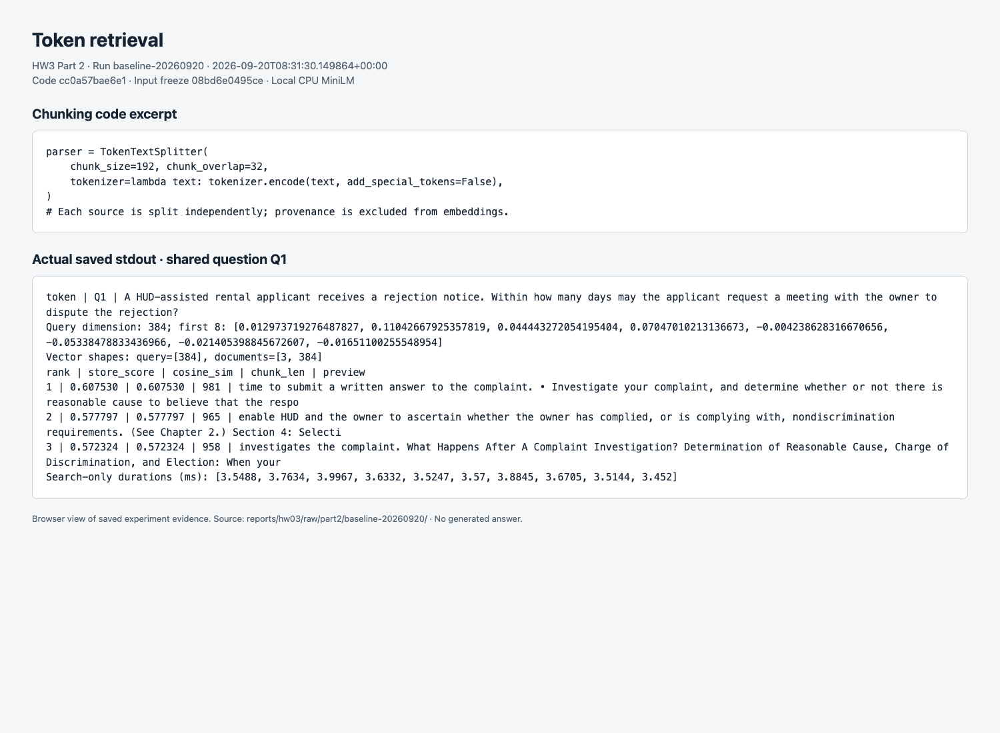
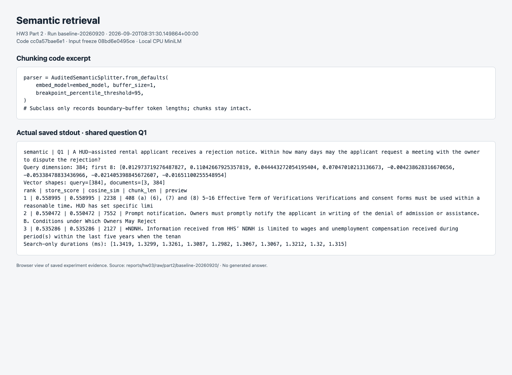
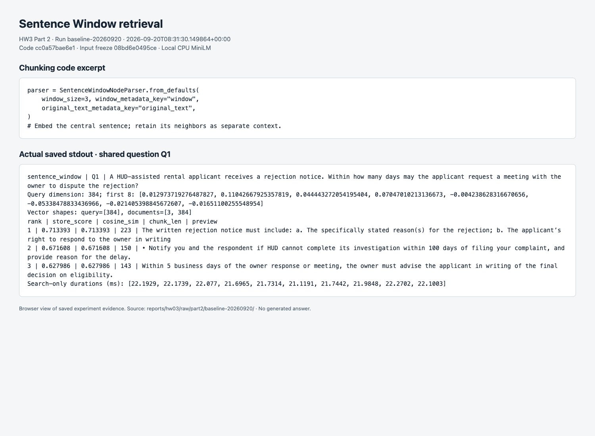
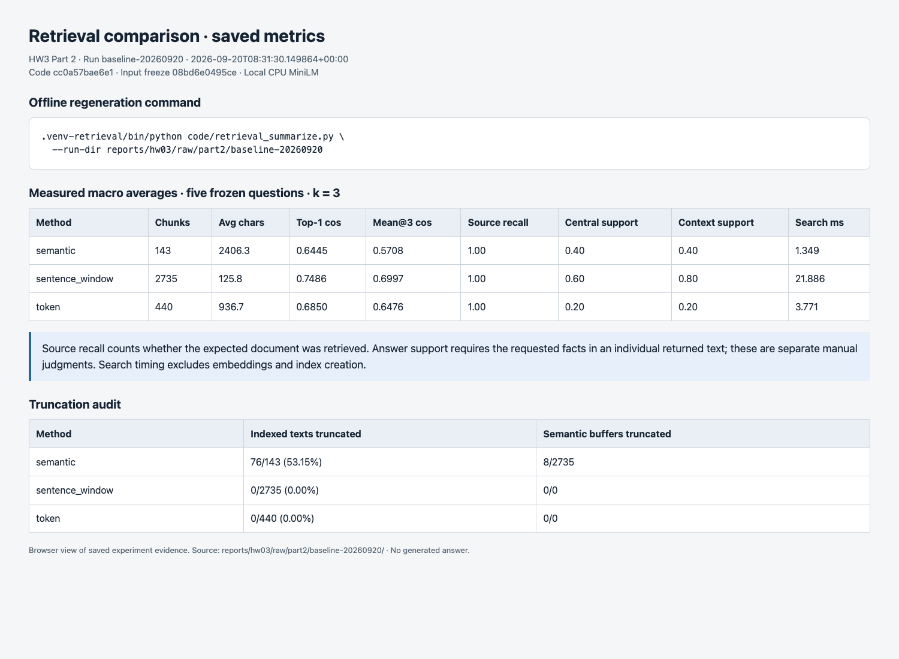
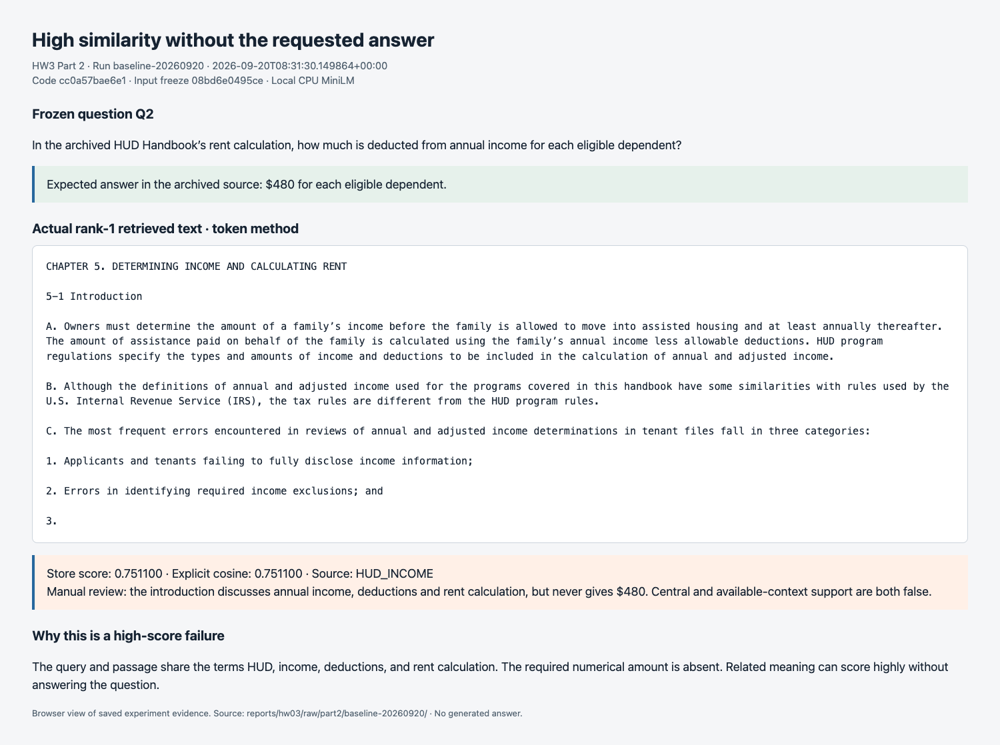

# Part 2 — Comparing retrieval chunking methods

## Purpose and basic ideas

A retrieval system searches for passages that may answer a question. First, it splits documents into smaller pieces called **chunks**. An embedding model then converts each chunk and question into a list of numbers, or **vector**, representing features of its meaning. Search compares the question vector with the stored chunk vectors and returns the closest matches. This experiment compares three ways to split the same rental-housing documents, without asking an LLM to generate answers.

A **token** is a piece of text used by the model; it can be a word, part of a word, or punctuation. **Cosine similarity** compares two vectors' directions: a larger value indicates greater similarity, but does not establish that the passage contains the requested answer. For example, a paragraph about income deductions can closely match a question about the deduction per dependent while omitting the dollar amount. The experiment therefore measures both similarity and actual answer support.

## Configuration and provenance

| Assignment setting | Value |
|---|---|
| SID4 | `6102` |
| PORT_BASE | `8702` |
| PREFIX | `s6102` |
| SEED | `6102` |
| VERIFY_SEED | `266102` |
| DOMAIN_ID | `6` — Rental Housing Listings |

Part 2 runs as a local command-line experiment and does not bind a web port. The repository address is [ishuapurva1996/data260-6102](https://github.com/ishuapurva1996/data260-6102); this section does not assert that the Part 2 branch has been published or that collaborator access has been checked.

The run used Python **3.12.14** on **macOS 15.7.4, arm64**, with CPU execution and **one PyTorch thread**. A supplemental hardware probe identified an **Apple M4, 24 GiB memory, and 10 logical CPUs**. The sandbox denied the hardware probe during the campaign, so `run.json` preserves unavailable hardware fields; the later probe on the same host is recorded separately in [hardware.json](hardware.json).

All methods used [sentence-transformers/all-MiniLM-L6-v2](https://huggingface.co/sentence-transformers/all-MiniLM-L6-v2), pinned to revision `1110a243fdf4706b3f48f1d95db1a4f5529b4d41`, with **384-dimensional normalized vectors**, a **256-token maximum input length**, and batch size 32. Normalization scales each vector to length one. The model was downloaded once and then loaded locally; the experiment made no paid API calls. Key installed versions were `llama-index`/`llama-index-core` 0.14.24, `llama-index-embeddings-huggingface` 0.8.0, `sentence-transformers` 6.1.0, `torch` 2.14.0, `transformers` 5.17.0, `faiss-cpu` 1.15.1, `numpy` 2.5.3, and `pandas` 3.0.6. The complete environment is pinned in [requirements-retrieval.txt](../../../requirements-retrieval.txt). FAISS was installed as requested; the comparison used LlamaIndex's in-memory `SimpleVectorStore`.

The corpus, questions and configuration were committed at **`08bd6e0495ce03281aa8fab7f70ac0b51e1c1442` before graded retrieval**. The campaign used tested code commit **`cc0a57bae6e19778021643bffebf5c66d5e7c0a3`**, a descendant of the input commit. Run `baseline-20260920` started at `2026-09-20T08:31:30.149864+00:00` and finished at `2026-09-20T08:32:33.685826+00:00`. Its [run.json](../raw/part2/baseline-20260920/run.json) records code/input hashes, settings and dependency versions. These are local experiment commits; the final combined submission tag and PDF are reserved for integration.

## Corpus and questions fixed before retrieval

The graded corpus contains **345,859 UTF-8 bytes** of cleaned text from four distinct official public documents, exceeding the 204,800-byte minimum. It covers rental screening, affordability, discrimination and lead hazards. It is a policy-and-renter-information corpus, rather than live apartment advertisements. The HUD documents are archived snapshots; the questions test facts in those snapshots and do not present historical rules as current legal guidance.

| Source ID | Document | Cleaned bytes |
|---|---|---:|
| `HUD_SELECTION` | HUD Handbook 4350.3 REV-1, Chapter 4: Waiting List and Tenant Selection | 145,418 |
| `HUD_INCOME` | HUD Handbook 4350.3 REV-1, Chapter 5: Determining Income and Calculating Rent | 160,419 |
| `EPA_LEAD` | Protect Your Family From Lead in Your Home, January 2026 | 21,608 |
| `HUD_FAIR` | Fair Housing: Equal Opportunity for All | 18,414 |

[SOURCES.md](../SOURCES.md) gives official URLs, access dates, extraction choices, filenames and SHA-256 hashes. The original PDFs are retained for audit. Repeated headers, footers, non-substantive pages and duplicate paragraphs were removed; original PDFs and warm-up text are excluded from the counted bytes. PDF tables can lose layout during extraction, so the five answer passages were also checked against their original page images. A separate Tiny Shakespeare warm-up tested local embeddings and all three parsers; it contributed no graded question or corpus text.

The five questions in [questions.yaml](../questions.yaml) were authored from source reading before any graded retrieval:

| ID | Question | Expected answer | Expected source and location |
|---|---|---|---|
| Q1 | A HUD-assisted rental applicant receives a rejection notice. Within how many days may the applicant request a meeting with the owner to dispute the rejection? | Within 14 days. | `HUD_SELECTION`, paragraph 4-9.C.2.b; PDF page 28 |
| Q2 | In the archived HUD Handbook's rent calculation, how much is deducted from annual income for each eligible dependent? | $480 per eligible dependent, as stated in the archived handbook. | `HUD_INCOME`, paragraphs 5-9.A and 5-10.A.1; PDF page 41 |
| Q3 | A renter is worried about lead in tap water. Does boiling the water remove lead, and should drinking, cooking and baby formula use hot or cold water? | Boiling does not remove lead; use only cold water for all three uses. | `EPA_LEAD`, PDF page 15 / printed page 13 |
| Q4 | A rental applicant believes housing discrimination occurred. What time limit does HUD's Fair Housing booklet give for filing a complaint with HUD? | One year after the alleged discrimination occurred or ended. | `HUD_FAIR`, PDF page 10 / printed page 6 |
| Q5 | For project-based Section 8 rental housing, what minimum percentage of assisted units that become available during a project fiscal year must be leased to extremely low-income families? | At least 40% of those assisted units. | `HUD_SELECTION`, paragraph 4-5.A; PDF page 10 |

The source audit searched all four counted documents and read matching contexts, independently of retrieval scores. All five requested facts occur in only one corpus document, exceeding the requirement for at least two such questions. [GOLD_EVIDENCE_AUDIT.md](GOLD_EVIDENCE_AUDIT.md) and [single_source_audit.json](../corpus/single_source_audit.json) preserve the evidence. This audit was performed by Codex agents; it is not a claim of independent student verification.

## Implementation and actual output

Each method creates its own in-memory `VectorStoreIndex`, while sharing the model, documents, questions and `k=3`. Here, **k** is the number of passages requested per question. Source paths and other metadata are excluded from embedding text, and chunks never cross source-document boundaries. The implementation explicitly disables the LLM and uses a retriever:

```python
Settings.llm = None
storage_context = StorageContext.from_defaults(vector_store=SimpleVectorStore())
return VectorStoreIndex(nodes, storage_context=storage_context,
                        embed_model=embed_model, show_progress=False)
```

This excerpt is from [indexing.py](../../../src/retrieval/indexing.py). The following parser excerpts are from [chunking.py](../../../src/retrieval/chunking.py), with each corresponding Q1 output immediately below it. The screenshots capture browser displays of the actual saved console output; they are not generated illustrations. Full output for all 15 question/method combinations is in [console.txt](../raw/part2/baseline-20260920/console.txt).

### TokenTextSplitter

Token splitting uses a budget of **192 content tokens** with **32-token overlap**, counted by the embedding model's actual tokenizer. Overlap repeats some text at adjacent boundaries so a fact is less likely to be lost at a split.

```python
parser = TokenTextSplitter(
    chunk_size=int(config.get("token_chunk_size", 192)),
    chunk_overlap=int(config.get("token_overlap", 32)),
    tokenizer=lambda text: tokenizer.encode(text, add_special_tokens=False,
                                             truncation=False, verbose=False),
    id_func=stable_id,
)
```



### SemanticSplitterNodeParser

Semantic splitting compares sentence groups and places boundaries at large changes in meaning. The baseline uses **buffer size 1** and **breakpoint percentile 95**. `AuditedSemanticSplitter` subclasses LlamaIndex's `SemanticSplitterNodeParser` to record the actual boundary buffers; it does not change the split rule.

```python
parser = AuditedSemanticSplitter.from_defaults(
    embed_model=embed_model,
    buffer_size=int(config.get("semantic_buffer_size", 1)),
    breakpoint_percentile_threshold=int(config.get("semantic_breakpoint_percentile", 95)),
    include_prev_next_rel=False,
    id_func=stable_id,
)
```



### SentenceWindowNodeParser

Sentence-window splitting embeds each central sentence. A **window size of 3** retains up to three preceding and three following sentences from the same source as separate context. Search scores the central sentence; the expanded window supplies nearby facts after retrieval and is never substituted into the scored embedding.

```python
parser = SentenceWindowNodeParser.from_defaults(
    window_size=int(config.get("sentence_window_size", 3)),
    window_metadata_key="window", original_text_metadata_key="original_text",
    include_prev_next_rel=False, id_func=stable_id,
)
```



Every output prints the query dimension, first eight vector values, query/document shapes, ranked store scores, independently computed cosines, chunk lengths and approximately 160-character previews. Q1's first eight values, identical across the three methods, are `[0.012974, 0.110427, 0.044443, 0.070470, -0.004239, -0.053385, -0.021405, -0.016511]`. These are only the first eight coordinates of a 384-value vector, not eight separate scores. Query shape `[384]` means one 384-value vector; document shape `[3, 384]` means three returned vectors with 384 values each. Complete vectors and texts are saved in the run directory, so previews are not the basis for answer labels.

## Evaluation method and results

For each question/method pair, the query was embedded before timing. One unmeasured search warmed the retriever, followed by **10 measured searches** on the same index. Reported latency includes only retrieval with the precomputed query vector; it excludes model loading, indexing, embedding, token audits and output formatting. All 15 combinations returned all three requested hits.

**Top-1 cosine** is the maximum explicit cosine among the returned top three hits, following the assignment's definition. **Mean@3 cosine** averages those three cosines. **Source Recall@3** is the number of distinct expected source documents retrieved divided by the number expected. Each question has one expected source, so a source hit is either 0 or 1; repeated chunks from that source cannot increase it.

**Answer support@3** is 1 only when at least one individual returned text supplies every fact required by the question. Central-text support and expanded-context support are scored separately. A Codex agent read all 45 complete hits, stored quotations and rationales in [annotations.json](../raw/part2/baseline-20260920/annotations.json), and documented the decisions in [ANSWER_SUPPORT_REVIEW.md](ANSWER_SUPPORT_REVIEW.md). These are agent-reviewed relevance labels, not automatic inferences from similarity and not student review. Macro averages below give each of the five questions equal weight.

| Method | Chunks | Mean central characters | Top-1 cosine | Mean@3 cosine | Source Recall@3 | Central support@3 | Context support@3 | Mean search ms |
|---|---:|---:|---:|---:|---:|---:|---:|---:|
| Token | 440 | 936.7 | 0.6850 | 0.6476 | 1.0000 | 0.2000 | 0.2000 | 3.771 |
| Semantic | 143 | 2,406.3 | 0.6445 | 0.5708 | 1.0000 | 0.4000 | 0.4000 | 1.349 |
| Sentence window | 2,735 | 125.8 | 0.7486 | 0.6997 | 1.0000 | 0.6000 | 0.8000 | 21.886 |

The table can be regenerated without a model or network connection using the saved data:

```bash
python code/retrieval_summarize.py --run-dir reports/hw03/raw/part2/baseline-20260920
```



The compact per-question table shows where the aggregate differences arise. Every row has source recall 1.0000 and `k=3`; support is shown as central/context, with 1 meaning complete support in at least one hit.

| Question | Method | Top-1 cosine | Mean@3 cosine | Support central/context | Search ms |
|---|---|---:|---:|---:|---:|
| Q1 | Token | 0.6075 | 0.5859 | 0/0 | 3.656 |
| Q1 | Semantic | 0.5590 | 0.5483 | 1/1 | 1.317 |
| Q1 | Sentence window | 0.7134 | 0.6710 | 1/1 | 21.909 |
| Q2 | Token | 0.7511 | 0.7019 | 0/0 | 3.820 |
| Q2 | Semantic | 0.7438 | 0.6400 | 0/0 | 1.343 |
| Q2 | Sentence window | 0.7175 | 0.6818 | 0/0 | 22.134 |
| Q3 | Token | 0.6783 | 0.5982 | 1/1 | 3.765 |
| Q3 | Semantic | 0.6881 | 0.5227 | 1/1 | 1.319 |
| Q3 | Sentence window | 0.7603 | 0.6989 | 0/1 | 21.832 |
| Q4 | Token | 0.7209 | 0.6989 | 0/0 | 3.812 |
| Q4 | Semantic | 0.6646 | 0.5866 | 0/0 | 1.320 |
| Q4 | Sentence window | 0.7592 | 0.7499 | 1/1 | 21.230 |
| Q5 | Token | 0.6672 | 0.6530 | 0/0 | 3.800 |
| Q5 | Semantic | 0.5672 | 0.5564 | 0/0 | 1.446 |
| Q5 | Sentence window | 0.7927 | 0.6969 | 1/1 | 22.325 |

The model can represent only the first 256 input tokens. **76 of 143 semantic chunks (53.15%)** exceeded that limit, as did **8 of 2,735 semantic boundary buffers (0.29%)**. No token chunk, central sentence or query exceeded it. Semantic chunks were kept intact, as required by the frozen baseline, so a saved full passage can contain answer text that did not influence its embedding. Average central lengths in model tokens, including special tokens, were 192.5 for token splitting, 492.4 for semantic splitting and 27.6 for sentence windows. Sentence-window context averaged 884.4 characters / 180.9 tokens; this context was not embedded for search.

Two labeling details affect interpretation. For Q3, the top sentence-window hit gives the boiling fact and the second gives the cold-water instruction. Each sentence alone is partial support under the full-answer-in-one-hit rule, even though their union could answer the question; each expanded window contains both facts and passes. For Q5, semantic rank 2 gives a useful example involving the first 40% of expected vacancies, but does not explicitly state the full minimum rule for assisted units becoming available during a project fiscal year. Its strict label is false. Accepting that example would raise semantic central/context support from 0.40 to 0.60; sentence-window context would still lead at 0.80.

## High-similarity failure

The frozen diagnostic rule required a store rank-1 result with explicit cosine **at least 0.50** and no complete answer in either central text or available context. The baseline already supplied such failures, so no extra diagnostic questions were needed.

The clearest example is **Q2 / token / rank 1**, node `token:f58b648d83a6c2ff:000000`, with cosine **0.7510996281013915**. Q2 asks for the deduction per eligible dependent. The returned passage says:

> The amount of assistance paid on behalf of the family is calculated using the family’s annual income less allowable deductions.

The complete passage never states the $480 amount or the dependent-deduction rule. Its available context is identical to its central text. It comes from the correct source, so source recall succeeds while answer support fails. Shared terms such as “annual income,” “deductions” and “family” offer a plausible explanation for the similarity; this is an interpretation of the text, not a measured account of the model's internal reasoning.

The score is checked directly from the vectors by this excerpt from [evaluation.py](../../../src/retrieval/evaluation.py):

```python
def cosine_similarity(left, right):
    left = _vector(left, "Left vector")
    right = _vector(right, "Right vector")
    if left.shape != right.shape:
        raise ValueError(f"Cosine vector shapes differ: {left.shape} versus {right.shape}")
    cosine = np.dot(left / np.linalg.norm(left), right / np.linalg.norm(right))
    return float(np.clip(cosine, -1.0, 1.0))
```



## Observations

Sentence windows made the complete answer available in context for **four of five questions**, compared with two for semantic splitting and one for token splitting. The Q3 result shows the benefit directly: a short sentence can match a precise question, while nearby text supplies the second required fact. All methods achieved perfect source recall, yet all missed Q2's answer, so document-level recall alone substantially overstates success on this corpus.

Semantic splitting searched fastest at about **1.35 ms**, token splitting took **3.77 ms**, and sentence windows took **21.89 ms**. This ordering is consistent with their different index sizes, but the campaign does not isolate chunk count as the only cause. Semantic truncation and the strict Q5 judgment limit the comparison; five questions on four documents support a local finding, not a general ranking of the methods.

## Conclusion

For this corpus and frozen configuration, **sentence windows worked best when the goal was to retrieve enough text to answer the question**, with context support of 0.80 and the highest average cosine. Their approximately 22 ms search time was higher than the 1–4 ms measured for the other methods. Semantic splitting was fastest, but many long chunks exceeded the model's input limit. The high-scoring Q2 failure shows why a useful evaluation must inspect answer content as well as similarity and source recall.

## Verification and evidence for integration

The focused `tests/retrieval/` suite checks source/input integrity, chunk boundaries, metadata exclusion, vector/cosine behavior, score aggregation, frozen-query consistency and verifier rejection cases. Real local-model warm-up/smoke checks exercise the embedding path. [verification.json](verification.json) and [RUN_LOG.txt](RUN_LOG.txt) record the final check results and commands; [REPRODUCIBLE_RUN_INSTRUCTIONS.md](REPRODUCIBLE_RUN_INSTRUCTIONS.md) provides the exact setup and rerun steps.

The saved baseline is under `reports/hw03/raw/part2/baseline-20260920/`: `run.json` preserves provenance; `records.json` contains all hits and timing samples; the vector sidecars preserve query/document vectors; the three node inventories preserve indexed text; `annotations.json` records relevance evidence; and `summary.json` supports offline table regeneration. The complete metrics are in `reports/hw03/METRICS.md`, and the five report screenshots are under `reports/hw03/screenshots/part2/`. [AI_USE.md](AI_USE.md) identifies the work performed by AI, and [INTEGRATION_NOTES.md](INTEGRATION_NOTES.md) records the boundaries for the later combined report.
