# Homework 3 | Rental Housing Listings

Pragya Apurva | DATA 260 | September 20, 2026

| Personal configuration | Value | Calculation / meaning |
| --- | --- | --- |
| SID4 | 6102 | Last four student-ID digits |
| PORT_BASE | 8702 | 8000 + (6102 mod 900) |
| PREFIX | s6102 | "s" + SID4 |
| SEED | 6102 | SID4 |
| VERIFY_SEED | 266102 | 260000 + SID4 |
| DOMAIN_ID | 6 | 6102 mod 8; Rental Housing Listings |

Part 1 adds login, logout and session management to the existing rental application. Part 2 compares token, semantic and sentence-window chunking for searching housing documents.

Hardware: MacBook Air, Apple M4, 10 logical CPUs, 24 GiB memory; macOS 15.7.4, arm64. Python 3.12.14.

Local model: sentence-transformers/all-MiniLM-L6-v2 for Part 2 embeddings, running on CPU with one PyTorch thread. Part 1 does not use an AI model.

Repository: https://github.com/ishuapurva1996/data260-6102

Repository access confirmed for Sbnikitha and supriyaselvanganesan on September 21, 2026.

Tested code (hw3-code) commit: 96b04abc04bb4cde131958ba38f37116336a4442

Submission tag: hw3 | https://github.com/ishuapurva1996/data260-6102/tree/hw3

# Part 1 | Login and session management

HTTP does not remember earlier requests, so a session connects later requests to a user's login. Starlette's SessionMiddleware stores the username and a random session ID in a signed cookie. The signature detects changes; it does not encrypt the contents. The password is not stored in the cookie.

The server keeps the active session IDs and their last-activity times. Dashboard access requires a valid cookie and an active matching entry. Logout or expiry removes that entry, so even a saved copy of the cookie stops working.

| Route | Behavior |
| --- | --- |
| GET / | Rental homepage; Login when signed out; Dashboard and Logout when signed in |
| GET /login | Username and password form |
| POST /login | admin / password: 303 to /dashboard; invalid credentials: 401 and a Bootstrap alert |
| GET /dashboard | Welcome with username; 303 to /login without an active session |
| GET /logout | Revoke the session, clear the cookie and redirect to / |

code/web_application/main.py | lines 108-116

```
    app.add_middleware(
        SessionMiddleware,
        secret_key=secret_key or os.environ.get("SECRET_KEY") or secrets.token_urlsafe(32),
        session_cookie="session",
        max_age=3600,
        same_site="lax",
        https_only=True,
    )
    app.include_router(auth.router)
```

The routes are in routers/auth.py. This single-worker teaching app uses public demo credentials and keeps sessions in memory. A restart clears them. The existing rental API remains unchanged and does not require login.

# Part 1 | Home page

The homepage retains the rental controls and changes its navigation when a user signs in.

code/web_application/routers/auth.py | lines 33-37

```
@router.get("/", response_class=HTMLResponse)
async def home(request: Request):
    return templates.TemplateResponse(
        request=request, name="index.html", context={"user": current_user(request)}, headers=NO_STORE,
    )
```


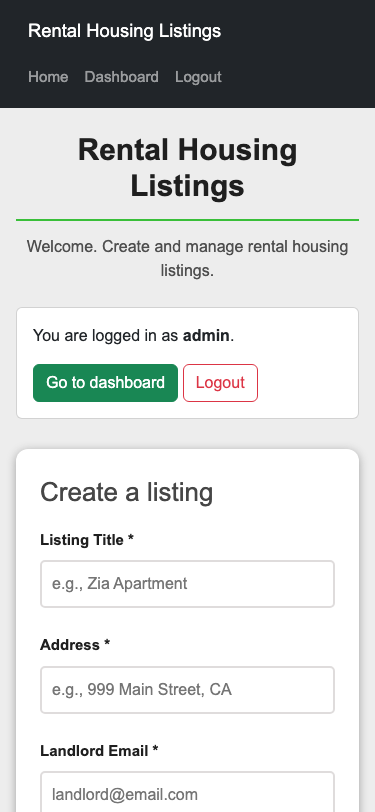

Home before login (left) and after login (right), shown at 375 x 812 pixels.

# Part 1 | Login form and error message

The form uses a Bootstrap card, labeled inputs and a submit button. Invalid credentials return HTTP 401 and display an alert above the form.

code/web_application/routers/auth.py | lines 59-64

```
    if username != "admin" or password != "password":
        return templates.TemplateResponse(
            request=request, name="login.html",
            context={"user": None, "error": "Invalid username or password."},
            status_code=401, headers=NO_STORE,
        )
```


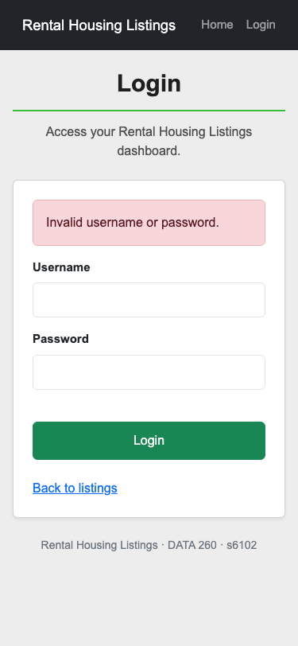

Login form (left) and the alert after an invalid login (right), at 375px width.

# Part 1 | Protected dashboard

A successful login redirects to the dashboard, which displays admin and the 300-second idle limit. The route checks the server's session registry before displaying the page.

code/web_application/routers/auth.py | lines 74-77

```
async def dashboard(request: Request):
    user = current_user(request)
    if user is None:
        return RedirectResponse("/login", status_code=303, headers=NO_STORE)
```

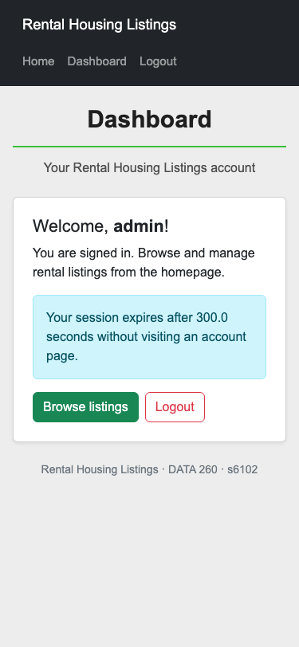

Dashboard after login, at 375px width. An anonymous request to this route returned HTTP 303 to /login.

# Part 1 | Logout and cookie replay

Logout removes the server's session entry and clears the browser cookie. To test revocation, the browser suite saves a valid cookie, logs out, then sends that old cookie to /dashboard from a fresh browser context. Access is denied.

code/web_application/routers/auth.py | lines 26-30

```
def revoke_session(request: Request) -> None:
    session = request.session
    sid = session.get("sid") if isinstance(session, dict) else None
    request.app.state.session_store.revoke(sid)
    request.scope["session"] = {}
```

code/web_application/routers/auth.py | lines 89-91

```
async def logout(request: Request):
    revoke_session(request)
    return RedirectResponse("/", status_code=303, headers=NO_STORE)
```

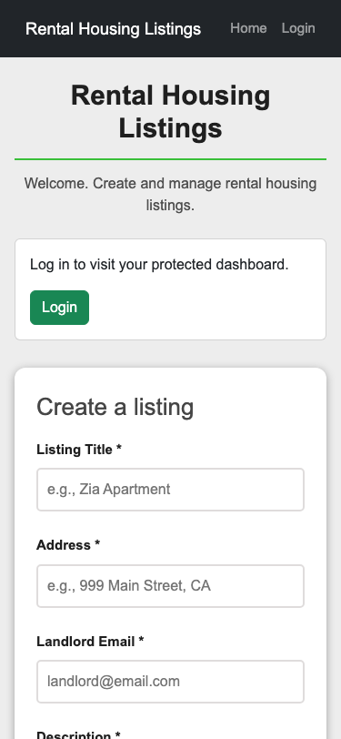

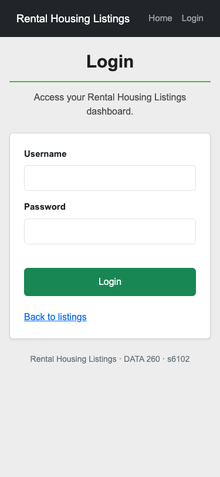

Homepage after logout (left) and login page after reusing the old cookie (right). Both redirects returned HTTP 303.

# Part 1 | Secure session cookie

HttpOnly prevents ordinary page JavaScript from reading the cookie. Secure restricts it to HTTPS, and SameSite=lax limits cross-site sending. Max-Age=3600 sets the cookie lifetime; the server enforces the shorter idle timeout separately.

code/web_application/main.py | lines 108-115

```
    app.add_middleware(
        SessionMiddleware,
        secret_key=secret_key or os.environ.get("SECRET_KEY") or secrets.token_urlsafe(32),
        session_cookie="session",
        max_age=3600,
        same_site="lax",
        https_only=True,
    )
```

reports/hw03/raw/part1/desktop-login-response-headers.txt | captured Set-Cookie

```
set-cookie: session=[REDACTED]; path=/; Max-Age=3600; httponly; samesite=lax; secure
```

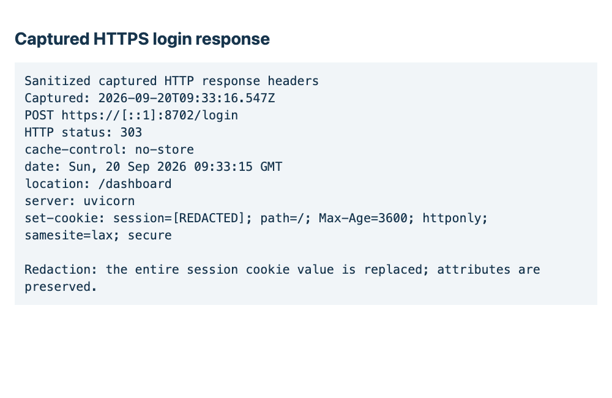

HTTPS login response. The session cookie value is hidden.

The browser ran against https://[::1]:8702 with a local self-signed certificate and sent the cookie with its dashboard request. Certificate acceptance was limited to the test browser contexts.

# Part 1 | Idle timeout

A session expires after 300 seconds without activity. The server checks expiry before renewing the session. Home, login and dashboard requests renew it; static files and rental API requests do not.

code/web_application/session_store.py | lines 27-35

```
    def cleanup(self, now: float | None = None) -> None:
        """Expire at the boundary, before any request can renew activity."""
        now = self.clock() if now is None else now
        expired = [
            sid for sid, (_, last_activity) in self._sessions.items()
            if now - last_activity >= self.idle_timeout
        ]
        for sid in expired:
            del self._sessions[sid]
```

| Check | Result |
| --- | --- |
| Copied expired cookie | A separate server used a 2-second demo timeout. Replaying the cookie after the wait returned 303 to /login. |
| 300-second boundary | A controlled clock confirmed renewal before the boundary and denial at exactly the limit. |
| Other invalid sessions | Changed cookies, unknown IDs, mismatched usernames and replaced logins were rejected. |


The copied cookie is denied after the short expiry demonstration. The application default remains 300 seconds.

# Part 1 | Bootstrap and templates

base.html shares the navbar across the home, login and dashboard pages. Bootstrap cards organize content, buttons identify actions and alerts explain errors. Bootstrap 5.3.2 is stored locally.

code/web_application/templates/base.html | lines 12-21

```
  <nav class="navbar navbar-dark bg-dark mb-4" aria-label="Main navigation">
    <div class="container-fluid nav-inner">
      <a class="navbar-brand" href="/">Rental Housing Listings</a>
      <div class="navbar-nav flex-row flex-wrap gap-3">
        <a class="nav-link" href="/">Home</a>
        
        <a class="nav-link" href="/dashboard">Dashboard</a>
        <a class="nav-link" href="/logout">Logout</a>
        
        <a class="nav-link" href="/login">Login</a>
```

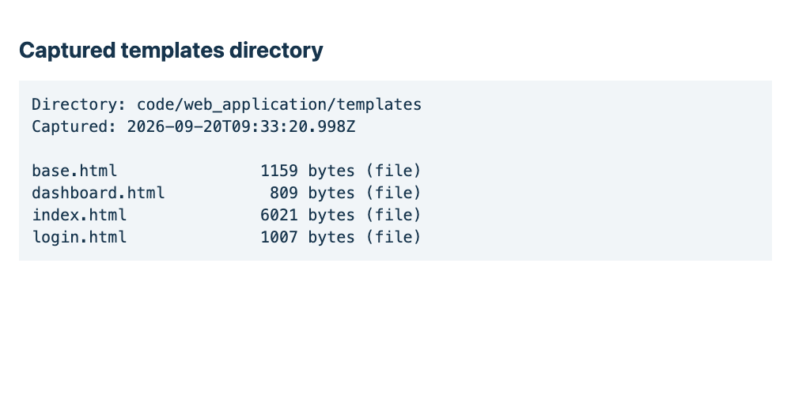

Application templates.

Browser tests checked the pages at 1280px and 375px widths. The content stayed within the screen without horizontal scrolling.

# Part 2 | Model and housing corpus

Retrieval splits documents into chunks and compares their embeddings with a question's embedding. An embedding is a vector of numbers representing features of the text. This experiment retrieves passages without generating an answer.

Model: sentence-transformers/all-MiniLM-L6-v2, revision 1110a243fdf4706b3f48f1d95db1a4f5529b4d41. It produces normalized 384-dimensional vectors and accepts at most 256 tokens. Runs use CPU, one PyTorch thread and batch size 32. A token is a word, word part or punctuation mark used by the model.

| Source | Document | Text bytes |
| --- | --- | --- |
| HUD_SELECTION | HUD Handbook 4350.3 REV-1, Chapter 4: Waiting List and Tenant Selection | 145,418 |
| HUD_INCOME | HUD Handbook 4350.3 REV-1, Chapter 5: Determining Income and Calculating Rent | 160,419 |
| EPA_LEAD | Protect Your Family From Lead in Your Home | 21,608 |
| HUD_FAIR | Fair Housing: Equal Opportunity for All | 18,414 |

The four local text files contain 345,859 bytes, above the 204,800-byte minimum. They were accessed on September 20, 2026. Repeated headers, footers and duplicate paragraphs were removed. The HUD files are archived documents; the questions refer to their stated rules.

SOURCES.md and CORPUS_MANIFEST.json record the URLs, access dates, filenames, byte sizes and hashes. Original PDFs are retained, and answer passages were checked against their page images. The first 12,000 characters of Tiny Shakespeare were used only for the warm-up.

Inputs were committed before retrieval at 08bd6e0495ce03281aa8fab7f70ac0b51e1c1442. The measured run used code cc0a57bae6e19778021643bffebf5c66d5e7c0a3. Package versions are pinned in requirements-retrieval.txt; FAISS is installed, while the indexes use SimpleVectorStore.

# Part 2 | Five questions

These questions and expected answers were saved in questions.yaml before the retrieval run. All source files below are in reports/hw03/corpus/text/.

| ID | Question | Expected answer | Expected source file |
| --- | --- | --- | --- |
| Q1 | A HUD-assisted rental applicant receives a rejection notice. Within how many days may the applicant request a meeting with the owner to dispute the rejection? | Within 14 days. | hud_tenant_selection.txt |
| Q2 | In the archived HUD Handbook’s rent calculation, how much is deducted from annual income for each eligible dependent? | $480 per eligible dependent in the archived handbook. | hud_income_rent.txt |
| Q3 | A renter is worried about lead in tap water. Does boiling the water remove lead, and should drinking, cooking and baby formula use hot or cold water? | Boiling does not remove lead. Use only cold water for drinking, cooking and baby formula. | epa_lead_2026.txt |
| Q4 | A rental applicant believes housing discrimination occurred. What time limit does HUD’s Fair Housing booklet give for filing a complaint with HUD? | One year after the alleged discrimination occurred or ended. | hud_fair_housing.txt |
| Q5 | For project-based Section 8 rental housing, what minimum percentage of assisted units that become available during a project fiscal year must be leased to extremely low-income families? | At least 40% of assisted units becoming available during the project fiscal year. | hud_tenant_selection.txt |

The source audit found each requested fact in only one corpus document, exceeding the requirement for at least two such questions. The matching passages and locations are recorded in part2/GOLD_EVIDENCE_AUDIT.md.

# Part 2 | Indexing and retrieval helper

Each chunker has its own in-memory index. Chunks stay within one document, and source metadata is excluded from embeddings. Settings.llm = None disables answer generation.

src/retrieval/indexing.py | lines 16-19

```
    Settings.llm = None
    storage_context = StorageContext.from_defaults(vector_store=SimpleVectorStore())
    return VectorStoreIndex(nodes, storage_context=storage_context,
                            embed_model=embed_model, show_progress=False)
```

The helper embeds the question, retrieves three passages and embeds them again to calculate cosine similarity. Selected statements from the helper are shown below.

src/retrieval/evaluation.py | selected source statements

```
query_vector = _vector(embed_model.get_query_embedding(query), "Query embedding")
query_values = query_vector.tolist()

retriever = index.as_retriever(similarity_top_k=k)

    results = retriever.retrieve(bundle)

vectors = embed_model.get_text_embedding_batch(texts) if texts else []

    cosine = cosine_similarity(query_vector, vector)
```

src/retrieval/evaluation.py | lines 25-25

```
    cosine = np.dot(left / np.linalg.norm(left), right / np.linalg.norm(right))
```

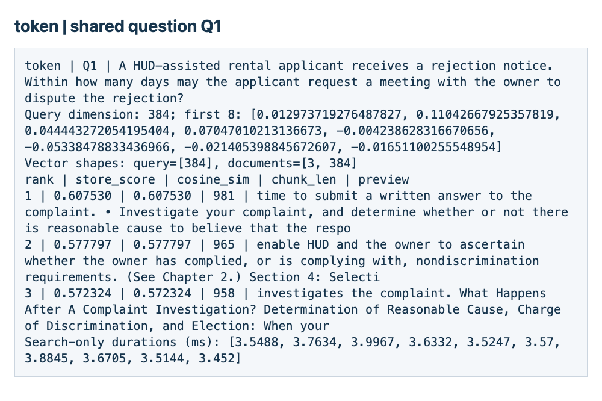

Helper output for Q1 using the token index. [384] is the query vector's shape; [3, 384] represents three document vectors. The table shows store scores, calculated cosines, lengths and text previews.

# Part 2 | TokenTextSplitter

Token splitting uses 192 content tokens per chunk and 32-token overlap. The model's tokenizer counts the tokens. Overlap repeats text near a boundary; this setting produced 440 chunks.

src/retrieval/chunking.py | lines 77-83

```
        parser = TokenTextSplitter(
            chunk_size=int(config.get("token_chunk_size", 192)),
            chunk_overlap=int(config.get("token_overlap", 32)),
            tokenizer=lambda text: tokenizer.encode(text, add_special_tokens=False,
                                                     truncation=False, verbose=False),
            id_func=stable_id,
        )
```


Token output for Q1 (k = 3).

# Part 2 | SemanticSplitterNodeParser

Semantic splitting places boundaries where neighboring sentence groups change in meaning. It uses buffer size 1 and breakpoint percentile 95, producing 143 chunks. AuditedSemanticSplitter subclasses the LlamaIndex parser to record its boundary buffers without changing the split rule.

src/retrieval/chunking.py | lines 85-91

```
        parser = AuditedSemanticSplitter.from_defaults(
            embed_model=embed_model,
            buffer_size=int(config.get("semantic_buffer_size", 1)),
            breakpoint_percentile_threshold=int(config.get("semantic_breakpoint_percentile", 95)),
            include_prev_next_rel=False,
            id_func=stable_id,
        )
```

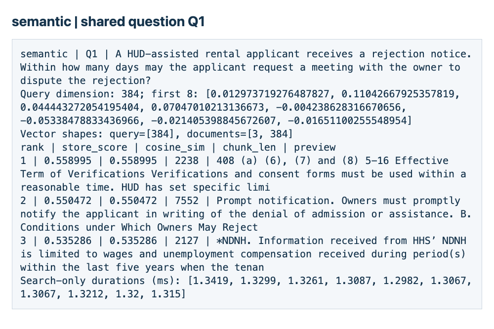

Semantic output for Q1 (k = 3).

# Part 2 | SentenceWindowNodeParser

Sentence-window splitting embeds each central sentence and keeps up to three sentences on either side as context. Search scores the central sentence; the neighboring text is available afterward. This setting produced 2,735 central sentences.

src/retrieval/chunking.py | lines 93-97

```
        parser = SentenceWindowNodeParser.from_defaults(
            window_size=int(config.get("sentence_window_size", 3)),
            window_metadata_key="window", original_text_metadata_key="original_text",
            include_prev_next_rel=False, id_func=stable_id,
        )
```

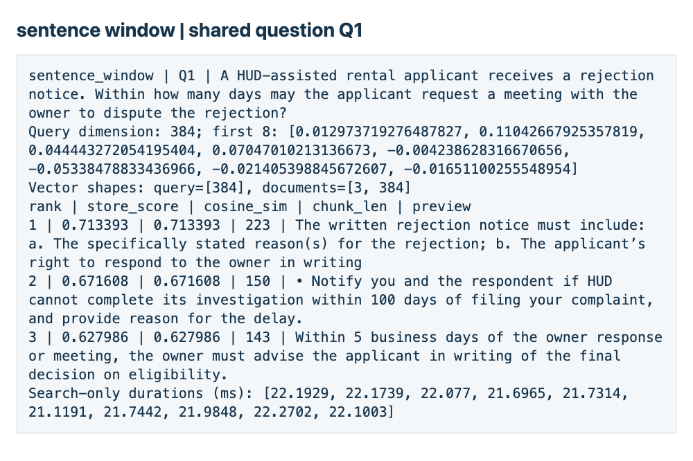

Sentence window output for Q1 (k = 3).

# Part 2 | Evaluation method

Five questions across three indexes give 15 comparisons. Each query is embedded before timing. One search warms the retriever, then ten searches are timed. Latency covers similarity search only, excluding embedding, index construction and output formatting.

| Metric | Definition |
| --- | --- |
| Top-1 cosine | Highest explicit cosine among the top three returned hits |
| Mean@3 cosine | Average explicit cosine of those three hits |
| Source Recall@3 | Distinct expected sources retrieved / expected sources. Repeated hits from one source do not increase recall. |
| Central support@3 | At least one central text contains every fact needed to answer the question |
| Context support@3 | At least one available context contains the full answer, including neighbors for sentence windows |
| Macro average | Each of the five questions has equal weight |

Answer support requires the full answer within one hit. It does not combine partial answers from different hits. Codex reviewed all 45 complete passages and recorded its labels, quotations and reasons in annotations.json. Similarity scores alone do not determine these labels.

Every comparison returned three hits. The five questions already produced high-scoring passages without answers, so no extra diagnostic questions were needed.

# Part 2 | Results across five questions

All three methods found the expected source for every question. Sentence-window context supplied four complete answers, semantic splitting supplied two and token splitting supplied one.

| Method | Chunks | Mean chars | Top-1 | Mean@3 | Recall@3 | Search ms |
| --- | --- | --- | --- | --- | --- | --- |
| Token | 440 | 936.7 | 0.6850 | 0.6476 | 1.0000 | 3.771 |
| Semantic | 143 | 2406.3 | 0.6445 | 0.5708 | 1.0000 | 1.349 |
| Sentence window | 2735 | 125.8 | 0.7486 | 0.6997 | 1.0000 | 21.886 |

| Method | Central support@3 | Context support@3 | Answers supported (context) |
| --- | --- | --- | --- |
| Token | 0.2000 | 0.2000 | 1/5 |
| Semantic | 0.4000 | 0.4000 | 2/5 |
| Sentence window | 0.6000 | 0.8000 | 4/5 |

Recompute the tables from recorded results

```
python code/retrieval_summarize.py \
  --run-dir reports/hw03/raw/part2/baseline-20260920
```

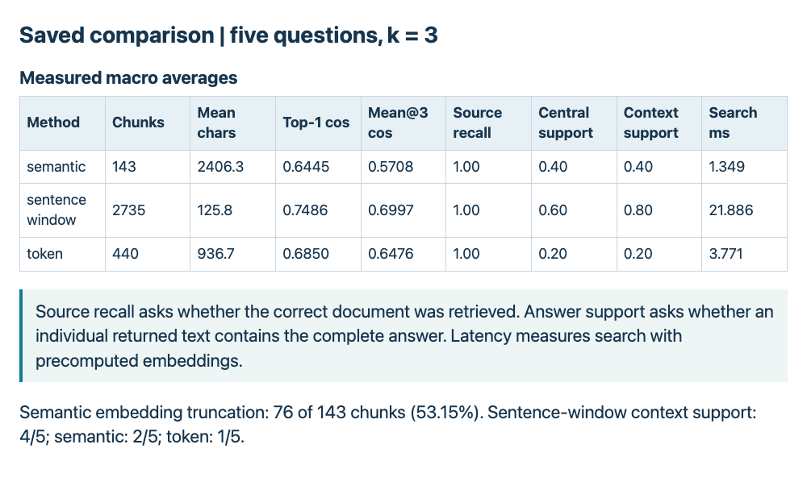

Results across the five questions.

# Part 2 | Results by question

Each row uses k = 3 and has source Recall@3 = 1.0000. A support value of 1 means a complete answer is present within at least one hit.

| Q | Method | Top-1 | Mean@3 | Support central/context | Search ms |
| --- | --- | --- | --- | --- | --- |
| Q1 | Token | 0.6075 | 0.5859 | 0/0 | 3.656 |
| Q1 | Semantic | 0.5590 | 0.5483 | 1/1 | 1.317 |
| Q1 | Sentence window | 0.7134 | 0.6710 | 1/1 | 21.909 |
| Q2 | Token | 0.7511 | 0.7019 | 0/0 | 3.820 |
| Q2 | Semantic | 0.7438 | 0.6400 | 0/0 | 1.343 |
| Q2 | Sentence window | 0.7175 | 0.6818 | 0/0 | 22.134 |
| Q3 | Token | 0.6783 | 0.5982 | 1/1 | 3.765 |
| Q3 | Semantic | 0.6881 | 0.5227 | 1/1 | 1.319 |
| Q3 | Sentence window | 0.7603 | 0.6989 | 0/1 | 21.832 |
| Q4 | Token | 0.7209 | 0.6989 | 0/0 | 3.812 |
| Q4 | Semantic | 0.6646 | 0.5866 | 0/0 | 1.320 |
| Q4 | Sentence window | 0.7592 | 0.7499 | 1/1 | 21.230 |
| Q5 | Token | 0.6672 | 0.6530 | 0/0 | 3.800 |
| Q5 | Semantic | 0.5672 | 0.5564 | 0/0 | 1.446 |
| Q5 | Sentence window | 0.7927 | 0.6969 | 1/1 | 22.325 |

For Q3, separate central sentences give the boiling and cold-water facts. Each alone is incomplete, while their expanded windows contain both facts. Q2's answer is absent from every method's results despite the high cosine scores.

# Part 2 | Limits of the comparison

The model reads only the first 256 input tokens. Text beyond that limit remains in the saved passage but does not affect its embedding. Audit lengths include special tokens; the 192-token chunk setting counts content tokens only.

| Method | Mean central tokens | Over 256 tokens | Mean context chars |
| --- | --- | --- | --- |
| Token | 192.5 | 0/440 | 936.7 |
| Semantic | 492.4 | 76/143 | 2406.3 |
| Sentence window | 27.6 | 0/2735 | 884.4 |

76 of 143 semantic chunks (53.15%) exceed the limit, as do 8 of 2,735 semantic boundary buffers (0.29%). No token chunk, central sentence or query exceeds it. Semantic chunks were kept intact. Sentence-window context averages 884.4 characters and 180.9 tokens; it is not embedded for search.

Q5's semantic rank-2 hit gives an example about the first 40% of expected vacancies. It does not state the complete minimum rule for assisted units becoming available during a project fiscal year, so its strict answer-support label is false. Counting that example as sufficient would raise semantic support from 0.40 to 0.60. Sentence-window context would still lead at 0.80.

The comparison covers five questions, four documents and one model configuration. The small sample and the answer-label choice limit how broadly the results can be applied.

# Part 2 | A high score without the answer

Q2 asks for the $480 dependent deduction. The top token hit scores 0.7511, above the 0.50 confidence threshold, but omits the amount. It reaches the right source without answering the question. Shared words about income and deductions likely explain the similarity.

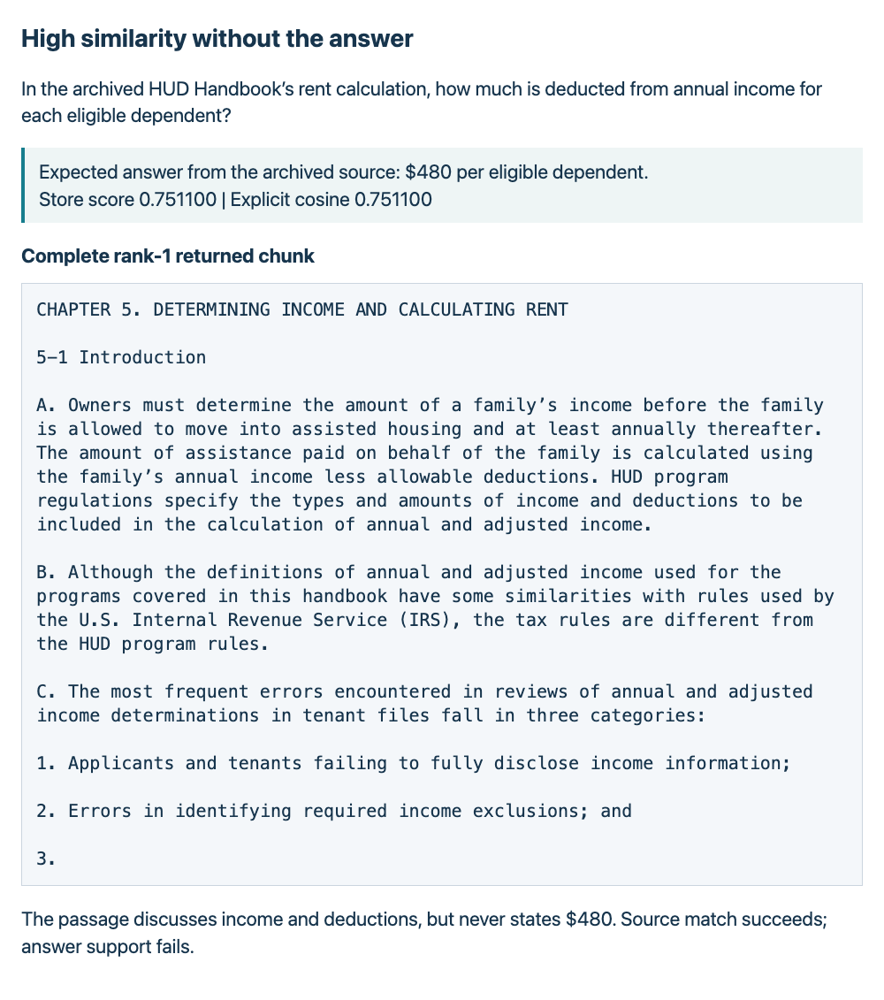

Q2's top token hit, including its complete returned text.

# Part 2 | Observations and conclusion

## Observations

Sentence windows supplied complete answers for four of five questions, compared with two for semantic splitting and one for token splitting. Q3 shows why the extra context helps: a sentence matches part of the question, while nearby text supplies the other fact. All methods found the right source for Q2, but none retrieved its answer. Source recall alone therefore overstates success here.

Semantic search was fastest at 1.35 ms, followed by token search at 3.77 ms and sentence-window search at 21.89 ms. This order is consistent with the number of chunks, although the experiment does not isolate chunk count as the cause. Long semantic chunks often exceeded the model's input limit, and the strict Q5 label also affects the comparison.

## Conclusion

Sentence windows worked best for this corpus because their context supported four of five answers and their average top-1 cosine was highest. They took about 22 ms per search, compared with 1-4 ms for the other methods. Semantic splitting was faster, but the model could not read all of its longer chunks. The Q2 failure shows that a useful retrieval check needs to examine the answer text as well as its similarity score.

# AI assistant use

## 1. What I used AI for and what I did myself

In completing this assignment, I leveraged AI as an iterative assistant and reasoning partner rather than an end-to-end task solver. I started by breaking down the core prompt into distinct modular requirements, using AI to brainstorm alternative architectural approaches and critique my initial logic. Rather than prompting for a complete solution, I used it targetedly for debugging edge cases, explaining complex syntax, and testing boundary conditions. Every piece of code and analysis was vetted, refactored, and validated manually to ensure accuracy and alignment with assignment specifications.

## 2. One AI-produced result that was unsuitable

During development, an early draft of the Part 2 verification code checked the vectors and similarity scores, but did not fully check that the saved results matched the committed questions and experiment settings. A changed question or requested result count (k) could therefore go unnoticed. The actual experiment used the correct questions.

## 3. How I detected the problem or checked the result

I identified missing comparisons between the saved results and committed inputs. Codex added tests that deliberately change the question, expected source, requested result count and configuration to check that the verifier rejects these mismatches.

## 4. What changed and why it works now

I updated the verifier to compare the saved results with the committed questions and settings. Additional tests confirmed that it rejected the altered records. The verifier now checks both the calculations and whether the results belong to the intended experiment.

The local model in Part 2 converts text into vectors for retrieval. It does not generate answers to the five questions.

# References and reproduction

The tutor's examples informed the separate authentication router and Bootstrap templates. Public documents and technical references are listed below.

| Reference | Source |
| --- | --- |
| HUD_SELECTION | https://www.hud.gov/sites/documents/43503c4hsgh.pdf |
| HUD_INCOME | https://www.hud.gov/sites/documents/43503c5hsgh.pdf |
| EPA_LEAD | https://www.epa.gov/system/files/documents/2026-02/protectyourfamily_pamphlet_2026_3.pdf |
| HUD_FAIR | https://www.hud.gov/sites/documents/fheo_booklet_eng.pdf |
| Tiny Shakespeare | https://raw.githubusercontent.com/karpathy/char-rnn/master/data/tinyshakespeare/input.txt |
| Embedding model | https://huggingface.co/sentence-transformers/all-MiniLM-L6-v2 |
| SessionMiddleware | https://raw.githubusercontent.com/encode/starlette/0.35.1/starlette/middleware/sessions.py |
| FastAPI forms | https://fastapi.tiangolo.com/tutorial/request-forms/ |
| Uvicorn HTTPS settings | https://uvicorn.dev/settings/#https |

The integration checks passed for authentication, existing rental behavior, retrieval and evidence consistency. Commands and results are recorded in reports/hw03/raw/integration/checks.json. Setup and rerun commands are in reports/hw03/REPRODUCIBLE_RUN_INSTRUCTIONS.md; verification.json contains the combined self-check result.

The appendix contains the complete auth.py. Supporting application and retrieval files remain in the repository.

# Appendix | Full auth.py

code/web_application/routers/auth.py | lines 1-50 of 91

Complete source, continued in original order

```
"""HTML authentication routes for the Rental Housing Listings teaching app."""

from pathlib import Path

from fastapi import APIRouter, Form, Request
from fastapi.responses import HTMLResponse, RedirectResponse
from fastapi.templating import Jinja2Templates


router = APIRouter()
templates = Jinja2Templates(directory=Path(__file__).resolve().parents[1] / "templates")
NO_STORE = {"Cache-Control": "no-store"}


def current_user(request: Request) -> str | None:
    """Trust a signed cookie only while its matching server session is active."""
    session = request.session
    sid = session.get("sid") if isinstance(session, dict) else None
    user = session.get("user") if isinstance(session, dict) else None
    user = request.app.state.session_store.authenticate(sid, user)
    if user is None:
        request.scope["session"] = {}
    return user


def revoke_session(request: Request) -> None:
    session = request.session
    sid = session.get("sid") if isinstance(session, dict) else None
    request.app.state.session_store.revoke(sid)
    request.scope["session"] = {}


@router.get("/", response_class=HTMLResponse)
async def home(request: Request):
    return templates.TemplateResponse(
        request=request, name="index.html", context={"user": current_user(request)}, headers=NO_STORE,
    )


@router.get("/login", response_class=HTMLResponse)
async def login_page(request: Request):
    return templates.TemplateResponse(
        request=request, name="login.html",
        context={"user": current_user(request), "error": None}, headers=NO_STORE,
    )


@router.post(
    "/login", response_class=RedirectResponse, status_code=303,
    response_description="Redirect to the dashboard after successful login.",
```

# Appendix | Full auth.py (continued)

code/web_application/routers/auth.py | lines 51-91 of 91

Complete source, continued in original order

```
    responses={401: {
        "description": "Invalid credentials; display the login form with an error.",
        "content": {"text/html": {"schema": {"type": "string"}}},
    }},
)
async def login(request: Request, username: str = Form(""), password: str = Form("")):
    # Replacement and unsuccessful login attempts both discard the old login.
    revoke_session(request)
    if username != "admin" or password != "password":
        return templates.TemplateResponse(
            request=request, name="login.html",
            context={"user": None, "error": "Invalid username or password."},
            status_code=401, headers=NO_STORE,
        )
    sid = request.app.state.session_store.create(username)
    request.session.update({"user": username, "sid": sid})
    return RedirectResponse("/dashboard", status_code=303, headers=NO_STORE)


@router.get(
    "/dashboard", response_class=HTMLResponse,
    responses={303: {"description": "Redirect to login when no active session exists."}},
)
async def dashboard(request: Request):
    user = current_user(request)
    if user is None:
        return RedirectResponse("/login", status_code=303, headers=NO_STORE)
    return templates.TemplateResponse(
        request=request, name="dashboard.html",
        context={"user": user, "idle_timeout": request.app.state.session_store.idle_timeout},
        headers=NO_STORE,
    )


@router.get(
    "/logout", response_class=RedirectResponse, status_code=303,
    response_description="Redirect home after revoking the session.",
)
async def logout(request: Request):
    revoke_session(request)
    return RedirectResponse("/", status_code=303, headers=NO_STORE)
```
