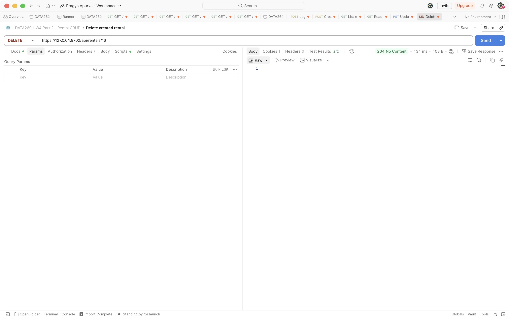
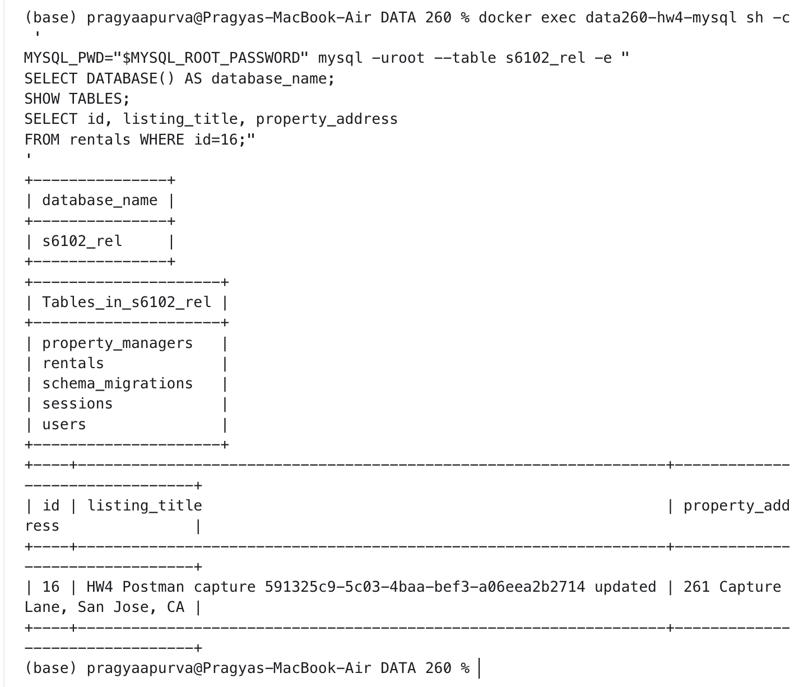
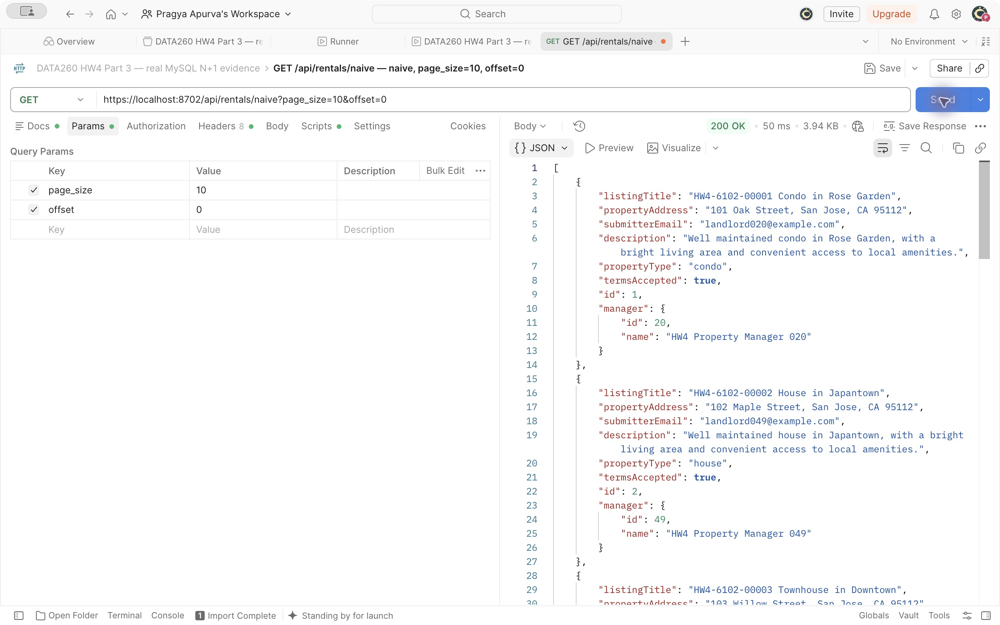
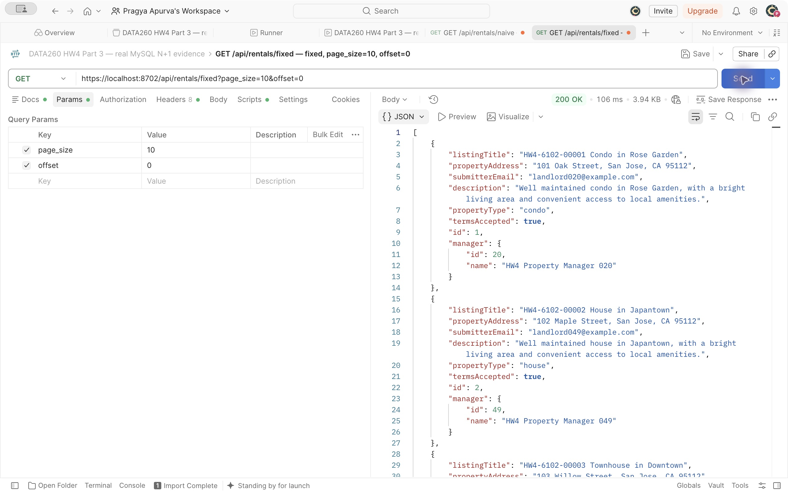
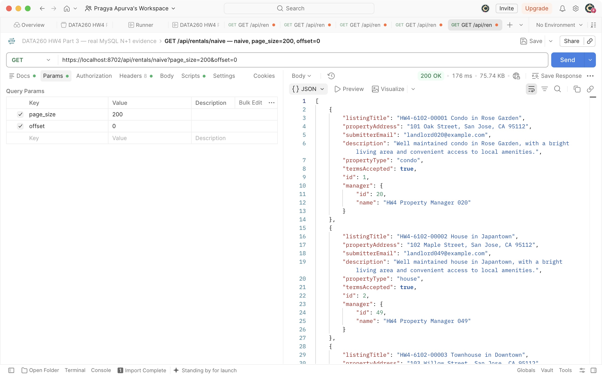

# HW4 Parts 1–3: local integration record

Parts 1–3 are merged into one local Rental Housing Listings application, and the integrated API, browser, MySQL, and performance smoke checks passed. The Parts 1–3 partial verifier reports **automated_status: pass**, **status: pass**, and **46/46 checks passed**. All required Parts 1–3 captures are present, and the capture rental, local credentials, and owned server have been cleaned up. This is a partial write-up for Parts 1–3, not the whole-homework PDF or verification on a submission tag.

## Configuration and revisions

| Item | Value |
| --- | --- |
| SID4 / PREFIX | 6102 / s6102 |
| PORT_BASE | 8702 |
| SEED / VERIFY_SEED | 6102 / 266102 |
| DOMAIN_ID / domain | 6 / Rental Housing Listings |
| Database | s6102_rel, MySQL 8.4.11 |
| Hardware recorded for the performance run | Apple M4, 10 CPU cores, 24 GiB memory; macOS 15.7.4 arm64 |
| Local language model | None used by Parts 1–3 |
| Integration branch | codex/hw4-part2-backend |
| Current tested code | 307b1d9adc050e422a205e2d3219914c2234d816 |
| Initial integrated code | e7382ddb9cc5e0a5cd867653254a0c6f62f2f9c7 |
| Shared foundation B | f29e7cc85baf52bea30bd4bb3209d1bd79b22051 |
| Initial Part 1 handoff | 5db1d4a12d996fa5eb45e9b71d7b2dbcd0708991 |
| Current Part 1 cleanup handoff | 5d84f1a038cfdfcedb667b8047e06d5ef095164b |
| Imported Part 3 implementation commit | 4f8390b84752d861ea6b47c5ac8615680192d841 |
| Imported Part 3 Postman evidence commit | e58669ffbfe3ed459ec2c7e664caa6186ba7ec8a |
| Part 3 measured revision | 9860a20342072168ed68a8d41eb16d9bfecf7729 |
| Verified HW3 baseline | 5742b2aadbafee5ba208311723ea470c09811dc5 |

The two sibling branches merged with foundation ancestry preserved. The partial verifier confirms the baseline, foundation, and both completed sibling commits are ancestors of the integrated tree. It also confirms that historical reports and unrelated application code were preserved. The latest local evidence/documentation commit can be resolved with `git rev-parse codex/hw4-part2-backend`; the tested code and measured revision above remain the provenance anchors even after later evidence-only commits. No `hw4` tag was created.

## Part 1: React interface

The React application has login, home, create, update, and delete pages. React Router handles the required URLs, and the parent passes mutation callbacks as props. Hooks manage form input and fetched data. The client uses the backend's HTTP-only cookie, sends the original six create fields, and updates only title and address. A successful write returns home and reloads the stored list. Failed writes retain entered values, and pending writes are protected against duplicate submission.

The original Part 1 branch passed 19 mock-browser checks, 12 real-browser checks, two controlled-expiry checks, and six runtime checks. These retain their original timestamps under `raw/part1/`. The real branch runtime ran from `2026-09-28T00:46:20.483805+00:00` through `2026-09-28T00:46:32.082772+00:00` at code commit `0c4906dfafde4cbe15e3ff6b7da4c8537814c6d1`.

After merging, the real browser suite was run again against the built React app on HTTPS port 8702. It passed all 12 checks, including six-field create, two-field update, direct update/delete URLs, logout, missing/invalid IDs, narrow-screen layout, and no uncaught JavaScript errors. Rental ID 10 and its login survived a real backend-process restart. After deletion, a second restart still returned 404 for that ID. The separate two-second idle-expiry demonstration passed both checks; production settings remain 300 seconds idle and 3,600 seconds absolute.

See [Part 1 report with code and screenshots](part1/REPORT_SECTION.md), [integrated real-browser output](raw/part2/integrated-browser/real-browser.json), [runtime output](raw/part2/integrated-browser/runtime.json), and [expiry output](raw/part2/integrated-browser/expiry-browser.json).


The production Vite build passed. Its output is in [integrated-build.txt](raw/part2/integrated-build.txt). The dependency audit remains qualified: Part 1 recorded two moderate Router 6-related advisory entries, and no major Router 7 migration was made. There is no configured frontend lint or typecheck command, so neither is claimed as passed.

## Part 2: Persistent backend

The original service now stores rentals, users, login sessions, and property managers in `s6102_rel`. The SQLAlchemy engine has the required name `db_session_basede26`. A request-scoped SQLAlchemy session groups database work; a separate row in the `sessions` table represents a browser login. Passwords are stored as Argon2 hashes. The browser cookie holds only a random opaque token, while MySQL stores its user link, creation time, absolute expiry, and last activity.

Every ordinary rental operation and both performance routes require the same database-backed authentication. Logout revokes the stored token, and idle or absolute expiry rejects it. Rental IDs come from MySQL. Updates preserve the four fields outside the two-field update contract. Failed writes roll back. The nullable manager relation in the early foundation let Part 3 add its experiment without creating a competing schema.

Foundation B was published after 23 real HTTPS/MySQL checks and a repeat-migration/seed check that preserved two existing demo rows. That historical acceptance artifact identifies a dirty HW3-baseline tree before B was committed. It remains labeled as the foundation gate. The integrated run at `e7382ddb9cc5e0a5cd867653254a0c6f62f2f9c7` independently passed the same 23 checks, using rental ID 9 for its create/read/update/delete sequence. Both actual process restart and logout-token revocation passed.

See [Part 2 report](part2/REPORT_SECTION.md), [foundation handoff](part2/FOUNDATION.md), [integrated API output](raw/part2/integrated-api.json), and [schema output](raw/part2/schema-smoke.json). All five actual Postman CRUD responses and the user-provided database screenshot are now included. Historical HTTPX output remains separately labeled.

### Part 2 CRUD code and actual outputs

The API keeps the existing six-field create body. An update accepts only `listingTitle` and `propertyAddress`, so editing these two fields preserves the landlord email, description, property type, and accepted terms. All rental routes share `Depends(require_user)`. The historical output examples below are the original foundation run using ID 4. The integrated rerun performed the same sequence with ID 9 and passed every operation; both artifacts remain available. The newer Postman images show a separate capture run using returned ID 16 and marker `591325c9-5c03-4baa-bef3-a06eea2b2714`, against application source `7350d9c98e8b56fcab4979fd94e0b39246f2b6d3`. The database image was captured before ID 16 was deleted; its absence was then verified.

Excerpt from [routers/rentals.py](../../code/web_application/routers/rentals.py):

```python
router = APIRouter(prefix="/api/rentals", tags=["rentals"], dependencies=[Depends(require_user)])
```

### Add a record: POST /api/rentals

The create handler constructs a `Rental`, commits it, and returns its database-generated ID.

```python
db.add(row)
db.commit()
return rental_json(row)
```


Captured at `2026-09-28T02:19:33.156Z`: POST returned **201** and all six fields for ID **16**. Its title, email, and description contain this capture run’s UUID. The [Postman test view](screenshots/part2/01-post-create-tests.png) records three passed assertions and none failed.

Actual response in the acceptance artifact: **201**, ID **4**, title **HW4 acceptance 20a5a6cf67**, address **260 Verification Lane, San Jose, CA**, landlord email **verification@example.com**, description **A real MySQL acceptance record for verified persistent CRUD.**, property type **apartment**, and accepted terms **true**. This ID is a historical result from that run; new captures must use the ID returned by their own POST.

### View records: GET /api/rentals

```python
statement = select(Rental).order_by(Rental.id)
```


Captured at `2026-09-28T02:21:10.683Z`: the unfiltered GET returned **200** with IDs **1, 2, and 16**. The [Postman test view](screenshots/part2/02-get-list-tests.png) records two passed assertions and none failed.

The endpoint returns a JSON array and supports the preserved optional title/address search. The actual acceptance request used `?q=HW4 acceptance 20a5a6cf67`; it returned **200** and one matching object with ID **4**, identical to the create response. The selected API tests also cover the unfiltered list.

### View one record: GET /api/rentals/{id}

```python
return rental_json(find_rental(db, rental_id))
```


Captured at `2026-09-28T02:21:52.163Z`: `GET /api/rentals/16` returned **200**, with the original values and immutable UUID markers matching the POST. The [Postman test view](screenshots/part2/03-get-by-id-tests.png) records two passed assertions and none failed.

The historical acceptance request `GET /api/rentals/4` returned **200** with the same object as the POST response. A missing positive ID returns **404**.

### Update a record: PUT /api/rentals/{id}

```python
row = find_rental(db, rental_id)
row.listing_title, row.property_address = payload.listingTitle, payload.propertyAddress
db.commit()
return rental_json(row)
```


Captured at `2026-09-28T02:22:53.371Z`: PUT returned **200** for ID **16**, added ` updated` to its title, and set the address to **261 Capture Lane, San Jose, CA**. The email, description, property type, and accepted terms remain unchanged. The [Postman test view](screenshots/part2/04-put-update-tests.png) records three passed assertions and none failed. A [subsequent literal-ID GET](screenshots/part2/04-updated-id-read.png) at `2026-09-28T02:27:19.326Z` returned the updated row and passed both status and ownership assertions.

The historical acceptance request to `/api/rentals/4` returned **200**, title **HW4 acceptance 20a5a6cf67 updated**, and address **261 Verification Lane**. The other four fields matched their original values. A subsequent request with an empty title returned **422**.

### Delete a record: DELETE /api/rentals/{id}

```python
db.delete(find_rental(db, rental_id))
db.commit()
return Response(status_code=204)
```



A [fresh ownership GET](screenshots/part2/04-pre-delete-owned-read.png) at `2026-09-28T03:50:45.953Z` passed the status and immutable-marker checks for ID **16**. DELETE then returned **204** with an empty body at `2026-09-28T03:51:06.099Z`; the [test view](screenshots/part2/05-delete-tests.png) records two passed assertions. A separate [plain GET of literal ID 16](screenshots/part2/05-deleted-id-404.png) returned **404** at `2026-09-28T03:51:29.776Z`. This deleted only the capture run’s row.

The historical acceptance deletion of `/api/rentals/4` returned **204** with no body. Reading that ID afterward returned **404**. The acceptance harness removed only the row it created.

All five sanitized responses are saved together in [api-acceptance.json](raw/part2/api-acceptance.json). [postman_collection.json](part2/postman_collection.json) supplies login, the five CRUD requests, and logout with status assertions. It has blank credential values and remembers the ID returned by its own POST.


### Part 2 database output

The user ran this read-only SQL against the same `data260-hw4-mysql` container used by the API on host port 3362:

```sql
SELECT DATABASE() AS database_name;
SHOW TABLES;
SELECT id, listing_title, property_address
FROM rentals WHERE id=16;
```



The original PNG is preserved unchanged. The complete title and address are readable despite terminal wrapping. Its actual capture time was not supplied; [provenance](raw/part2/postman/database-image.json) separately records ingestion and file modification times. ID 16 was subsequently deleted and the original two rows preserved.

## Part 3: Query performance

The deterministic seed produced 5,000 rentals and 200 managers, with 25 rentals per manager. Generated and stored dataset hashes matched. The naive endpoint performs one rental query and one explicit manager query per returned rental. The fixed endpoint uses one left join and returns the same ordered JSON, including rentals whose manager is null. Both routes include the same two observed authentication/activity statements in total SQL counts.

The original 180-request experiment ran on a clean measured revision from `2026-09-28T00:38:59.945643Z` to `2026-09-28T00:39:05.948186Z`. It used 30 measured requests per size/version, after 18 separate warmups. The recorded environment used Python 3.13.5, one Uvicorn worker, HTTPS port 8702, MySQL 8.4.11, and no listing-title index. Raw requests, warmups, configuration, source hashes, and timestamps remain unchanged.

| Page size | Naive total/data SQL | Fixed total/data SQL | Naive p50 ms | Fixed p50 ms | p50 speed-up |
| ---: | ---: | ---: | ---: | ---: | ---: |
| 10 | 13 / 11 | 3 / 1 | 11.514 | 7.557 | 1.524× |
| 50 | 53 / 51 | 3 / 1 | 26.380 | 8.630 | 3.057× |
| 200 | 203 / 201 | 3 / 1 | 74.496 | 14.202 | 5.245× |

The median benefit grows with page size because the naive route adds database round trips while the fixed data-query count stays at one. This does not mean every percentile improved. At size 10, fixed p99 was 85.671 ms versus 23.194 ms naive because one fixed request took 115.455 ms. That sample was retained; its cause was not established. The [complete metrics](METRICS.md) include all six rows, p50/p95/p99, and ratios.

The later index experiment added `ix_rentals_listing_title`. For a selective title lookup, MySQL EXPLAIN changed from access type `index`, key `PRIMARY`, and 4,868 estimated rows to access type `ref`, key `ix_rentals_listing_title`, and one estimated row. Results and dataset hashes stayed equal. These are optimizer estimates, not measured latency or actual scanned-row counts. The index experiment is separate from the unindexed N+1 timing run. See [index comparison](raw/part3/index/20260928T004453-df40d32d/comparison.json) and [Part 3 report](part3/REPORT_SECTION.md).

Integration preserved the measured performance, authentication, model, schema, SQL-counter, and serialization source hashes. The sole changed Python file in the recorded application hash set is ordinary `routers/rentals.py`: its optional `q` search now preserves HW3 Unicode casefold matching. That route is not called by the measured performance endpoints. The integrated smoke run again found total SQL counts 13/53/203 naive and three fixed, with equal ordered payloads at all three sizes. No full timing rerun was needed because the measured execution path did not change. The published latency values remain measurements of the original recorded environment, not new latency claims for the integration smoke run.

### Part 3 query code

To show N+1, first fetch one page of rentals, then perform one manager lookup per rental. For N rentals this needs N+1 data statements. SQLAlchemy's identity map remembers loaded objects inside a session; `Session.get` could reuse an object and avoid the extra query. The explicit SELECT below always goes to MySQL, even for repeated manager IDs.

```python
@router.get('/naive', response_model=list[PerformanceRentalResponse])
def naive(page_size: int = Query(10, ge=1, le=200), offset: int = Query(0, ge=0),
          db: Session = Depends(get_db)):
    rentals = db.scalars(select(Rental).order_by(Rental.id).limit(page_size).offset(offset)
                         .execution_options(hw4_data_query=True)).all()
    rows = []
    for rental in rentals:
        # An explicit SELECT always executes, even when the same manager is
        # already in the ORM identity map. Session.get/lazy access would hide N+1.
        manager = db.scalar(select(PropertyManager).where(PropertyManager.id == rental.manager_id)
                            .execution_options(hw4_data_query=True))
        rows.append(_serialize(rental, manager))
    return rows
```

The fixed version joins rentals to managers in one data statement. A left join keeps a rental even if its manager is null. Both implementations share the same ordering, pagination, ordinary-field serializer and response validation.

```python
@router.get('/fixed', response_model=list[PerformanceRentalResponse])
def fixed(page_size: int = Query(10, ge=1, le=200), offset: int = Query(0, ge=0),
          db: Session = Depends(get_db)):
    rows = db.execute(select(Rental, PropertyManager)
                      .outerjoin(PropertyManager, Rental.manager_id == PropertyManager.id)
                      .order_by(Rental.id).limit(page_size).offset(offset)
                      .execution_options(hw4_data_query=True)).all()
    return [_serialize(rental, manager) for rental, manager in rows]
```


### Part 3 actual Postman outputs

All six required endpoint/size screenshots were captured in **Postman 12.29.5** against server revision `4f8390b84752d861ea6b47c5ac8615680192d841` at `https://localhost:8702`. Part 2 assigned an exclusive capture slot. The dedicated `s6102_rel` database at port 33363 still contained exactly 5,000 rentals and 200 managers, with migrations 001/003 and the listing-title index present. The [capture manifest](raw/part3/postman/manifest.json) records timestamps, image hashes and configuration.

The unchanged [collection](part3/postman_collection.json) ran one local functional iteration at **2026-09-28 01:53:31 UTC**: login followed by six GET requests. Postman reported **53 passed, 0 failed, 3 skipped and 0 errors**. All three fixed payloads equaled their naive counterpart; each earlier naive equality check was skipped until that counterpart was available. The [runner summary](screenshots/part3/collection-run-summary.png), [size-200 equality screenshot](screenshots/part3/payload-equality-200.png), and [runner text, top](raw/part3/postman/runner-results-top.txt)/[bottom](raw/part3/postman/runner-results-bottom.txt) preserve the results. The [configuration screenshot](screenshots/part3/collection-run-configuration.png) shows one local functional iteration.

Each request below was then sent individually to capture its response. Its matching test image shows eight passing checks for status, JSON type, exact row count, ascending IDs, manager data and observed SQL headers. The equality check is skipped in these individual sends because its comparison values live only within one Collection Runner run; the completed run above supplies the equality evidence.

```http
GET https://localhost:8702/api/rentals/naive?page_size=10&offset=0
```



[Observed response headers](screenshots/part3/naive-10-headers.png) show **13 total SQL statements**, including auth, and **11 data statements**. [Passing tests](screenshots/part3/naive-10-tests.png) confirm exactly 10 rows and populated manager data.

```http
GET https://localhost:8702/api/rentals/fixed?page_size=10&offset=0
```



[Observed response headers](screenshots/part3/fixed-10-headers.png) show **3 total SQL statements**, including auth, and **1 data statements**. [Passing tests](screenshots/part3/fixed-10-tests.png) confirm exactly 10 rows and populated manager data.

```http
GET https://localhost:8702/api/rentals/naive?page_size=50&offset=0
```


[Observed response headers](screenshots/part3/naive-50-headers.png) show **53 total SQL statements**, including auth, and **51 data statements**. [Passing tests](screenshots/part3/naive-50-tests.png) confirm exactly 50 rows and populated manager data.

```http
GET https://localhost:8702/api/rentals/fixed?page_size=50&offset=0
```


[Observed response headers](screenshots/part3/fixed-50-headers.png) show **3 total SQL statements**, including auth, and **1 data statements**. [Passing tests](screenshots/part3/fixed-50-tests.png) confirm exactly 50 rows and populated manager data.

```http
GET https://localhost:8702/api/rentals/naive?page_size=200&offset=0
```



[Observed response headers](screenshots/part3/naive-200-headers.png) show **203 total SQL statements**, including auth, and **201 data statements**. [Passing tests](screenshots/part3/naive-200-tests.png) confirm exactly 200 rows and populated manager data.

```http
GET https://localhost:8702/api/rentals/fixed?page_size=200&offset=0
```


[Observed response headers](screenshots/part3/fixed-200-headers.png) show **3 total SQL statements**, including auth, and **1 data statements**. [Passing tests](screenshots/part3/fixed-200-tests.png) confirm exactly 200 rows and populated manager data.

[SSL verification remained enabled](screenshots/part3/tls-verification.png), with the [custom public CA loaded](screenshots/part3/tls-ca.png) with user assistance. Credentials stayed in unshared local values and were cleared afterward; the [clearing record](raw/part3/postman/local-values-cleared.json) records UI verification at 2026-09-28 02:07:07.440 UTC. No credentials or cookie values are visible in these images. The [capture inventory and procedure](screenshots/part3/README.md) links all 23 visually reviewed captures. The native tool emitted JPEG bytes; the exact [native originals](raw/part3/postman/native-captures/) are retained, and the displayed PNGs are lossless conversions with identical decoded pixels and dimensions. No crop, resize, annotation or composite was applied ([format verification](raw/part3/postman/image-format-check.json)).

These are functional screenshot requests after the index experiment. Their visible response times do not replace the selected 180-request dataset or its percentiles. The original timing rows, metrics, seed manifest, index snapshots and measured source bytes remain unchanged; [preservation evidence](raw/part3/postman/preservation_after.json) and the [database postflight](raw/part3/postman/postflight.json) record those checks. The query excerpts and matching request images are paired in this report.

## Initial integration verification

The integrated tests used dedicated MySQL instances and exclusive HTTPS evidence slots. API/browser work used the evidence database on host port 3362; ordinary pytest fixtures used a separate instance on 3363; Part 3 live checks and the combined performance smoke used the dedicated performance instance on 33363. All three database names are `s6102_rel`. Shared data was not reset, and the harnesses stopped only their own processes.

| Integrated check | Recorded time (UTC) | Actual outcome |
| --- | --- | --- |
| API/auth/CRUD acceptance | 2026-09-28T00:55:59.072951+00:00 | 23/23 passed |
| Selected Python suite | 2026-09-28T00:56:08.104131+00:00 to 00:56:13.809031+00:00 | 191 passed, 111 warnings, no skips; pytest duration 5.42 s |
| Browser/runtime workflow | 2026-09-28T00:56:20.413881+00:00 to 00:56:31.124030+00:00 | 12 real-browser, two expiry, and six runtime checks passed |
| Combined deep-link/auth/performance smoke | 2026-09-28T00:56:42.886910+00:00 to 00:56:45.959111+00:00 | 29/29 passed |
| Partial evidence verifier | 2026-09-28T00:58:08.565999+00:00 | Automated checks pass; overall incomplete because 12 manual captures are missing |

The 29 smoke checks cover the exact 5,000/200 dataset, the five built React routes and actual assets, API JSON 404 behavior, retained docs, shared authentication, all six size/version combinations, equal payloads, SQL counts, and revoked-token rejection. [Pytest metadata](raw/part2/pytest-integrated.metadata.json) records source hashes and confirms source was unchanged during the run. The API and pytest artifacts mark the worktree dirty because new evidence was present; the tested revision and source hashes are recorded rather than implying a clean final tagged checkout.

Evidence: [pytest output](raw/part2/pytest-integrated.txt), [combined smoke output](raw/part2/integration-smoke.json), and [initial partial verification](raw/part2/cleanup-followup/verification-before.json). Failed early attempts remain beside selected passes and are not counted as successful runs.

A later read-only [database preservation check](raw/part2/integrated-database-preserved.json) at `2026-09-28T01:00:51.453365+00:00` passed: the performance dataset, index inventory, and query results match the post-index snapshot, while the API/browser and ordinary-test instances each still contain two rentals.

## Current cleanup follow-up

Part 1 cleanup commit `5d84f1a038cfdfcedb667b8047e06d5ef095164b` was merged at `6957de05690566887cab38a8d4c03537f665417a`. Current tested code is `307b1d9adc050e422a205e2d3219914c2234d816`. The change affects the browser test runner and verification provenance; frontend/backend application code and the measured performance path are unchanged, so the original benchmark remains selected.

| Follow-up check | Actual outcome | Evidence |
| --- | --- | --- |
| Normal HTTPS browser/runtime at merge `6957de0` | 12 browser, two expiry, and six runtime checks passed; cleanup `already_absent` for ID 14 | [browser](raw/part2/cleanup-followup/browser/real-browser.json), [expiry](raw/part2/cleanup-followup/browser/expiry-browser.json), [runtime](raw/part2/cleanup-followup/browser/runtime.json) |
| Deliberate interruption at current code | 8/8 passed; exact confirmed-created ID 15 deleted and every pre-existing rental unchanged | [interruption check](raw/part2/cleanup-followup/interruption/check.json) |
| Current selected Python suite | 209 passed, 111 warnings, no skips, 5.95 s | [pytest](raw/part2/cleanup-followup/pytest-integrated.txt), [metadata](raw/part2/cleanup-followup/pytest-integrated.metadata.json) |
| Current combined smoke | 29/29 passed | [smoke](raw/part2/cleanup-followup/integration-smoke.json) |

The normal runtime ran at `2026-09-28T01:14:34.935389+00:00` through `01:14:46.483869+00:00`. The interruption check ran at `01:15:32.713257+00:00` through `01:15:35.397312+00:00` on isolated development port 8712; it deliberately produced runtime status `interrupted` and exit 143, then verified row cleanup, process shutdown, and port release. That interrupted browser trace is not a failed normal acceptance run.

The current pytest run began at `2026-09-28T01:15:32.510124+00:00`; the 29-check smoke ran at `01:15:50.150794+00:00` through `01:15:53.159300+00:00`. Seventeen new cleanup-guard unit tests use SQLite. Required MySQL evidence remains the live interruption check and integrated MySQL checks; SQLite is not substituted for that proof. The additional provenance regression and metadata cover the CJS browser runner, Python runtime runner, and interruption driver.

At `2026-09-28T01:16:15.241788+00:00`, [cleanup-follow-up partial verification](raw/part2/capture-recheck/verification-before.json) again reported 34/46 checks passing, automated status **pass**, and overall **incomplete** solely for the same 12 manual captures. [The previous verifier](raw/part2/cleanup-followup/verification-before.json), initial integration timings, and original screenshot paths are preserved.

## Captured structure and remaining work


The Finder captures satisfy the project-folder evidence item. Part 1 and integrated browser images are also available. All five Part 2 CRUD response images, all six Part 3 endpoint/size response images, and the database screenshot are captured. Fifteen native Part 2 Postman JPEGs are retained with pixel-identical PNG conversions; the user’s database PNG is copied byte-for-byte. No image content was edited.

The database screenshot shows `s6102_rel`, the five tables, and updated rental 16 before deletion. Its terminal table wraps, but the complete title and address are readable. The user took this image because the computer-use tool denied native Terminal and Codex app control. A MySQL GUI was unnecessary. [Image provenance](raw/part2/postman/database-image.json) records ingestion at 2026-09-28T03:50:51.701131+00:00; the actual capture timestamp was not supplied and remains unknown.

The [manual capture manifest](manual-captures.json) now records 13/13 completed evidence items. The [capture record](raw/part2/postman/manifest.json) connects actual images, requests, database preservation, local credential clearing and server shutdown.

Part 4, the final whole-homework PDF and combined AI-use review, collaborator access confirmation, the `hw4` tag, and verification on that tagged commit remain later submission work. Nothing was pushed, published, or deployed by this local integration.

## Final Parts 1–3 capture verification

At `2026-09-28T03:55:37.917251+00:00`, the [partial verifier](verification.parts123.json) passed **46/46 checks**, with automated and overall status **pass** and exit code **0**. There are no remaining Parts 1–3 manual captures or sibling implementation handoffs. [The exact invocation](raw/part2/postman/verification-run.json) and [the preceding 44/46 result](raw/part2/postman/verification-before-completion.json) remain available. This is a selected-evidence/source check, not a new automated API, pytest, browser or benchmark run.

Part 3 evidence-only commit `e58669ffbfe3ed459ec2c7e664caa6186ba7ec8a` merged at `5c939bd8b32c41c7514bb061210a1f4e43b25862`; available-capture checkpoint `53937d1d6f3ece1353302fa7135107c9a6ca592c` preserved the earlier incomplete state. Part 2’s capture server ran application source `7350d9c98e8b56fcab4979fd94e0b39246f2b6d3`. Later evidence-only commits did not alter that application source or the measured performance path.

The five primary CRUD operations passed 12 assertions: POST 3, list GET 2, initial ID GET 2, PUT 3, DELETE 2. This is not a Collection Runner total. After the user supplied the database image, a renewed login returned 200 and a fresh exact-ID GET confirmed the saved UUID in the immutable email and description. DELETE returned 204 with an empty body at 03:51:06.099 UTC; a separate literal-ID GET returned 404 at 03:51:29.776 UTC; logout returned 204 at 03:51:48.474 UTC. [The capture log](raw/part2/postman/capture-log.json) retains exact image timestamps and hashes.

The [read-only database postflight](raw/part2/postman/postflight.json) passed **11/11 checks**. ID 16 is absent, and only original IDs 1 and 2 remain with every recorded field and their canonical hash unchanged. The manager count, server identity, migration journal, tables and index definitions are preserved. The [local-value record](raw/part2/postman/local-values-cleared.json) confirms the email and password values were empty after reopening Postman’s Variables tab; only this capture collection’s temporary state was cleared. The [shutdown record](raw/part2/postman/server-shutdown.json) confirms owned Uvicorn PID 82539 stopped and port 8702 was free. The launcher’s exit 1 was the expected KeyboardInterrupt after Ctrl-C; Uvicorn reported successful shutdown. The three dedicated MySQL databases remain available without reset.
