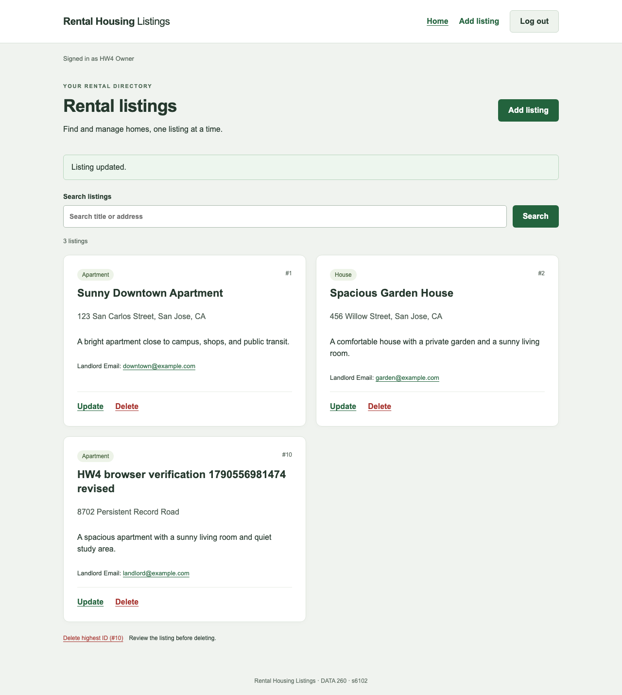

# HW4 Parts 1–3: local integration record

Parts 1–3 are merged into one local Rental Housing Listings application, and the integrated API, browser, MySQL, and performance smoke checks passed. The partial verifier reports **automated_status: pass** and **status: incomplete**: 34 of 46 recorded checks pass, while 12 required manual captures remain unavailable. This is a partial write-up for Parts 1–3, not the whole-homework PDF or verification on a submission tag.

## Configuration and revisions

| Item | Value |
| --- | --- |
| SID4 / PREFIX | 6102 / s6102 |
| PORT_BASE | 8702 |
| SEED / VERIFY_SEED | 6102 / 266102 |
| DOMAIN_ID / domain | 6 / Rental Housing Listings |
| Database | s6102_rel, MySQL 8.4.11 |
| Hardware recorded for the performance run | Apple M4, 10 CPU cores, 24 GiB memory; macOS 15.7.4 arm64 |
| Local language model | None used by Parts 1–3 |
| Integration branch | codex/hw4-part2-backend |
| Current tested code | 307b1d9adc050e422a205e2d3219914c2234d816 |
| Initial integrated code | e7382ddb9cc5e0a5cd867653254a0c6f62f2f9c7 |
| Shared foundation B | f29e7cc85baf52bea30bd4bb3209d1bd79b22051 |
| Initial Part 1 handoff | 5db1d4a12d996fa5eb45e9b71d7b2dbcd0708991 |
| Current Part 1 cleanup handoff | 5d84f1a038cfdfcedb667b8047e06d5ef095164b |
| Imported Part 3 final commit | 4f8390b84752d861ea6b47c5ac8615680192d841 |
| Part 3 measured revision | 9860a20342072168ed68a8d41eb16d9bfecf7729 |
| Verified HW3 baseline | 5742b2aadbafee5ba208311723ea470c09811dc5 |

The two sibling branches merged with foundation ancestry preserved. The partial verifier confirms the baseline, foundation, and both completed sibling commits are ancestors of the integrated tree. It also confirms that historical reports and unrelated application code were preserved. The latest local evidence/documentation commit can be resolved with `git rev-parse codex/hw4-part2-backend`; the tested code and measured revision above remain the provenance anchors even after later evidence-only commits. No `hw4` tag was created.

## Part 1: React interface

The React application has login, home, create, update, and delete pages. React Router handles the required URLs, and the parent passes mutation callbacks as props. Hooks manage form input and fetched data. The client uses the backend's HTTP-only cookie, sends the original six create fields, and updates only title and address. A successful write returns home and reloads the stored list. Failed writes retain entered values, and pending writes are protected against duplicate submission.

The original Part 1 branch passed 19 mock-browser checks, 12 real-browser checks, two controlled-expiry checks, and six runtime checks. These retain their original timestamps under `raw/part1/`. The real branch runtime ran from `2026-09-28T00:46:20.483805+00:00` through `2026-09-28T00:46:32.082772+00:00` at code commit `0c4906dfafde4cbe15e3ff6b7da4c8537814c6d1`.

After merging, the real browser suite was run again against the built React app on HTTPS port 8702. It passed all 12 checks, including six-field create, two-field update, direct update/delete URLs, logout, missing/invalid IDs, narrow-screen layout, and no uncaught JavaScript errors. Rental ID 10 and its login survived a real backend-process restart. After deletion, a second restart still returned 404 for that ID. The separate two-second idle-expiry demonstration passed both checks; production settings remain 300 seconds idle and 3,600 seconds absolute.

See [Part 1 report with code and screenshots](part1/REPORT_SECTION.md), [integrated real-browser output](raw/part2/integrated-browser/real-browser.json), [runtime output](raw/part2/integrated-browser/runtime.json), and [expiry output](raw/part2/integrated-browser/expiry-browser.json).

The production Vite build passed. Its output is in [integrated-build.txt](raw/part2/integrated-build.txt). The dependency audit remains qualified: Part 1 recorded two moderate Router 6-related advisory entries, and no major Router 7 migration was made. There is no configured frontend lint or typecheck command, so neither is claimed as passed.

## Part 2: Persistent backend

The original service now stores rentals, users, login sessions, and property managers in `s6102_rel`. The SQLAlchemy engine has the required name `db_session_basede26`. A request-scoped SQLAlchemy session groups database work; a separate row in the `sessions` table represents a browser login. Passwords are stored as Argon2 hashes. The browser cookie holds only a random opaque token, while MySQL stores its user link, creation time, absolute expiry, and last activity.

Every ordinary rental operation and both performance routes require the same database-backed authentication. Logout revokes the stored token, and idle or absolute expiry rejects it. Rental IDs come from MySQL. Updates preserve the four fields outside the two-field update contract. Failed writes roll back. The nullable manager relation in the early foundation let Part 3 add its experiment without creating a competing schema.

Foundation B was published after 23 real HTTPS/MySQL checks and a repeat-migration/seed check that preserved two existing demo rows. That historical acceptance artifact identifies a dirty HW3-baseline tree before B was committed. It remains labeled as the foundation gate. The integrated run at `e7382ddb9cc5e0a5cd867653254a0c6f62f2f9c7` independently passed the same 23 checks, using rental ID 9 for its create/read/update/delete sequence. Both actual process restart and logout-token revocation passed.

See [Part 2 report](part2/REPORT_SECTION.md), [foundation handoff](part2/FOUNDATION.md), [integrated API output](raw/part2/integrated-api.json), and [schema output](raw/part2/schema-smoke.json). The five Postman CRUD screenshots and database-client screenshot remain pending; HTTPX output is supporting evidence rather than a replacement.

## Part 3: Query performance

The deterministic seed produced 5,000 rentals and 200 managers, with 25 rentals per manager. Generated and stored dataset hashes matched. The naive endpoint performs one rental query and one explicit manager query per returned rental. The fixed endpoint uses one left join and returns the same ordered JSON, including rentals whose manager is null. Both routes include the same two observed authentication/activity statements in total SQL counts.

The original 180-request experiment ran on a clean measured revision from `2026-09-28T00:38:59.945643Z` to `2026-09-28T00:39:05.948186Z`. It used 30 measured requests per size/version, after 18 separate warmups. The recorded environment used Python 3.13.5, one Uvicorn worker, HTTPS port 8702, MySQL 8.4.11, and no listing-title index. Raw requests, warmups, configuration, source hashes, and timestamps remain unchanged.

| Page size | Naive total/data SQL | Fixed total/data SQL | Naive p50 ms | Fixed p50 ms | p50 speed-up |
| ---: | ---: | ---: | ---: | ---: | ---: |
| 10 | 13 / 11 | 3 / 1 | 11.514 | 7.557 | 1.524× |
| 50 | 53 / 51 | 3 / 1 | 26.380 | 8.630 | 3.057× |
| 200 | 203 / 201 | 3 / 1 | 74.496 | 14.202 | 5.245× |

The median benefit grows with page size because the naive route adds database round trips while the fixed data-query count stays at one. This does not mean every percentile improved. At size 10, fixed p99 was 85.671 ms versus 23.194 ms naive because one fixed request took 115.455 ms. That sample was retained; its cause was not established. The [complete metrics](METRICS.md) include all six rows, p50/p95/p99, and ratios.

The later index experiment added `ix_rentals_listing_title`. For a selective title lookup, MySQL EXPLAIN changed from access type `index`, key `PRIMARY`, and 4,868 estimated rows to access type `ref`, key `ix_rentals_listing_title`, and one estimated row. Results and dataset hashes stayed equal. These are optimizer estimates, not measured latency or actual scanned-row counts. The index experiment is separate from the unindexed N+1 timing run. See [index comparison](raw/part3/index/20260928T004453-df40d32d/comparison.json) and [Part 3 report](part3/REPORT_SECTION.md).

Integration preserved the measured performance, authentication, model, schema, SQL-counter, and serialization source hashes. The sole changed Python file in the recorded application hash set is ordinary `routers/rentals.py`: its optional `q` search now preserves HW3 Unicode casefold matching. That route is not called by the measured performance endpoints. The integrated smoke run again found total SQL counts 13/53/203 naive and three fixed, with equal ordered payloads at all three sizes. No full timing rerun was needed because the measured execution path did not change. The published latency values remain measurements of the original recorded environment, not new latency claims for the integration smoke run.

## Initial integration verification

The integrated tests used dedicated MySQL instances and exclusive HTTPS evidence slots. API/browser work used the evidence database on host port 3362; ordinary pytest fixtures used a separate instance on 3363; Part 3 live checks and the combined performance smoke used the dedicated performance instance on 33363. All three database names are `s6102_rel`. Shared data was not reset, and the harnesses stopped only their own processes.

| Integrated check | Recorded time (UTC) | Actual outcome |
| --- | --- | --- |
| API/auth/CRUD acceptance | 2026-09-28T00:55:59.072951+00:00 | 23/23 passed |
| Selected Python suite | 2026-09-28T00:56:08.104131+00:00 to 00:56:13.809031+00:00 | 191 passed, 111 warnings, no skips; pytest duration 5.42 s |
| Browser/runtime workflow | 2026-09-28T00:56:20.413881+00:00 to 00:56:31.124030+00:00 | 12 real-browser, two expiry, and six runtime checks passed |
| Combined deep-link/auth/performance smoke | 2026-09-28T00:56:42.886910+00:00 to 00:56:45.959111+00:00 | 29/29 passed |
| Partial evidence verifier | 2026-09-28T00:58:08.565999+00:00 | Automated checks pass; overall incomplete because 12 manual captures are missing |

The 29 smoke checks cover the exact 5,000/200 dataset, the five built React routes and actual assets, API JSON 404 behavior, retained docs, shared authentication, all six size/version combinations, equal payloads, SQL counts, and revoked-token rejection. [Pytest metadata](raw/part2/pytest-integrated.metadata.json) records source hashes and confirms source was unchanged during the run. The API and pytest artifacts mark the worktree dirty because new evidence was present; the tested revision and source hashes are recorded rather than implying a clean final tagged checkout.

Evidence: [pytest output](raw/part2/pytest-integrated.txt), [combined smoke output](raw/part2/integration-smoke.json), and [initial partial verification](raw/part2/cleanup-followup/verification-before.json). Failed early attempts remain beside selected passes and are not counted as successful runs.

A later read-only [database preservation check](raw/part2/integrated-database-preserved.json) at `2026-09-28T01:00:51.453365+00:00` passed: the performance dataset, index inventory, and query results match the post-index snapshot, while the API/browser and ordinary-test instances each still contain two rentals.

## Current cleanup follow-up

Part 1 cleanup commit `5d84f1a038cfdfcedb667b8047e06d5ef095164b` was merged at `6957de05690566887cab38a8d4c03537f665417a`. Current tested code is `307b1d9adc050e422a205e2d3219914c2234d816`. The change affects the browser test runner and verification provenance; frontend/backend application code and the measured performance path are unchanged, so the original benchmark remains selected.

| Follow-up check | Actual outcome | Evidence |
| --- | --- | --- |
| Normal HTTPS browser/runtime at merge `6957de0` | 12 browser, two expiry, and six runtime checks passed; cleanup `already_absent` for ID 14 | [browser](raw/part2/cleanup-followup/browser/real-browser.json), [expiry](raw/part2/cleanup-followup/browser/expiry-browser.json), [runtime](raw/part2/cleanup-followup/browser/runtime.json) |
| Deliberate interruption at current code | 8/8 passed; exact confirmed-created ID 15 deleted and every pre-existing rental unchanged | [interruption check](raw/part2/cleanup-followup/interruption/check.json) |
| Current selected Python suite | 209 passed, 111 warnings, no skips, 5.95 s | [pytest](raw/part2/cleanup-followup/pytest-integrated.txt), [metadata](raw/part2/cleanup-followup/pytest-integrated.metadata.json) |
| Current combined smoke | 29/29 passed | [smoke](raw/part2/cleanup-followup/integration-smoke.json) |

The normal runtime ran at `2026-09-28T01:14:34.935389+00:00` through `01:14:46.483869+00:00`. The interruption check ran at `01:15:32.713257+00:00` through `01:15:35.397312+00:00` on isolated development port 8712; it deliberately produced runtime status `interrupted` and exit 143, then verified row cleanup, process shutdown, and port release. That interrupted browser trace is not a failed normal acceptance run.

The current pytest run began at `2026-09-28T01:15:32.510124+00:00`; the 29-check smoke ran at `01:15:50.150794+00:00` through `01:15:53.159300+00:00`. Seventeen new cleanup-guard unit tests use SQLite. Required MySQL evidence remains the live interruption check and integrated MySQL checks; SQLite is not substituted for that proof. The additional provenance regression and metadata cover the CJS browser runner, Python runtime runner, and interruption driver.

At `2026-09-28T01:16:15.241788+00:00`, [cleanup-follow-up partial verification](raw/part2/capture-recheck/verification-before.json) again reported 34/46 checks passing, automated status **pass**, and overall **incomplete** solely for the same 12 manual captures. [The previous verifier](raw/part2/cleanup-followup/verification-before.json), initial integration timings, and original screenshot paths are preserved.

## Captured structure and remaining work

The two Finder captures satisfy the project-folder evidence item. Original captured JPEG bytes are retained beside PNG format conversions; no content was edited. Part 1 and integrated browser screenshots are available. The remaining **12 manual captures** are five Part 2 Postman CRUD responses, six Part 3 Postman size/version responses, and one database-client view. Postman is absent from the available native apps. The attempted native Terminal capture was denied by the computer-use tool; real schema/query JSON is available, but it does not replace the required database screenshot.

The [manual capture manifest](manual-captures.json) records each item separately. Follow [Part 2 capture steps](part2/MANUAL_CAPTURES.md) and [Part 3 capture steps](screenshots/part3/README.md). The collections contain no configured credentials, and no image has been fabricated.

Part 4, the final whole-homework PDF and combined AI-use review, collaborator access confirmation, the `hw4` tag, and verification on that tagged commit remain later submission work. Nothing was pushed, published, or deployed by this local integration.

## Remaining Part 2 capture access recheck

At `2026-09-28T01:29:38.647410+00:00`, the [availability record](raw/part2/capture-recheck/availability.json) confirmed that Postman was still absent from the checked app inventory and application folders, and could not be opened. Native Terminal access was denied again by the computer-use tool. No dedicated MySQL GUI was found in the inspected locations. No new screenshot, server process, or capture rental was created. Port 8702 was free and was not claimed; the existing databases and benchmark measurements were untouched.

All six Part 2 images therefore remain pending: POST, list GET, ID GET, PUT, DELETE, and the database view. The existing project-folder images remain complete. The required next step is to make Postman and an allowed database client available, with separate authorization for any new installation. The database view must use the API's Part 2 instance on host port 3362, capture only this run's uniquely marked rental before deletion, and omit credentials, token values, and password hashes. The Terminal denial was not bypassed.

The [capture instructions](part2/MANUAL_CAPTURES.md) now explain single-run ownership, recovery after an uncertain POST, a fresh exact-ID/marker comparison before each mutation, the database-before-delete order, and a final literal-ID 404 check. The prepared collection uses a GUID in immutable fields and guards against stale or overridden IDs; offline script checks are explicitly separate from actual Postman execution. Each new image must be placed beneath its corresponding code excerpt once genuinely captured.

The [partial verifier](verification.parts123.json) was rerun against the retained selected evidence at `2026-09-28T01:29:57.581094+00:00`. It again reports **automated status pass**, **34/46 checks passed**, and **overall incomplete** for the same 12 manual images (six Part 2 and six Part 3). Its exit code 1 reflects these missing images. [Run details](raw/part2/capture-recheck/verification-run.json) preserve the exact command; [the prior verifier](raw/part2/capture-recheck/verification-before.json) is retained. This recheck is not a new API, browser, pytest, or performance measurement run.
