# HW4 Part 1: React rental client

SID4 **6102** · PORT_BASE **8702** · PREFIX **s6102** · SEED **6102** · VERIFY_SEED **266102** · DOMAIN_ID **6** (Rental Housing Listings).

This section documents Part 1 only. It is a report fragment for the later combined homework PDF, not a claim that the complete HW4 submission or tagged verification is finished. The verified HW3 baseline is `5742b2aadbafee5ba208311723ea470c09811dc5`. Part 2 foundation `f29e7cc85baf52bea30bd4bb3209d1bd79b22051` was merged into the Part 1 branch. The final selected browser runs use code commit `0c4906d` (full hash in their JSON). The JSON records exact source hashes for the frontend and runners; subsequent commits contain report/evidence changes only. No `hw4` tag was created.

Execution environment: macOS 15.7.4 on arm64, Node 24.19.0, React 18.3.1, React Router 6.30.6, Vite 7.3.6, Playwright 1.62.1, and MySQL 8.4.11. Part 1 does not invoke a local language model. CPU model and memory were not collected because the hardware query was unavailable in the default sandbox.

## How the client works

A React **component** is a function that describes one part of the screen. **Props** are values or callbacks passed from a parent component to a child. A **hook**, such as `useState` or `useEffect`, lets a component remember changing values or synchronize with an external service. React Router chooses the component for the current URL.

The browser calls the existing FastAPI service with relative `/api/...` URLs. The backend verifies the login and reads or writes MySQL. React displays the response; it does not invent a record ID or store a session token. A successful mutation returns home, where a new GET reloads the saved list. If that GET fails, the page offers a read retry rather than repeating the completed write.

## Login and protected screens

`Login.jsx` collects email and password. The shared API helper sends credentials with the request so the browser handles the HTTP-only cookie. “HTTP-only” means browser JavaScript cannot read the cookie. Authentication state starts as unknown and is checked with `/api/auth/me` on each full page load. A local Boolean is never treated as proof of login. Protected pages show “Login required” until the server has accepted the session.

From `frontend/src/auth/AuthContext.jsx` (lines 17–32):

```jsx
    request("/auth/me", {
      signal: controller.signal,
      notifyUnauthorized: false,
    })
      .then(({ user }) => {
        if (!controller.signal.aborted)
          setAuth({ status: "authenticated", user });
      })
      .catch((error) => {
        if (controller.signal.aborted) return;
        setAuth({
          status: error.status === 401 ? "anonymous" : "error",
          user: null,
          error: error.message,
        });
      });
```

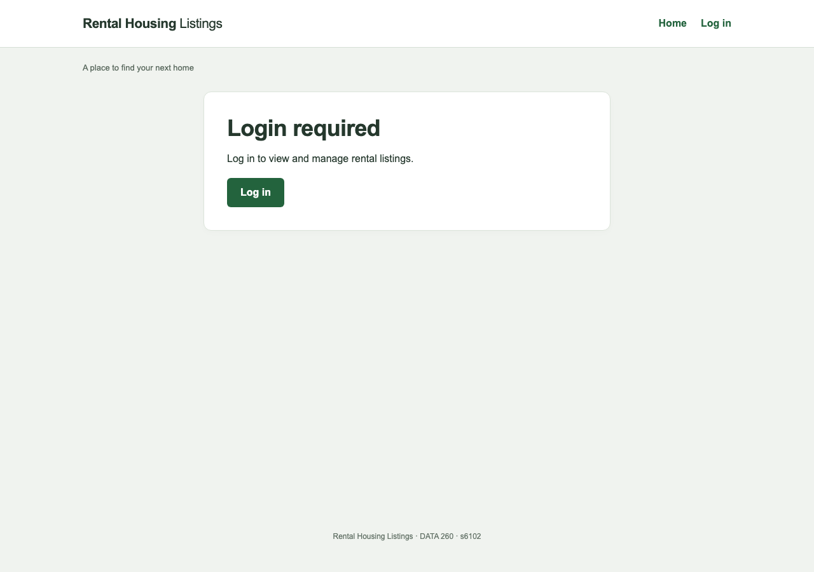

Real HTTPS output: a direct protected-page visit displays Login required and no rental data.
From `frontend/src/pages/Login.jsx` (lines 10–14):

```jsx
  const { pending, error, submit } = useSubmission(
    () => auth.login(email.trim(), password),
    "You are logged in.",
  );
  if (auth.user) return <Navigate to="/" replace />;
```

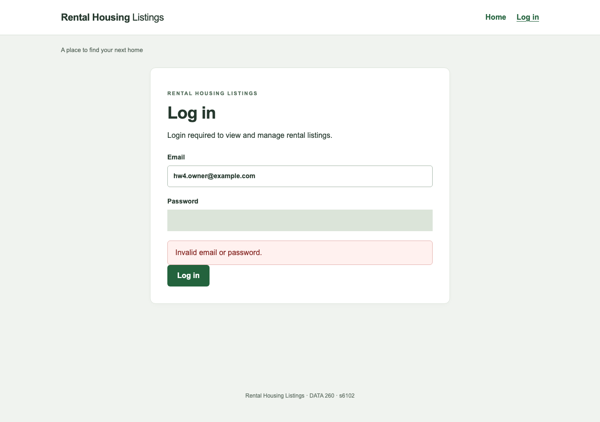

Real HTTPS output: invalid credentials are rejected. The password control is masked in every saved screenshot.
The real browser check confirmed `s6102_session` has HttpOnly, Secure, SameSite=Lax and Path=/, is absent from `document.cookie`, and is not copied to local or session storage. The cookie value and password are redacted or omitted from saved output.

## I. Home at `/`

`Home.jsx` fetches the server list in an effect. An `AbortController` cancels an obsolete load when the route or search changes. While waiting, the page shows a loading state. It also has explicit empty and error states. Each rental card includes the server ID, title, address, description, property type, landlord email, and update/delete links.

From `frontend/src/pages/Home.jsx` (lines 17–30):

```jsx
  useEffect(() => {
    const controller = new AbortController();
    setState({ loading: true, records: [] });
    rentals
      .list(query, controller.signal)
      .then((records) => {
        if (!controller.signal.aborted) setState({ records, loading: false });
      })
      .catch((error) => {
        if (!controller.signal.aborted)
          setState({ records: [], loading: false, error: error.message });
      });
    return () => controller.abort();
  }, [query, attempt]);
```

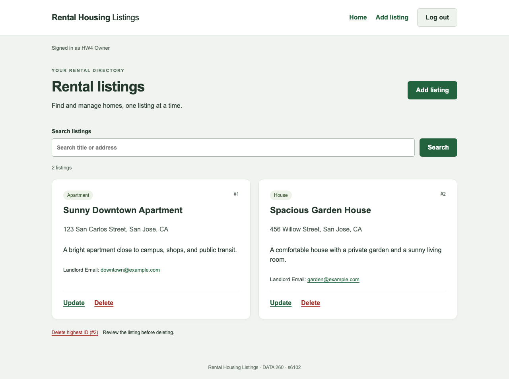

Real MySQL output: the home page displays stored rental records after login.
Title/address search is preserved. “Delete highest ID” takes the user to the confirmation screen for the highest displayed ID in the unfiltered list; it does not delete immediately.

## II. Create at `/create`

The two required domain fields are Listing title and Property address. Creation also preserves the prior four fields: Landlord Email, Description, Property type, and acceptance of terms. The request contains all six fields and no ID. Description requires at least 26 characters. The server validates the request and returns a database-assigned ID.

From `frontend/src/pages/CreateRecord.jsx` (lines 10–17):

```jsx
  const [values, setValues] = useState({
    listingTitle: "",
    propertyAddress: "",
    submitterEmail: "",
    description: "",
    propertyType: "apartment",
    termsAccepted: false,
  });
```

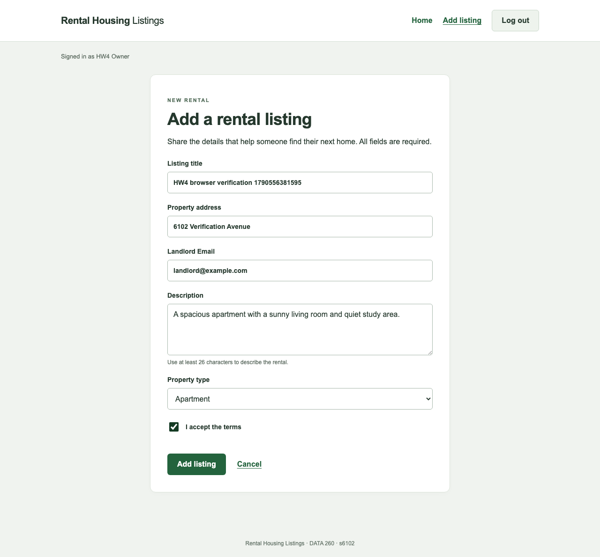

Real browser output: all six required create values are entered before submission.
From `frontend/src/pages/CreateRecord.jsx` (lines 29–35):

```jsx
    return onAdd({
      ...values,
      listingTitle: values.listingTitle.trim(),
      propertyAddress: values.propertyAddress.trim(),
      submitterEmail: values.submitterEmail.trim(),
    });
  }, "Listing added.");
```

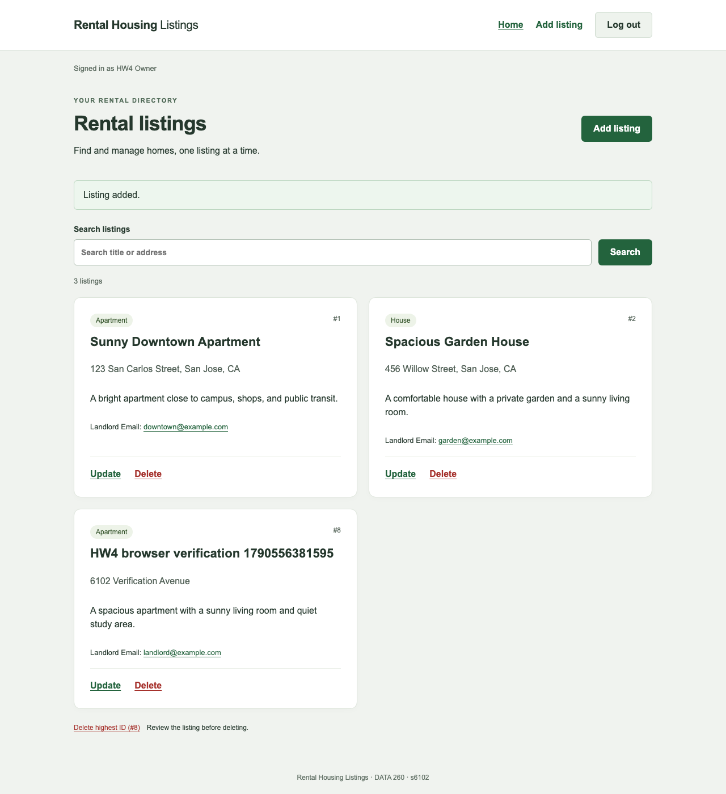

Real MySQL output: the new listing appears on the freshly loaded home page with its server-assigned ID.
A completed write also sends a `rentals-changed` event. If the user has already navigated Home, the list reloads there when the write finishes. Cancel is unavailable while a write is pending, so it cannot misleadingly imply that the request will be canceled.

The shared submit hook uses a synchronous lock and disables controls while a write is pending. A 422 validation error or a failed connection preserves the input. The mock suite deliberately forced both failures and dispatched repeated submit events; it observed only one pending create request.

## III. Update at `/update?id=N`

The query parameter selects a record while the route stays exactly `/update`. A missing, malformed, or nonpositive ID shows a selection message without sending a mutation. A valid ID is loaded from the backend, including after a browser refresh. Update sends only the title and address, leaving the other stored fields unchanged.

From `frontend/src/pages/UpdateRecord.jsx` (lines 11–24):

```jsx
function UpdateForm({ record, onUpdate }) {
  const [values, setValues] = useState({
    listingTitle: record.listingTitle,
    propertyAddress: record.propertyAddress,
  });
  const { pending, error, submit } = useSubmission(() => {
    const fields = {
      listingTitle: values.listingTitle.trim(),
      propertyAddress: values.propertyAddress.trim(),
    };
    if (!fields.listingTitle || !fields.propertyAddress)
      throw new Error("Listing title and property address cannot be blank.");
    return onUpdate(record.id, fields);
  }, "Listing updated.");
```

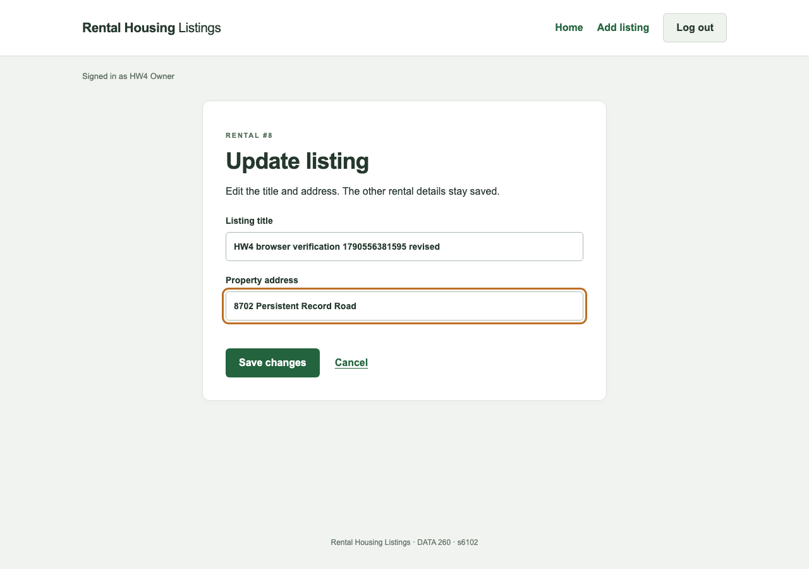

Real browser output: the selected listing is loaded and its two editable values are changed.

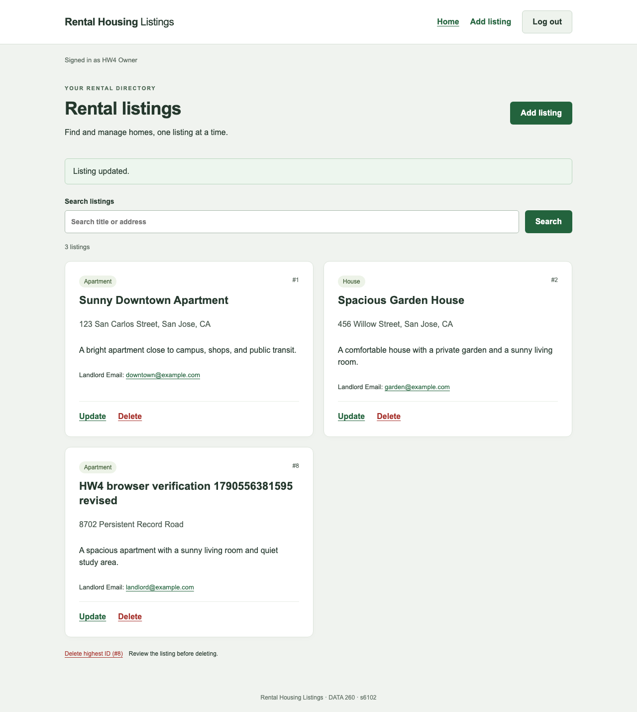

Real MySQL output: the home page shows the updated title and address after a refresh.


Real persistence output: after stopping the first backend process and starting another, the existing browser session still sees the updated listing.
The first restart verifies two distinct kinds of persistence: the rental row remains in MySQL, and the authentication-session row still authorizes the existing cookie. It does not rely on data remaining in a Python process.

## IV. Delete at `/delete?id=N`

`DeleteRecord.jsx` loads the selected record and displays its title and address before deletion. Cancel returns home without a write. The Delete listing button calls the mutation prop, and a 204 response is accepted without parsing JSON.

From `frontend/src/pages/DeleteRecord.jsx` (lines 11–16):

```jsx
  const state = useSelectedRental(id);
  const { pending, error, submit } = useSubmission(
    () => onDelete(id),
    "Listing deleted.",
  );
  if (!state.record) return <RecordState {...state} />;
```

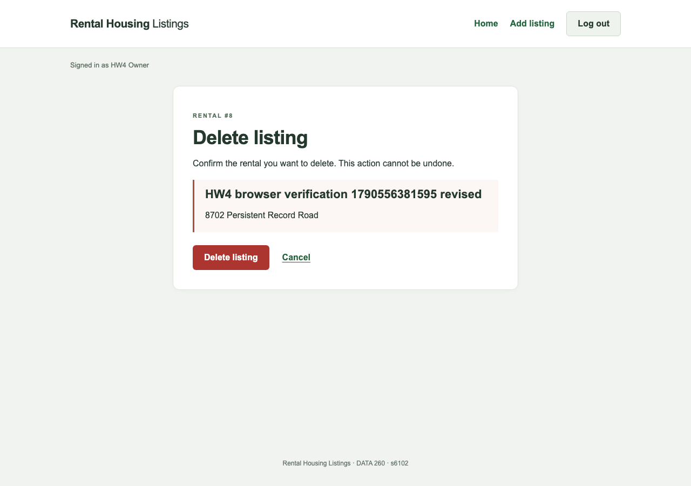

Real browser output: deletion requires a deliberate confirmation for the identified record.
From `frontend/src/api/client.js` (lines 53–54):

```jsx
  if (response.status === 204) return undefined;
  const data = await response.json().catch(() => null);
```

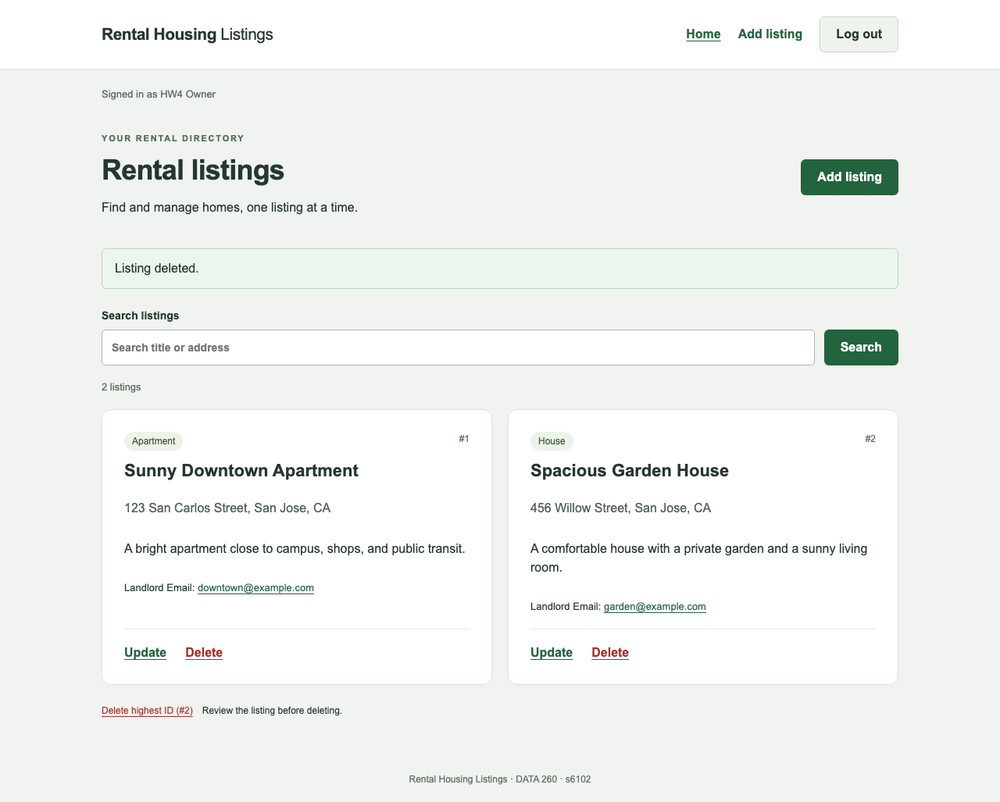

Real MySQL output: after deletion and browser refresh, the record is absent. A direct GET returns 404; the runtime runner also confirmed 404 after a second backend restart.
## V. Props, hooks, routing, and session expiry

The parent passes callbacks to each required mutation component. The components use these callbacks rather than duplicating fetch logic. All five required routes are served by FastAPI's production asset handler as well as by React Router, so a fresh direct browser visit works.

From `frontend/src/App.jsx` (lines 133–176):

```jsx
          <Routes>
            <Route path="/login" element={<Login />} />
            <Route
              path="/"
              element={
                <RequireAuth>
                  <Home />
                </RequireAuth>
              }
            />
            <Route
              path="/create"
              element={
                <RequireAuth>
                  <CreateRecord onAdd={rentals.create} />
                </RequireAuth>
              }
            />
            <Route
              path="/update"
              element={
                <RequireAuth>
                  <SelectedRecord kind="update" />
                </RequireAuth>
              }
            />
            <Route
              path="/delete"
              element={
                <RequireAuth>
                  <SelectedRecord kind="delete" />
                </RequireAuth>
              }
            />
            <Route
              path="*"
              element={
                <section className="panel">
                  <h1>Page not found</h1>
                  <Link to="/">Back to listings</Link>
                </section>
              }
            />
          </Routes>
```

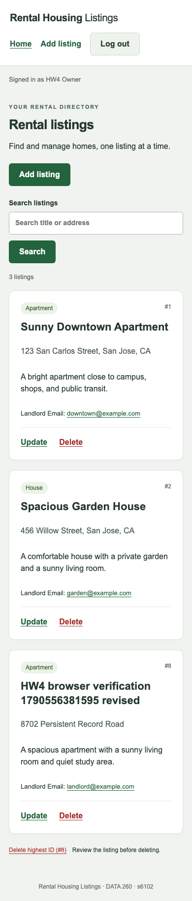

Real browser output at 390 × 844: rental cards and navigation fit the viewport. The runner checked document and body widths for horizontal overflow.
From `frontend/src/api/client.js` (lines 55–63):

```jsx
  if (!response.ok) {
    if (
      response.status === 401 &&
      notifyUnauthorized &&
      requestEpoch === authEpoch
    )
      window.dispatchEvent(new Event("session-expired"));
    throw new ApiError(response.status, data?.detail);
  }
```

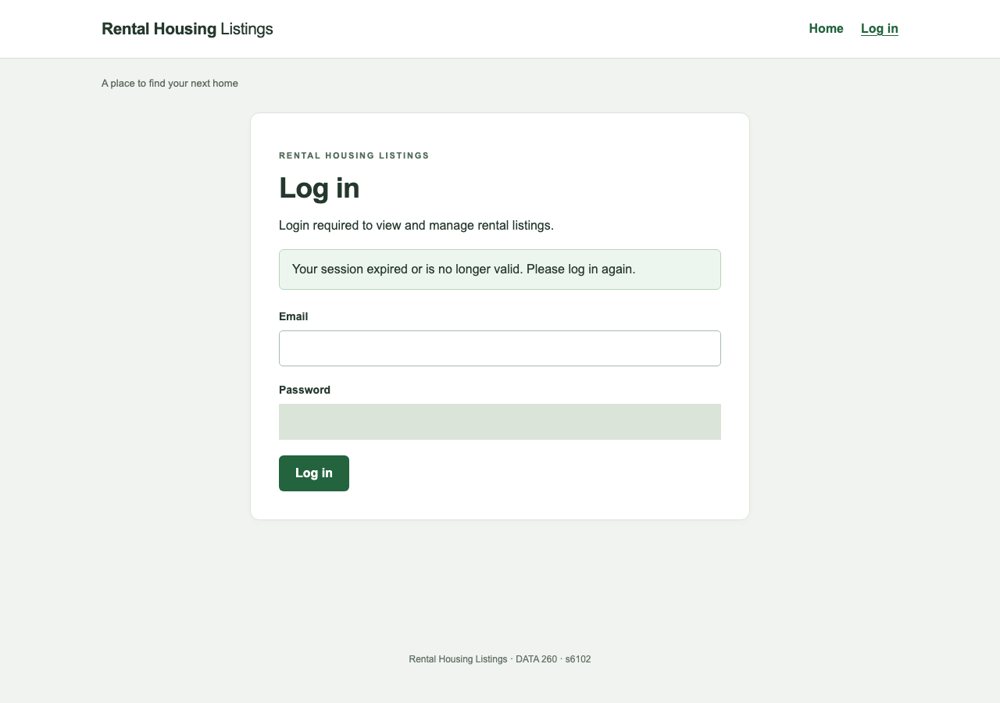

Real MySQL expiry output: with an explicitly configured two-second idle timeout for demonstration, the next list request returns 401; stale records disappear and the login page explains the expired session.
An incrementing UI-session counter prevents a delayed 401 from an older login from clearing a newer login. This counter contains no credentials; the backend cookie remains the only authentication proof.

The expiry capture uses the backend's existing `create_app(idle_timeout=2)` test seam in a temporary test process. Normal production settings remain 300 seconds of inactivity and 3600 seconds of absolute lifetime. No alternate authentication implementation or mock cookie is used in this capture.

## Verification results and limits

| Check group | Actual result | Evidence |
| --- | --- | --- |
| Production Vite build | Passed | `raw/part1/build.txt` and `RUN_LOG.txt` |
| Mock browser behavior | 19/19 passed | `raw/part1/mock-browser.json` |
| Real HTTPS/MySQL browser | 12/12 passed | `raw/part1/real-browser.json` |
| Real controlled idle expiry | 2/2 passed | `raw/part1/expiry-browser.json` |
| Runtime/database/restart checks | 6/6 passed | `raw/part1/runtime.json` |
| Browser JavaScript | No uncaught page errors in mock/real suites | Browser JSON checks |

The mock evidence is visibly labeled and only proves client behavior under controlled responses. The real evidence used HTTPS `127.0.0.1:8702` and MySQL 8.4.11, database `s6102_rel`, on the coordinated isolated development instance at 127.0.0.1:3362. The browser trusts the local development certificate only for these test contexts. The actual successful requests and screenshots, not an in-memory substitute, support the create/update/delete conclusions.

The earlier unsuccessful runs are preserved as `*-attempt*` files. They record test-harness URL interception, accessible-label, response-body, and runtime-restart issues; they are not counted as passing evidence. An interrupted attempt left one precisely identified test row, which was removed without resetting other data; the cleanup JSON records that action separately from acceptance.

`npm audit` was not clean: it reported two moderate Router 6-related entries whose advertised fix requires Router 7. The course-aligned shared contract specifies Router 6. This application has fixed local navigation destinations and no server-side rendering/hydration; the remaining dependency advisory is recorded in the handoff rather than hidden or silently resolved through a major-version migration.

Part 1's remaining external step is Part 2's combined branch merge and integration rerun. Part 1 screenshots are available; there is no pending Part 1 manual capture. This section does not cover Part 2/3 Postman captures, Part 4, the final report PDF, collaborator checks, or the `hw4` submission tag.

## Sources used

The supplied `DATA260_HW4.pdf` defines the Part 1 components, routes, authentication and evidence requirements. The supplied `DATA236_demo4` illustrates components and props, but its user-ID login was not adopted. The shared HW4 contract defines the six-field create request and two-field update request. Implementation details were checked against [React useEffect](https://react.dev/reference/react/useEffect), [React Router 6 overview](https://reactrouter.com/6.30.1/start/overview), and [Vite documentation](https://vite.dev/guide/).
