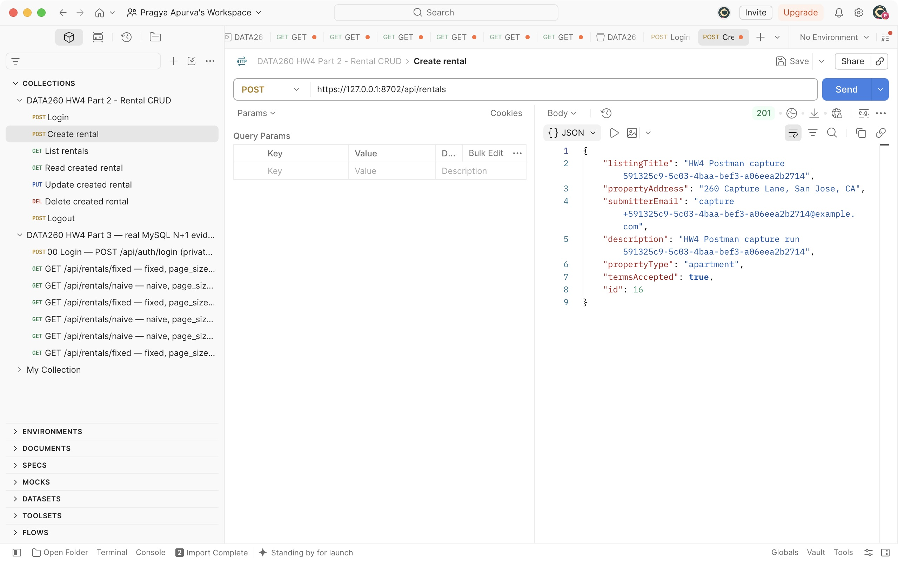
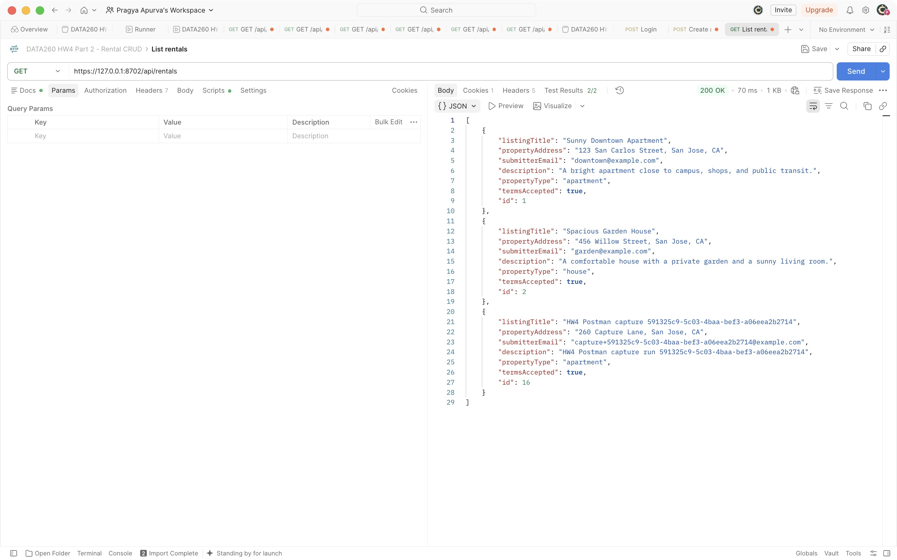
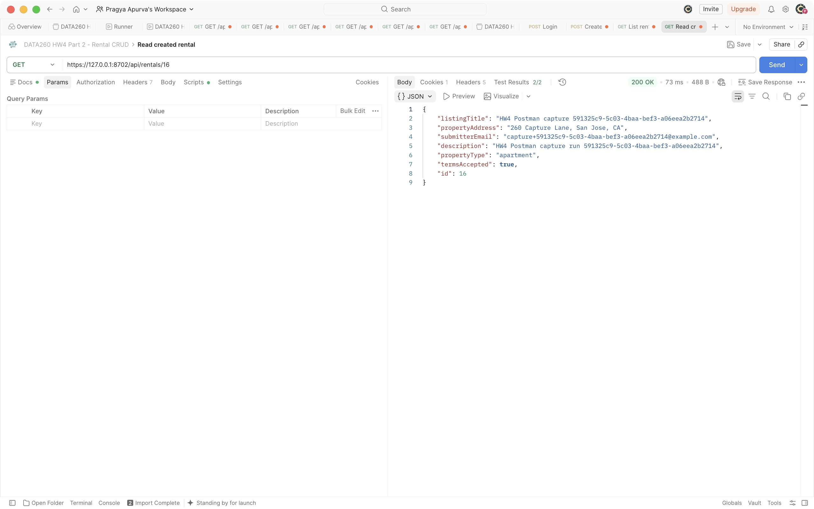
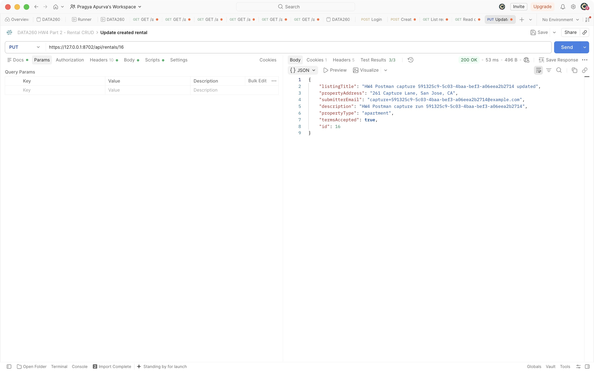
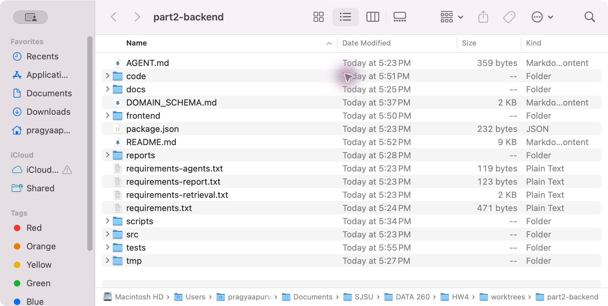
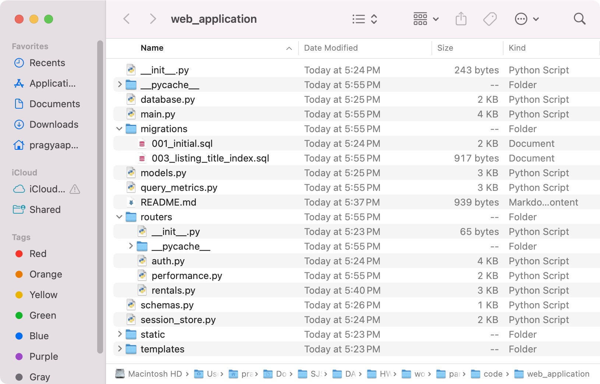

# Part 2: MySQL persistence and server-side sessions

Part 2 moves the existing Rental Housing Listings service from process memory to MySQL and owns the final local integration of Parts 1–3. The initial integration passed 23 real HTTPS/MySQL acceptance checks, 191 selected Python tests, all real-browser/restart/expiry checks, and 29 combined serving/auth/performance smoke checks. The later cleanup follow-up passed 209 tests and the live interruption check, as recorded separately below. The project-folder screenshots and four actual Part 2 Postman responses are captured. Only the Part 2 DELETE and database images remain pending; all six Part 3 Postman images are complete. The latest partial verification passes 44 of 46 checks, with automated status pass and overall status incomplete.

| Configuration | Value |
| --- | --- |
| SID4 / PREFIX | 6102 / s6102 |
| PORT_BASE | 8702 |
| SEED / VERIFY_SEED | 6102 / 266102 |
| DOMAIN_ID / domain | 6 / Rental Housing Listings |
| Database / engine | s6102_rel / MySQL 8.4.11 |
| Required connection variable | db_session_basede26 |
| Shared foundation B | f29e7cc85baf52bea30bd4bb3209d1bd79b22051 |
| Cleanup-follow-up tested code | 307b1d9adc050e422a205e2d3219914c2234d816 |
| Actual Part 2 Postman application source | 7350d9c98e8b56fcab4979fd94e0b39246f2b6d3 |
| Initial integrated code | e7382ddb9cc5e0a5cd867653254a0c6f62f2f9c7 |
| Integration branch | codex/hw4-part2-backend |

The foundation acceptance ran at `2026-09-28T00:28:47.592877+00:00` over `https://127.0.0.1:8702`. Its artifact records the HW3 baseline revision `5742b2aadbafee5ba208311723ea470c09811dc5` with a dirty working tree, because the foundation code had not yet been committed. That record is evidence for the pre-commit foundation gate, not an assertion that HW3 already contained this implementation. Foundation B was then committed and shared with Parts 1 and 3. The separate integrated run at `e7382ddb9cc5e0a5cd867653254a0c6f62f2f9c7` also passed 23 checks at `2026-09-28T00:55:59.072951+00:00`; its output is [integrated-api.json](../raw/part2/integrated-api.json). The earlier foundation outputs below retain their original IDs and timestamps.

## Database connection and schema

SQLAlchemy maps Python objects to MySQL rows. The required variable `db_session_basede26` is the SQLAlchemy engine, which manages database connections. A request-scoped SQLAlchemy `Session` groups database work and is closed after the request. This database session is different from a login session: a login session is a row in `sessions` that lets the server recognize an authenticated browser.

The connection configuration accepts `mysql+pymysql` and the exact database name `s6102_rel`. Credentials come from private environment configuration and are not included in these artifacts. Setup is explicit; importing or starting the app does not create tables or insert sample data.

Excerpt from [database.py](../../../code/web_application/database.py):

```python
db_session_basede26 = create_engine(
    get_database_url(),
    pool_pre_ping=True,
    pool_recycle=1800,
    hide_parameters=True,
    connect_args={"charset": "utf8mb4", "init_command": "SET time_zone = '+00:00'"},
)
SessionLocal = sessionmaker(bind=db_session_basede26, expire_on_commit=False)
```

Observed output in [schema-smoke.json](../raw/part2/schema-smoke.json):

```json
{
  "repeat_migration_applied": [],
  "repeat_seed_inserted": 0,
  "rows_preserved": true,
  "rental_count": 2
}
```

The schema contains `rentals`, `users`, `sessions`, and `property_managers`, plus the migration journal `schema_migrations`. The SQL migration is [001_initial.sql](../../../code/web_application/migrations/001_initial.sql). Repeating migration and demo seeding preserved the two existing demo rentals. These rows were explicitly seeded examples; no transfer of live HW3 in-memory data is claimed.

| Table | Stored data and constraints |
| --- | --- |
| `rentals` | Auto-increment integer ID; title, address, landlord email, description, property type, and accepted terms; nullable `manager_id` foreign key |
| `users` | Auto-increment ID, name, unique normalized email, and password hash |
| `sessions` | Opaque token ID, user foreign key, creation time, fixed expiry time, and last activity time |
| `property_managers` | Auto-increment ID and name; the related entity used by Part 3 |

Excerpt from [models.py](../../../code/web_application/models.py):

```python
id: Mapped[int] = mapped_column(Integer, primary_key=True, autoincrement=True)
listing_title: Mapped[str] = mapped_column(String(255), nullable=False)
property_address: Mapped[str] = mapped_column(String(255), nullable=False)
```

The saved MySQL `SHOW CREATE TABLE` output confirms `AUTO_INCREMENT`, required columns, a unique email key, and the foreign keys. MySQL checks also reject empty titles/addresses, short descriptions, unsupported property types, and unaccepted terms. Application validation additionally checks email syntax, length limits, and unexpected fields. Real MySQL tests verify distinct IDs for concurrent inserts and rollback after a failed write. Deleting the highest rental does not reset the ID sequence.

**Required output screenshot:** `reports/hw04/screenshots/part2/06-database.png` is pending. The schema JSON above is supporting evidence, not a screenshot. [MANUAL_CAPTURES.md](MANUAL_CAPTURES.md) gives the exact capture steps.

## Email/password login and persistent sessions

Login compares the supplied password with the stored Argon2 hash. Successful login creates a random token and stores it in MySQL with the user ID. The browser receives only that token in the `s6102_session` cookie; the cookie contains no name, email, or other user fields. API responses expose only the public user fields `id`, `name`, and `email`.

Excerpt from [session_store.py](../../../code/web_application/session_store.py):

```python
token = SessionToken(
    id=secrets.token_urlsafe(32),
    user_id=user_id,
    created_at=now,
    expires_at=now + timedelta(seconds=ABSOLUTE_TIMEOUT_SECONDS),
    last_activity_at=now,
)
```

Observed cookie attributes in [api-acceptance.json](../raw/part2/api-acceptance.json):

```text
HttpOnly; Max-Age=3600; Path=/; SameSite=lax; Secure
```

`HttpOnly` prevents browser JavaScript from reading the cookie. `Secure` restricts it to HTTPS. `SameSite=lax` limits when browsers attach it to cross-site requests. Reusable token values are intentionally absent from saved output.

Authentication looks up the session and user in MySQL. It rejects sessions after 300 seconds of inactivity or 3,600 seconds from creation. Accepted activity updates `last_activity_at` without extending `expires_at`. Times are stored as UTC. Logout deletes the database session and clears the browser cookie. A copied token therefore cannot restore the revoked login. Old HW3 signed cookies and forged tokens are rejected.

Observed acceptance results:

| Check | Result |
| --- | --- |
| Anonymous rental access and bad credentials | Denied |
| Valid login and cookie attributes | Passed |
| Actual server-process restart retains login and rental | Passed |
| Logout and copied-token replay | 204 logout; 401 replay |
| Logout removes database token | Passed |
| Idle expiry and absolute expiry | Both denied |

Expiry checks moved the test token's stored timestamps past the relevant boundary. They did not wait an hour or change other users' sessions. The Python tests also cover boundary times, unknown emails, repeated login, failed login replacement, and every protected ordinary rental route.

## The five CRUD operations

The API keeps the existing six-field create body. An update accepts only `listingTitle` and `propertyAddress`, so editing these two fields preserves the landlord email, description, property type, and accepted terms. All rental routes share `Depends(require_user)`. The historical output examples below are the original foundation run using ID 4. The integrated rerun performed the same sequence with ID 9 and passed every operation; both artifacts remain available. The newer Postman images show a separate capture run using returned ID 16 and marker `591325c9-5c03-4baa-bef3-a06eea2b2714`, against application source `7350d9c98e8b56fcab4979fd94e0b39246f2b6d3`. ID 16 remains available for the pending database screenshot.

Excerpt from [routers/rentals.py](../../../code/web_application/routers/rentals.py):

```python
router = APIRouter(prefix="/api/rentals", tags=["rentals"], dependencies=[Depends(require_user)])
```

### Add a record: POST /api/rentals

The create handler constructs a `Rental`, commits it, and returns its database-generated ID.

```python
db.add(row)
db.commit()
return rental_json(row)
```



Captured at `2026-09-28T02:19:33.156Z`: POST returned **201** and all six fields for ID **16**. Its title, email, and description contain this capture run’s UUID. The [Postman test view](../screenshots/part2/01-post-create-tests.png) records three passed assertions and none failed.

Actual response in the acceptance artifact: **201**, ID **4**, title **HW4 acceptance 20a5a6cf67**, address **260 Verification Lane, San Jose, CA**, landlord email **verification@example.com**, description **A real MySQL acceptance record for verified persistent CRUD.**, property type **apartment**, and accepted terms **true**. This ID is a historical result from that run; new captures must use the ID returned by their own POST.

### View records: GET /api/rentals

```python
statement = select(Rental).order_by(Rental.id)
```



Captured at `2026-09-28T02:21:10.683Z`: the unfiltered GET returned **200** with IDs **1, 2, and 16**. The [Postman test view](../screenshots/part2/02-get-list-tests.png) records two passed assertions and none failed.

The endpoint returns a JSON array and supports the preserved optional title/address search. The actual acceptance request used `?q=HW4 acceptance 20a5a6cf67`; it returned **200** and one matching object with ID **4**, identical to the create response. The selected API tests also cover the unfiltered list.

### View one record: GET /api/rentals/{id}

```python
return rental_json(find_rental(db, rental_id))
```



Captured at `2026-09-28T02:21:52.163Z`: `GET /api/rentals/16` returned **200**, with the original values and immutable UUID markers matching the POST. The [Postman test view](../screenshots/part2/03-get-by-id-tests.png) records two passed assertions and none failed.

The historical acceptance request `GET /api/rentals/4` returned **200** with the same object as the POST response. A missing positive ID returns **404**.

### Update a record: PUT /api/rentals/{id}

```python
row = find_rental(db, rental_id)
row.listing_title, row.property_address = payload.listingTitle, payload.propertyAddress
db.commit()
return rental_json(row)
```



Captured at `2026-09-28T02:22:53.371Z`: PUT returned **200** for ID **16**, added ` updated` to its title, and set the address to **261 Capture Lane, San Jose, CA**. The email, description, property type, and accepted terms remain unchanged. The [Postman test view](../screenshots/part2/04-put-update-tests.png) records three passed assertions and none failed. A [subsequent literal-ID GET](../screenshots/part2/04-updated-id-read.png) at `2026-09-28T02:27:19.326Z` returned the updated row and passed both status and ownership assertions.

The historical acceptance request to `/api/rentals/4` returned **200**, title **HW4 acceptance 20a5a6cf67 updated**, and address **261 Verification Lane**. The other four fields matched their original values. A subsequent request with an empty title returned **422**.

### Delete a record: DELETE /api/rentals/{id}

```python
db.delete(find_rental(db, rental_id))
db.commit()
return Response(status_code=204)
```

The historical acceptance deletion of `/api/rentals/4` returned **204** with no body. Reading that ID afterward returned **404**. The acceptance harness removed only the row it created.

**Required adjacent screenshot:** `05-delete.png` is pending.

All five sanitized responses are saved together in [api-acceptance.json](../raw/part2/api-acceptance.json). [postman_collection.json](postman_collection.json) supplies login, the five CRUD requests, and logout with status assertions. It has blank credential values and remembers the ID returned by its own POST.

## Transactions and serving the React build

If a request fails, the shared database dependency rolls back uncommitted changes and closes the database session. This prevents a failed write from leaving a partial rental record. Mutation handlers commit explicitly. Authentication activity is committed before endpoint work, so a valid request can count as activity even if later validation or domain work fails.

Excerpt from [database.py](../../../code/web_application/database.py):

```python
try:
    yield session
except Exception:
    session.rollback()
    raise
finally:
    session.close()
```

The passing MySQL tests include duplicate-email rejection, required-field and foreign-key rejection, a deliberately failing request after a flushed insert, and confirmation that the failed insert is absent afterward.

The same FastAPI service serves `frontend/dist` over HTTPS using [run_hw04_web.py](../../../scripts/run_hw04_web.py). Explicit routes `/`, `/login`, `/create`, `/update`, and `/delete` serve the built React entry page. `/assets` serves its assets, and `/dashboard` redirects to `/`. A missing build returns an explanatory **503**. Unknown `/api/...` routes retain a JSON **404**, and `/docs` stays available. Fixture-build serving tests passed. After integration, the real Vite production build also passed, and the 29-check combined smoke confirmed all five entry routes, both built assets, retained docs, and API JSON 404 behavior.

Python imports use `web_application` with the repository's `code/` on the import path. This avoids confusing the project folder with Python's standard-library `code` module. The foundation exports the engine, session factory, request dependency, models, authentication dependency, and rental serializer for Part 3.

**Project-structure screenshots captured:** the integrated worktree root and expanded backend modules are shown below. These are actual Finder captures. The original JPEG bytes are retained beside PNG format conversions; no content was edited.





The earlier path inventory at `2026-09-28T00:33:10.848027+00:00` remains in [project-structure.json](../raw/part2/project-structure.json). Its empty `frontend` list reflects the independent backend branch at that time. It is not the final combined tree.

## Initial verification results and remaining work

| Evidence | Actual outcome |
| --- | --- |
| [integrated-api.json](../raw/part2/integrated-api.json) | 23/23 real HTTPS/MySQL checks passed on merged code |
| [pytest-integrated.txt](../raw/part2/pytest-integrated.txt) | 191 passed, 111 warnings in 5.42 seconds; no skips |
| [integrated real browser](../raw/part2/integrated-browser/real-browser.json) | 12/12 passed |
| [integrated expiry](../raw/part2/integrated-browser/expiry-browser.json) | 2/2 passed |
| [integrated runtime](../raw/part2/integrated-browser/runtime.json) | 6/6 passed, including actual restarts |
| [combined smoke](../raw/part2/integration-smoke.json) | 29/29 passed |
| [initial partial verifier](../raw/part2/cleanup-followup/verification-before.json) | Automated status pass; 34/46 checks pass; 12 unavailable manual captures keep overall status incomplete |
| [api-acceptance.json](../raw/part2/api-acceptance.json) | Historical foundation gate: 23/23 passed |
| [schema-smoke.json](../raw/part2/schema-smoke.json) | Repeated migration applied nothing; repeated seed inserted nothing; two rows preserved |
| [pytest-backend.txt](../raw/part2/pytest-backend.txt) | 122 passed, 98 warnings in 4.31 seconds; no skips |
| [api-acceptance-attempt1.json](../raw/part2/api-acceptance-attempt1.json) | Failed with ConnectError during the restart harness sequence; retained as failed evidence |
| [pytest-backend-attempt1.txt](../raw/part2/pytest-backend-attempt1.txt) | 110 passed, 4 failed; expected exception class did not match PyMySQL's CHECK-violation mapping |

The historical 122-test run includes 114 current web tests and eight unchanged HW3 aggregate-verifier tests. Its 98 warnings are dependency deprecations. The initial integrated suite includes later review regressions, partial-verifier tests, and Part 3 tests; it passed 191 tests with 111 dependency deprecation warnings. Its metadata records exact source hashes and confirms source was unchanged during the run. The failed constraint tests were corrected to assert MySQL error numbers `1048` for NOT NULL and `3819` for CHECK violations, while still asserting rollback and unchanged rows. Database validation was not weakened.

The foundation acceptance used the dedicated `data260-hw4-mysql` container on host port **3362**. Part 2 then released HTTPS port **8702** and that evidence database to Part 1. Later backend tests used `data260-hw4-part2-tests` on **3363**. No shared database reset is part of this workflow.

## Initial local integration of Parts 1–3

Part 1 commit `5db1d4a12d996fa5eb45e9b71d7b2dbcd0708991` and Part 3 commit `4f8390b84752d861ea6b47c5ac8615680192d841` are merged into `codex/hw4-part2-backend`, preserving foundation B as a shared ancestor. Initial integrated tested code is `e7382ddb9cc5e0a5cd867653254a0c6f62f2f9c7`. Subsequent evidence/documentation commits can be resolved from the branch tip without relabeling the tested revision.

The selected pytest run began at `2026-09-28T00:56:08.104131+00:00`. The browser runtime ran from `2026-09-28T00:56:20.413881+00:00` through `2026-09-28T00:56:31.124030+00:00`. It confirmed that browser-created rental ID 10 and the existing login survived a backend restart, and that deletion stayed effective after another restart. The two-check expiry demonstration used the documented two-second test seam; production retains 300-second idle and 3,600-second absolute lifetimes.

The combined smoke ran from `2026-09-28T00:56:42.886910+00:00` through `2026-09-28T00:56:45.959111+00:00` against Part 3's dedicated MySQL instance on port 33363. It confirmed exactly 5,000 rentals and 200 managers, shared login for ordinary and performance routes, equal ordered naive/fixed payloads, and the expected total SQL counts: 13/53/203 naive versus three fixed at sizes 10/50/200. Revoked tokens failed on both performance endpoints. The test did not reset the dataset. A read-only [post-integration preservation check](../raw/part2/integrated-database-preserved.json) at `2026-09-28T01:00:51.453365+00:00` confirmed identical performance data, indexes, and query results; ports 3362 and 3363 each still contained two rentals.

The original 180-request benchmark remains tied to clean revision `9860a20342072168ed68a8d41eb16d9bfecf7729`. Source comparison found no change to measured query, authentication, schema/model, SQL-counter, or serialization code. The ordinary CRUD search-only change is outside the measured endpoints. The recorded timing run therefore remains applicable to its original environment without a new integrated latency claim. Its full results and the separate index experiment are in [METRICS.md](../METRICS.md).

At `2026-09-28T00:58:08.565999+00:00`, the [initial partial verifier](../raw/part2/cleanup-followup/verification-before.json) reported automated status **pass** and overall **incomplete**. At that time, all 12 false checks were missing manual evidence: five Part 2 Postman images, six Part 3 Postman images, and one database image. The project-folder evidence item passed. Postman was unavailable then, and the native Terminal capture attempt was denied by the computer-use tool. Actual schema/query JSON is retained; no screenshot was substituted or fabricated.

See [the combined partial write-up](../PARTS123.md) and [handoff](HANDOFF.md) for exact revisions, runtime ownership, evidence locations, and reproduction steps. Part 4, the whole-homework PDF, collaborator access checks, the `hw4` tag, and verification against that tag remain later work.

## Cleanup follow-up

Part 1 cleanup commit `5d84f1a038cfdfcedb667b8047e06d5ef095164b` was merged at `6957de05690566887cab38a8d4c03537f665417a`. The cleanup-follow-up tested code is `307b1d9adc050e422a205e2d3219914c2234d816`. The change affects the browser test runner and verification provenance; frontend/backend application code and the measured performance path are unchanged, so the original benchmark remains selected.

| Follow-up check | Actual outcome | Evidence |
| --- | --- | --- |
| Normal HTTPS browser/runtime at merge `6957de0` | 12 browser, two expiry, and six runtime checks passed; cleanup `already_absent` for ID 14 | [browser](../raw/part2/cleanup-followup/browser/real-browser.json), [expiry](../raw/part2/cleanup-followup/browser/expiry-browser.json), [runtime](../raw/part2/cleanup-followup/browser/runtime.json) |
| Deliberate interruption at current code | 8/8 passed; exact confirmed-created ID 15 deleted and every pre-existing rental unchanged | [interruption check](../raw/part2/cleanup-followup/interruption/check.json) |
| Current selected Python suite | 209 passed, 111 warnings, no skips, 5.95 s | [pytest](../raw/part2/cleanup-followup/pytest-integrated.txt), [metadata](../raw/part2/cleanup-followup/pytest-integrated.metadata.json) |
| Current combined smoke | 29/29 passed | [smoke](../raw/part2/cleanup-followup/integration-smoke.json) |

The normal runtime ran at `2026-09-28T01:14:34.935389+00:00` through `01:14:46.483869+00:00`. The interruption check ran at `01:15:32.713257+00:00` through `01:15:35.397312+00:00` on isolated development port 8712; it deliberately produced runtime status `interrupted` and exit 143, then verified row cleanup, process shutdown, and port release. That interrupted browser trace is not a failed normal acceptance run.

The current pytest run began at `2026-09-28T01:15:32.510124+00:00`; the 29-check smoke ran at `01:15:50.150794+00:00` through `01:15:53.159300+00:00`. Seventeen new cleanup-guard unit tests use SQLite. Required MySQL evidence remains the live interruption check and integrated MySQL checks; SQLite is not substituted for that proof. The additional provenance regression and metadata cover the CJS browser runner, Python runtime runner, and interruption driver.

At `2026-09-28T01:16:15.241788+00:00`, [cleanup-follow-up partial verification](../raw/part2/capture-recheck/verification-before.json) again reported 34/46 checks passing, automated status **pass**, and overall **incomplete** solely for the same 12 manual captures. [The previous verifier](../raw/part2/cleanup-followup/verification-before.json), initial integration timings, and original screenshot paths are preserved.

## Review follow-up

The expanded reviewed backend suite passed **130 tests**, with no skipped
database checks. The [output](../raw/part2/pytest-backend-reviewed.txt) has a
[provenance record](../raw/part2/pytest-backend-reviewed.metadata.json) naming the
real MySQL instance, command, revision, and output hash.

Review caught one preserved-behavior regression: MySQL LIKE did not match
`Straße` when searching for `STRASSE`. A real MySQL regression test failed first;
the ordinary listing route now uses the same Unicode casefold substring test
as HW3 after selecting rows in ID order. This loads all ordinary listings for
search, consistent with that route's unpaginated contract. It does not change
the two separately paginated performance endpoints.

The acceptance harness now attempts server shutdown and resource closure even
if database cleanup fails, and records cleanup failures without secret details.
HW4 fixture imports are lazy so they do not force the web stack into the
repository's separate retrieval environment. These changes have focused tests.

## Historical capture access recheck

At `2026-09-28T01:29:38.647410+00:00`, the [availability record](../raw/part2/capture-recheck/availability.json) confirmed that Postman was still absent from the checked app inventory and application folders, and could not be opened. Native Terminal access was denied again by the computer-use tool. No dedicated MySQL GUI was found in the inspected locations. No new screenshot, server process, or capture rental was created. Port 8702 was free and was not claimed; the existing databases and benchmark measurements were untouched.

At that recheck, all six Part 2 images were still pending: POST, list GET, ID GET, PUT, DELETE, and the database view. The project-folder images were complete. The earlier guide unnecessarily treated a MySQL GUI as a prerequisite; the working MySQL CLI inside `data260-hw4-mysql` is sufficient for a user-captured terminal image. The database view must use the API’s Part 2 instance on host port 3362, capture only this run’s uniquely marked rental before deletion, and omit credentials, token values, and password hashes. The Terminal denial was not bypassed.

The [capture instructions](MANUAL_CAPTURES.md) now explain single-run ownership, recovery after an uncertain POST, a fresh exact-ID/marker comparison before each mutation, the database-before-delete order, and a final literal-ID 404 check. The prepared collection uses a GUID in immutable fields and guards against stale or overridden IDs; offline script checks are explicitly separate from actual Postman execution. Each new image must be placed beneath its corresponding code excerpt once genuinely captured.

The partial verifier was rerun against the retained selected evidence at `2026-09-28T01:29:57.581094+00:00`. It reported **automated status pass**, **34/46 checks passed**, and **overall incomplete** for the same 12 manual images (six Part 2 and six Part 3). Its exit code 1 reflects these missing images. [Run details](../raw/part2/capture-recheck/verification-run.json) preserve the exact command; [the prior verifier](../raw/part2/capture-recheck/verification-before.json) is retained. This recheck is not a new API, browser, pytest, or performance measurement run.

## Actual Postman capture follow-up

Postman 12.29.5 is now available. The four primary images above and six supporting views are genuine native captures from the HTTPS application on port 8702, with certificate verification enabled. The [capture manifest](../raw/part2/postman/manifest.json) records application source `7350d9c98e8b56fcab4979fd94e0b39246f2b6d3`, evidence-only merge `5c939bd8b32c41c7514bb061210a1f4e43b25862`, and unchanged application source during that merge. Part 3’s six completed Postman images were merged from `e58669ffbfe3ed459ec2c7e664caa6186ba7ec8a`. The [capture log](../raw/part2/postman/capture-log.json) preserves timestamps and observations. Original JPEGs are retained; the [format check](../raw/part2/postman/image-format-check.json) confirms identical decoded pixels after PNG conversion, with no cropping, resizing, annotation, or compositing. The [visual review](../raw/part2/postman/visual-review.json) passed for the four primary images and updated-ID GET.

At `2026-09-28T02:33:01.034223+00:00`, the [latest partial-verifier run](../raw/part2/postman/verification-run.json) reported **44/46 checks passed**, **automated status pass**, and **overall incomplete**. Only `part2/postman-delete` and `part2/database` remain false. This checks the retained automated evidence and newly available images; it is not another API, browser, pytest, or benchmark run.

The user is preparing the database screenshot while owned rental **16** remains present. Native Terminal and Codex app control were denied by the computer-use tool; the available Codex terminal reader can only read output. A MySQL GUI is not required: the user can run the supplied Docker/MySQL CLI command and capture `SELECT DATABASE()`, `SHOW TABLES`, and the title/address query for exact ID 16. After that image is saved, the remaining sequence is a fresh ownership GET, DELETE capture, literal-ID 404 proof, logout, local credential clearing, and read-only database postflight. None of those remaining actions is claimed complete.
